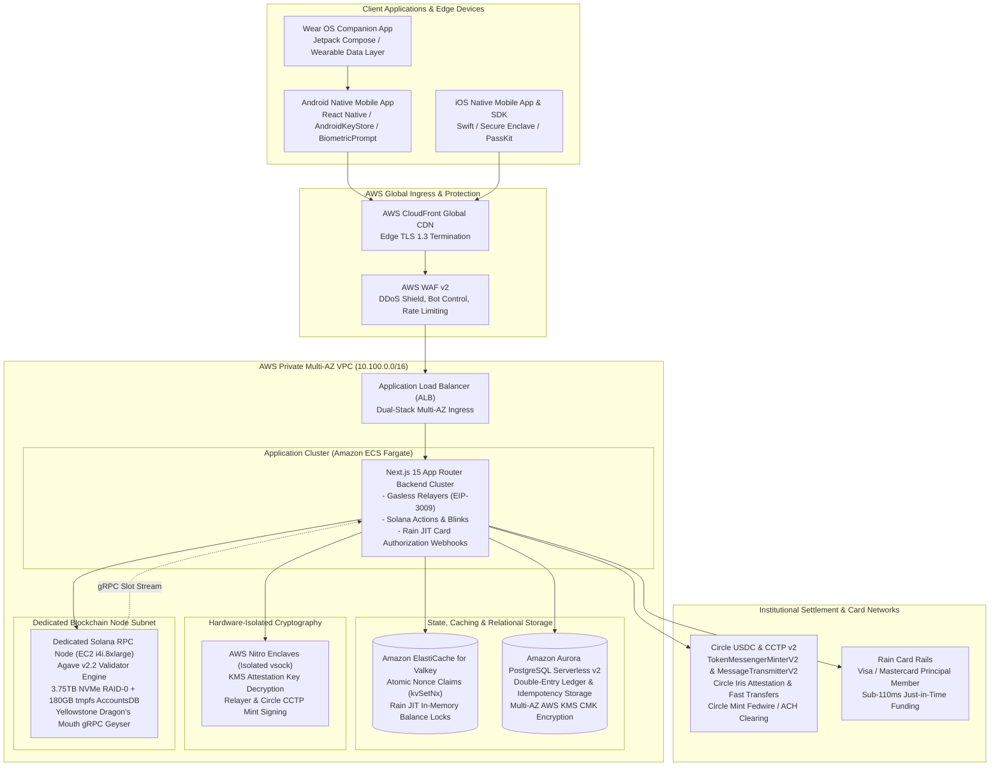

# FurlPay Documentation & Architecture Blueprints

### The Sovereign Digital Dollar Payment & Card Infrastructure

Enterprise-grade technical documentation, AWS cloud migration roadmaps, dedicated Agave v2.x Solana RPC specifications, Circle CCTP v2 cross-chain rails, Rain JIT card issuing blueprints, and comprehensive security audits.

---

## System Architecture Overview

---

## Master Documentation Index

### 1. AWS Cloud & Dedicated Infrastructure Blueprints (aws/)

* [Cross-Platform USDC Payment Engine & AWS Architecture (2026–2027)](aws/FURLPAY_USDC_PAYMENT_FLOW_AND_AWS_ARCHITECTURE.md)  
  End-to-end USDC payment flow across Android Native (`native-app`), Wear OS (`guardian`), iOS (`furlpay-swift`), and AWS dedicated infrastructure. Details hardware Keystore/Secure Enclave signing, EIP-3009 gasless transfers, Solana v0 transactions, sub-110ms Rain JIT card authorizations, Circle CCTP v2 burn-and-mint, and AWS Nitro Enclaves.
* [1-Year Master Infrastructure & AWS Migration Blueprint (2026–2027)](aws/FURLPAY_1_YEAR_AWS_INFRASTRUCTURE_REPORT.md)  
  Complete 12-month engineering roadmap moving FurlPay from Vercel edge functions and managed RPC providers (Helius/QuickNode) to a private Multi-AZ VPC on Amazon Web Services (AWS).
* [AWS Infrastructure Cost Optimization & FinOps Reduction Report](aws/FURLPAY_AWS_COST_OPTIMIZATION_REPORT.md)  
  FinOps engineering analysis slashing annual AWS infrastructure expenditures from **\$44,040/year** down to **\$21,480/year (51.2% reduction)** by eliminating `io2` Block Express IOPS charges in favor of local Nitro NVMe SSDs (`i4i.8xlarge`), adopting ElastiCache for Valkey, and optimizing standby RPC failover.
* [Zero-Cash AWS Blueprint & Production Solana Node Specification](aws/FURLPAY_AWS_FREE_TIER_NODE_CONFIG_REPORT.md)  
  Running 100% free on AWS via capital stacking (\$25,000–\$100,000 AWS Activate credits + Solana Foundation grants). Contains official Agave v2.2 validator arguments, Linux sysctl tuning (`21-agave-validator.conf`), dual NVMe RAID-0 storage scripts, tmpfs AccountsDB setup, Yellowstone Dragon's Mouth gRPC configuration, and automated slot health monitoring.

---

### 2. Security Audits & Vulnerability Assessments (audit/)

* [Master Monorepo Security Audit Report](audit/FULL_CODEBASE_AUDIT_REPORT.md)  
  Exhaustive code audit across Solana Anchor programs, Next.js API routes, Android/Wear OS native applications, and client SDKs. Uncovers and remediates critical vulnerabilities including the Solana escrow token drain in `auto_release.rs`, merchant wallet fallback to `1111...1111`, WooCommerce/Magento HMAC bypass, Swift timing side-channel leaks, and Android SQLite encryption.
* [Mobile Security Audit & Hardening Guide](docs/MOBILE_SECURITY_AUDIT.md)  
  Analysis of Android and iOS cryptographic boundaries, reverse engineering protections, anti-hooking checks, and biometric authentication gates.
* [x402 Micropayment Attack Vectors & Mitigation](docs/security/x402-attacks.md)  
  Facilitator-layer hardening for HTTP 402 AI agent payment rails, closing cross-resource substitution (F1) and duplicate settlement race conditions (F2).
* [Transaction Security Standards](docs/TRANSACTION_SECURITY.md)  
  Formal verification of transaction signing, nonce isolation, and replay defense mechanisms.

---

### 3. Mobile, Wearable & Client Protocols (docs/)

* [Self-Custodial Wallet Architecture](docs/SELF-CUSTODIAL-WALLET-DESIGN.md)  
  BIP-39, SLIP-0010 (Solana Ed25519), and BIP-44 (EVM Secp256k1) key generation, memory zeroization, and multi-account derivation.
* [Android Native Release & Signing Runbook](docs/ANDROID-RELEASE.md)  
  Google Play Console signing keys, APK optimization, and ProGuard/R8 obfuscation rules.
* [Google Play Store Signing Runbook](docs/PLAY-SIGNING-RUNBOOK.md)  
  Step-by-step key registration, upload keystores, and app integrity verification.
* [Certificate Pinning & Rotation Runbook](docs/CERT-PIN-ROTATION.md)  
  Zero-downtime HPKP / mTLS certificate rotation for mobile network security configs.
* [Hardware Wallet Research & Integration](docs/HARDWARE-WALLET-RESEARCH.md)  
  Tangem, Ledger, and NFC hardware-token signing integrations for high-net-worth accounts.

---

### 4. Protocols, Settlement & Custody Models (docs/)

* [Production Go-Live Money Runbook](docs/GO-LIVE-MONEY.md)  
  Financial operation guidelines, liquidity provisioning, and treasury hot/warm/cold balance thresholds.
* [Ledger Reconciliation & Invariant Checks](docs/RECONCILIATION.md)  
  Continuous double-entry verification between off-chain balances and on-chain token states.
* [Balance Custody Mapping](docs/BALANCE-CUSTODY-MAP.md)  
  Taxonomy of self-custody vs. custodial escrow accounts across multi-chain rails.
* [Custody Disclosure & Regulatory Disclaimers](docs/CUSTODY-DISCLOSURE.md)  
  Compliant disclosure language for retail and institutional stablecoin holders.
* [API v1 Surface Specification](docs/API-V1-SURFACE.md)  
  Public REST & WebSocket interface contracts for merchant integrations.
* [Verified Protocol Claims](docs/VERIFIED-CLAIMS.md)  
  Benchmarked performance figures: sub-500ms settlement, 58,000+ edge requests, 0% error rate.

---

### 5. Expansion Blueprints & Strategy (reports/)

* [Singapore Expansion Master Blueprint](reports/furlpay_singapore_expansion_master_blueprint.md)  
  MAS Major Payment Institution (MPI) compliance roadmap, SGQR / PayNow integration, and Southeast Asian cross-border settlement.
* [USDC Travel Market & Tourism Rails](reports/furlpay_singapore_usdc_travel_market_report.md)  
  Stablecoin travel spend analysis, merchant discount rate (MDR) disruption, and hotel direct-settlement protocols.
* [USDC Travel Architecture & Security Blueprint](reports/furlpay_usdc_travel_architecture_and_security_blueprint.md)  
  Offline travel vouchers, MCC-locked virtual cards, and airline ticketing integration.
* [Algorithmic Settlement & Competitive Disruption](reports/furlpay_algorithmic_settlement_competitive_report.md)  
  Comparative analysis against Stripe, RedotPay, and traditional acquiring networks.
* [Partner Onboarding Master Report](reports/furlpay_partner_onboarding_master_report.md)  
  Technical guidelines for payment service providers (PSPs), independent sales organizations (ISOs), and payment gateways.

---

## Technology Stack Breakdown

| Layer | Technologies & Protocols |
| :--- | :--- |
| **Cloud & Infrastructure** | **Amazon Web Services (AWS)**: EC2 `i4i.8xlarge`, ECS Fargate, CloudFront, ALB, Aurora PostgreSQL Serverless v2, ElastiCache for Valkey, AWS Nitro Enclaves, AWS KMS, Amazon SNS, CloudWatch, Terraform. |
| **Dedicated Blockchain Node** | **Agave v2.2.x** (Solana Validator Engine), **Yellowstone Dragon's Mouth gRPC Geyser**, Ubuntu 24.04 LTS, Nitro NVMe RAID-0, Linux tmpfs AccountsDB. |
| **Cross-Chain & Stablecoins**| **Circle USDC**, **Circle CCTP v2** (`MessageTransmitterV2`, `TokenMessengerMinterV2`), Circle Iris Attestation API, Circle Mint API, Circle Programmable Wallets, Circle Arc. |
| **Card Issuing Rails** | **Rain Cards** (Visa/Mastercard Principal Member), Sub-110ms Just-in-Time (JIT) Funding Webhooks, ISO 8583 Authorization Bridge. |
| **Backend Application** | **Next.js 15 (App Router)**, Node.js 22, TypeScript 5.5, Zod, Viem, `@solana/web3.js`, EIP-3009 Gasless Relay Engine, EIP-712 Typed Signing. |
| **Mobile Applications** | **React Native / Expo** (Android & iOS), **Kotlin 2.1** (Android & Wear OS Compose), **Swift 6.0** (iOS / Apple Watch), Google Play Integrity API, AndroidKeyStore, Apple Secure Enclave. |
| **Security & Cryptography** | Hardware-backed Biometric Authentication (Class 3 / Strong), Ed25519, Secp256k1, AES-256-GCM, Constant-Time HMAC-SHA256, Zeroization. |

---

## Community & Support

- GitHub Organization: [github.com/FurlPay](https://github.com/FurlPay)
- Developer Documentation: [github.com/FurlPay/docs](https://github.com/FurlPay/docs)
- Security Inquiries: [security@furlpay.com](mailto:security@furlpay.com)

---

  Copyright © 2026 FurlPay Inc. All rights reserved. Sovereign financial rails for the next billion users.

