# Mobile & Wearable UX, Bug & Feature Gap Audit: FurlPay

**Auditor:** Senior Mobile Product Engineer & Security/UX Auditor  
**Date:** August 2026  
**Target Codebase:** FurlPay Monorepo (`native-app/`, `guardian/`, `ios/FurlPayGuardian/`, `packages/`, `apps/web/`)  
**Scope:** Android (React Native Expo + Native Kotlin Guardian), iOS (Swift 6 SwiftUI Guardian), Wear OS (Wear Compose 1.5), watchOS (SwiftUI watchOS 11), Web Parity & Backend API Route Alignment.  
**Classification:** Pre-Production Launch Readiness Assessment

---

## 1. Executive Summary

FurlPay is an ambitious, high-craft, stablecoin-first financial super-app spanning self-custodial wallets, virtual bank accounts, cross-chain swaps, fractional equities, debit cards, and travel bookings. However, a comprehensive static and architectural audit across all mobile and wearable codebases reveals critical structural flaws, security bypasses, money movement defects, and platform divergence that currently block a commercial release.

### Key Executive Takeaways

1. **Catastrophic Currency Denomination Mismatch (P0 - Financial Loss Risk):** In the primary React Native mobile client, the send flow converts non-USD assets (such as EURC or XSGD) into USD amounts before transmitting them to the custodial transfer endpoint (`native-app/lib/send/useSend.ts:420`). The backend ledger deducts this number directly from the native token balance (`apps/web/src/app/api/wallets/transfer/route.ts:189-191`), leading to balance corruption, overdraw failures, or incorrect value deduction.
2. **Broken iOS Send Rail via Incomplete Intent Dispatch (P0 - Non-Functional Core Flow):** On iOS (`ios/FurlPayGuardian/FurlPayGuardian/Features/Send/SendView.swift:250-263`), tapping "Send" calls `POST /api/payments/create` through the action registry. The route creates an unexecuted payment intent and returns an EIP-712 quote; the iOS view assumes completion upon receiving the intent, marks the transaction as "Sent", and dismisses without ever signing or calling `/api/payments/execute`. No money actually moves.
3. **Severe Swift API DTO Schema Drift (P0 - Guaranteed Network Rejection):** Direct wallet transfer DTOs in Swift (`ios/FurlPayGuardian/Shared/Network/DTOs.swift:506-510`) declare fields `{ destination, amountUsd, asset }` and completely omit required parameters `chain` and `signature`. The backend `TransferSchema` (`apps/web/src/lib/schemas.ts:7-16`) strictly requires `{ destination, amount, token, chain, signature }`, resulting in a 100% failure rate (HTTP 400 Bad Request) on all iOS direct transfer requests.
4. **Biometric Security Hardware Bypass in Card PAN & CVV Reveal (P0 - Sensitive Data Exposure):** In the React Native card details reveal modal (`native-app/app/(tabs)/cards.tsx:144-149`), when biometric authentication hardware is missing or un-enrolled on an Android or iOS device, the handler catches the hardware exception and immediately displays the unmasked 16-digit PAN, CVV, and expiry date without demanding device PIN/passcode fallback authentication.
5. **Zero Rotary Input Handling on Wear OS (P0 - Platform Quality & Certification Blocker):** Across all 10 Wear OS Compose screens in `guardian/app/wear/src/main/kotlin/com/furlpay/guardian/wear/ui/`, there is not a single implementation of rotary crown scrolling (`Modifier.rotary()`), rendering crown navigation on Google Pixel Watch and Samsung Galaxy Watch entirely inert and failing Google Play Wear OS Quality guidelines.
6. **WatchOS QuickPay QR Renderer Disabled (P0 - Feature Black Hole):** On Apple Watch (`ios/FurlPayGuardianWatch/Screens/WatchScreens.swift:322-334`), `QRRenderer.image(from:)` compiles out CoreImage on `os(watchOS)` and unconditionally returns `nil`. `WatchQuickPayView` renders an entirely blank container when attempting to display the receive QR code.
7. **Strict "No Emoji" Policy Violation & Cross-Platform Tofu Rendering (P0 - Brand/UI Policy Violation):** `ios/FurlPayGuardian/Shared/Models/TravelDocument.swift:91-94` emits raw Unicode flag and globe emojis in UI views (`PassportCardView.swift:161`), violating the strict Lucide icon design system policy and diverging from `native-app/components/PassportCard.tsx:10-15` (which explicitly stripped flag emojis due to Android missing glyph / tofu box rendering).
8. **Multi-Platform Design System Color Fragmentation (P1 - Brand Dissociation):** The monorepo possesses four disjointed color definitions: Web canonical tokens use OLED Black with Red `#FF3B30` (`packages/ui/src/tokens.ts`); React Native uses Neon Mint `#00E599` (`native-app/lib/theme.ts`); Wear OS uses Emerald `#5CE5A6` and Deep Teal `#0E2B28` (`guardian/app/wear/.../GuardianTheme.kt`); and iOS uses Midnight Navy `#05050A` and Dodger Blue `#4A8FFF` (`ios/.../Formatting.swift`).
9. **Missing Screen Security Protection on Wear OS (P1 - Privacy & Keystroke Leak):** While Android mobile sets `FLAG_SECURE` (`guardian/app/mobile/MainActivity.kt:62-65`) and React Native uses native privacy view controllers (`native-app/lib/secureScreen.ts`), `WearMainActivity.kt` contains zero window security flags, allowing recent app switchers and screen recording services to snapshot financial balances and card last-4s.
10. **Watchface Complication Data Exposure (P1 - PII Leak):** The Wear OS complication provider (`BalanceComplicationService.kt:29-50`) renders real-time financial net worth on the watchface complication without checking if the watch is currently worn on-wrist or unlocked.

---

## 2. Scorecard

| Platform Target | Screens Audited | P0 (Blockers) | P1 (High) | P2 (Medium) | P3 (Low) | Web Feature Parity % |
| :--- | :---: | :---: | :---: | :---: | :---: | :---: |
| **Android (`native-app` - React Native Expo)** | 42 | 2 | 3 | 4 | 2 | **92%** |
| **Android (`guardian/app/mobile` - Kotlin Compose)** | 8 | 0 | 2 | 2 | 1 | **34%** |
| **iOS (`ios/FurlPayGuardian` - Swift 6 SwiftUI)** | 35 | 3 | 2 | 3 | 2 | **86%** |
| **Wear OS (`guardian/app/wear` - Kotlin Wear Compose)** | 10 | 1 | 3 | 2 | 1 | **28%** (Scoped MVP) |
| **watchOS (`ios/FurlPayGuardianWatch` - SwiftUI)** | 10 | 1 | 2 | 1 | 1 | **28%** (Scoped MVP) |

---

## 3. Screen Inventory & Parity Status vs. Web

| Screen / Feature Route | Web (`apps/web`) | Android RN (`native-app`) | Android Guardian (`guardian/mobile`) | iOS (`FurlPayGuardian`) | Wear OS (`guardian/wear`) | watchOS (`GuardianWatch`) | Parity Status & Notes |
| :--- | :---: | :---: | :---: | :---: | :---: | :---: | :--- |
| **Dashboard / Home** | `/dashboard` | `app/(tabs)/index.tsx` | `MainActivity.kt` (Dashboard) | `DashboardView.swift` | `HomeScreen.kt` | `WatchHomeView` | Full parity on RN/iOS. Companion apps show summary cards only. |
| **Cards Management** | `/cards` | `app/(tabs)/cards.tsx` | `MainActivity.kt` (List only) | `CardsView.swift` | `CardsScreen.kt` (Freeze only) | `WatchCardsView` (Freeze only) | Biometric reveal present on RN/iOS. Wearables restrict to Freeze. |
| **3DS2 Card Approvals** | `/cards/approve` | `app/approvals.tsx` | ❌ Missing | `MoreScreens.swift` (Challenges) | ❌ Missing | ❌ Missing | OOB push approval implemented in RN/iOS; missing in companion. |
| **Send / Transfers** | `/transfers` | `app/(tabs)/send.tsx` | ❌ Missing | `SendView.swift` (Broken execution) | ❌ Out of scope | ❌ Out of scope | RN has currency bug; iOS has execution bug. |
| **Receive / QuickPay** | `/receive` | `app/receive.tsx` | ❌ Missing | `SimpleScreens.swift` (Receive) | `QuickPayScreen.kt` | `WatchQuickPayView` (Blank bug) | watchOS QR rendering broken; Wear OS works. |
| **Cross-Chain Swaps** | `/swaps` | `app/swap.tsx`, `swaps.tsx` | ❌ Missing | `SwapView.swift` | ❌ Out of scope | ❌ Out of scope | Full multi-step Li.Fi execution on RN; custodial swap on iOS. |
| **Investing / Portfolio** | `/investing` | `app/(tabs)/invest.tsx` | ❌ Missing | `MarketsView.swift` / `SimpleScreens` | `PortfolioScreen.kt` | `WatchPortfolioView` | Full portfolio graphs on Web/RN/iOS; summary on watch. |
| **Stock Detail & Orders** | `/markets/[symbol]` | `app/market/[symbol].tsx` | ❌ Missing | `StockDetailView.swift` | `StockScreen.kt` (Buy/Sell active) | `WatchStockView` (Buy active) | Watch enables trading without biometric confirmation. |
| **Virtual Banking** | `/banking` | `app/banking.tsx` | ❌ Missing | `BankingView.swift` | ❌ Out of scope | ❌ Out of scope | Virtual accounts provisionable; transfers are preview-only. |
| **Bill Pay** | `/bills` | `app/bills.tsx` | ❌ Missing | `BillsView.swift` | ❌ Out of scope | ❌ Out of scope | Scheduled and overdue bill management supported on RN/iOS. |
| **Yield / Earn Vaults** | `/earn` | `app/earn.tsx` | ❌ Missing | `EarnView.swift` | ❌ Out of scope | ❌ Out of scope | Parity across Web, RN, and iOS. |
| **Credit / Borrow Line** | `/credit` | `app/credit.tsx` | ❌ Missing | `CreditView.swift` | ❌ Out of scope | ❌ Out of scope | Collateral and LTV monitoring present on RN/iOS. |
| **Travel Hub & Search** | `/travel` | `app/travel/index.tsx` | `TripsScreen.kt` (List only) | `TravelView.swift` | `TravelScreen.kt` (List only) | `WatchTravelView` (List only) | Flights, hotels, deals on RN/iOS; trips summary on watch. |
| **Hotel Map & Detail** | `/hotels` | `app/travel/map.tsx` | ❌ Missing | `HotelMapView.swift` | ❌ Out of scope | ❌ Out of scope | Mapbox/Apple Maps integration on RN/iOS. |
| **Boarding Passes** | `/travel/boarding-passes`| `app/travel/boarding-pass.tsx`| ❌ Missing | `BoardingPassView.swift` | ❌ Missing | ❌ Missing | Dynamic boarding countdown and pass visualizer. |
| **Passport Vault** | `/passport` | `app/passport.tsx` | ❌ Missing | `PassportVaultView.swift` | ❌ Out of scope | ❌ Out of scope | Secure document vault with biometric authorization. |
| **Passport Verification** | Hosted / SDK | `app/passport-scan.tsx` | ❌ Missing | `PassportVerificationFlow.swift` | ❌ Out of scope | ❌ Out of scope | NFC / MRZ capture simulation on RN/iOS. |
| **Identity Verification** | `/kyc` | `app/verify-identity.tsx` | ❌ Missing | `SecurityScreens.swift` (Verify) | ❌ Out of scope | ❌ Out of scope | Persona/Sumsub KYC tier upgrade flow. |
| **Self-Custodial Wallet**| N/A | `app/wallet.tsx` | ❌ Missing | ❌ Missing | ❌ Missing | ❌ Missing | RN-exclusive BIP-39 mnemonic phrase manager. |
| **UPI Scanner & Confirm**| N/A | `app/upi/confirm.tsx` | `UpiScanScreen.kt` | ❌ Missing (Platform limitation) | ❌ Out of scope | ❌ Out of scope | Scans UPI QR codes and launches external UPI apps on Android. |
| **Tap to Pay (Merchant)**| N/A | ❌ Missing | `TapToPayScreen.kt` (Android) | `TapToPayView.swift` (ProximityReader)| ❌ Out of scope | ❌ Out of scope | Merchant contactless card reader on native Android/iOS. |
| **AI Co-pilot / Voice** | `/chat` | `app/chat.tsx` | `LiveVoiceScreen.kt` (Gemini) | `LiveVoiceView.swift` | `VoiceScreen.kt` | `WatchVoiceView` | Gemini Live voice interaction on phone; dictation on watch. |
| **Passkey Management** | `/auth/passkey` | `app/passkeys.tsx` | ❌ Missing | `SecurityScreens.swift` (Passkeys) | ❌ Out of scope | ❌ Out of scope | FIDO2 WebAuthn credential manager on RN/iOS. |
| **Account Deletion** | `/account` | `app/delete-account.tsx` | ❌ Missing (Store Policy Gap) | `SecurityScreens.swift` (Delete) | ❌ Out of scope | ❌ Out of scope | In-app account deletion present on RN and iOS; missing on Android Guardian. |

---

## 4. Findings

### Severity Rubric
- **P0 (Critical):** Direct financial loss risk, critical security vulnerability/bypass, core flow completely broken, or major platform store policy violation.
- **P1 (High):** Significant functional defect, state/data corruption risk, missing compliance/security defense, or severe design system breakdown.
- **P2 (Medium):** Usability failure, edge case defect, missing gesture/haptic standard, or unhandled network/offline state.
- **P3 (Low):** Minor visual inconsistency, polish issue, or typographical drift.

---

### [FURL-P0-001] Biometric Hardware Failure Bypasses Protection and Reveals Plaintext Card Credentials
- **Severity:** P0
- **Tag:** `Security` / `Bug`
- **Evidence:** `native-app/app/(tabs)/cards.tsx:144-149`
- **Verification Status:** `Verified`
- **Impact:** Any user or physical attacker holding an enrolled device where biometric authentication hardware is disabled, un-enrolled, or temporarily unavailable can immediately reveal the full unmasked 16-digit card PAN, CVV, and expiration date without entering a device passcode or PIN.
- **Reproduction / Code Reasoning:**
  In `native-app/app/(tabs)/cards.tsx`, the `DetailsModal` manages revealing card secrets. Lines 144–149 state:
  ```typescript
  try {
    const res = await LocalAuthentication.authenticateAsync({
      promptMessage: "Confirm your identity to view card details",
      cancelLabel: "Cancel",
      fallbackLabel: "Use passcode",
    });
    if (!res.success) return;
  } catch {
    // If biometrics are unavailable on the device, fall through and display.
  }
  setRevealed(true);
  ```
  If `LocalAuthentication.authenticateAsync` throws an exception (e.g. `NOT_ENROLLED`, `NO_HARDWARE`, or permission denied), the catch block swallows the error and executes `setRevealed(true)`. This completely bypasses authentication instead of locking the details and requiring a master password or passkey.
- **Recommended Fix:** Enforce a strict fallback gate. If biometric authentication throws or fails, invoke a secure PIN/Passkey challenge or abort the reveal entirely:
  ```typescript
  try {
    const res = await LocalAuthentication.authenticateAsync({ ... });
    if (!res.success) return;
    setRevealed(true);
  } catch (e) {
    setError("Device security authentication required to view card numbers.");
  }
  ```
- **Estimated Effort:** `S` (Small - < 2 hours)

---

### [FURL-P0-002] Send Workflow Sends USD-Converted Amount to Native Balance Transfer Endpoint
- **Severity:** P0
- **Tag:** `Bug` / `Security`
- **Evidence:** `native-app/lib/send/useSend.ts:420` vs `apps/web/src/app/api/wallets/transfer/route.ts:164-165,189-191`
- **Verification Status:** `Verified`
- **Impact:** Submitting a transfer for non-USD stablecoins (e.g. EURC, XSGD, or volatile assets) deducts the USD dollar value rather than the native token quantity from the ledger, causing severe ledger corruption, unintended overdraws, or unexpected transfer rejections.
- **Reproduction / Code Reasoning:**
  In `native-app/lib/send/useSend.ts` at line 420:
  ```typescript
  const res = await api<TransferResult>("/wallets/transfer", {
    method: "POST",
    body: {
      destination: check.destination,
      amount: check.amountUsd, // <-- BUG: Passes USD value instead of native token amount
      token: wallet.currency,
      chain: wallet.chain,
      signature: authSig,
    },
  });
  ```
  Meanwhile, the backend route handler in `apps/web/src/app/api/wallets/transfer/route.ts` executes:
  ```typescript
  if (src.amount < body.amount) {
    return NextResponse.json({ error: "insufficient_funds" }, { status: 400 });
  }
  src.amount -= body.amount;
  ```
  If a user transfers 100 EURC (worth ~$108 USD), `useSend.ts` transmits `amount: 108`. The backend checks if the user has 108 EURC and deducts 108 EURC instead of 100 EURC. If the user only held 100 EURC, the transfer is rejected with `insufficient_funds` even though the user had sufficient native balance.
- **Recommended Fix:** Pass `check.amountTokens` (the native decimal units) to `/wallets/transfer`:
  ```typescript
  amount: check.amountTokens,
  ```
- **Estimated Effort:** `S` (Small - < 2 hours)

---

### [FURL-P0-003] iOS Send Screen Dispatches Unexecuted Payment Intent and Silently Aborts
- **Severity:** P0
- **Tag:** `Bug`
- **Evidence:** `ios/FurlPayGuardian/FurlPayGuardian/Features/Send/SendView.swift:244-263` vs `apps/web/src/app/api/payments/create/route.ts:52-67`
- **Verification Status:** `Verified`
- **Impact:** Users attempting to send money on iOS receive a green "Sent" confirmation receipt, but no money is transferred and no blockchain or ledger transaction occurs.
- **Reproduction / Code Reasoning:**
  In `ios/FurlPayGuardian/FurlPayGuardian/Features/Send/SendView.swift` lines 250–264:
  ```swift
  let rejection = await container.confirmAndDispatch(Confirmation(
      action: "send_payment",
      endpoint: "/payments/create",
      method: "POST",
      body: body,
      summary: "Send \(amountUsd.usd) to \(destination)",
      amountUsd: amountUsd.doubleValue
  ))
  if let rejection {
      phase = .failed(rejection)
  } else {
      phase = .sent(idempotencyKey)
  }
  ```
  `POST /api/payments/create` is a preparation endpoint that only returns an unsigned quote (`{ paymentId, status: "quoted", signData: { ... } }`). It does not move money until `POST /api/payments/execute` is called with the signed payload. The iOS view mistakes the quote creation for execution, marks the phase as `.sent`, and dismisses the view.
- **Recommended Fix:** Update `SendView.swift` to invoke `container.api.transfer(...)` against `/api/wallets/transfer` or complete the two-phase `/payments/create` -> EIP-712 sign -> `/payments/execute` flow.
- **Estimated Effort:** `M` (Medium - 1–2 days)

---

### [FURL-P0-004] iOS Direct Transfer DTO Fails Backend Validation Schema With HTTP 400
- **Severity:** P0
- **Tag:** `Bug`
- **Evidence:** `ios/FurlPayGuardian/Shared/Network/DTOs.swift:506-510` vs `apps/web/src/lib/schemas.ts:7-16`
- **Verification Status:** `Verified`
- **Impact:** Any call to `FurlPayAPIClient.transfer()` fails with HTTP 400 Bad Request due to missing required schema fields and invalid key names.
- **Reproduction / Code Reasoning:**
  In `ios/FurlPayGuardian/Shared/Network/DTOs.swift` line 506:
  ```swift
  struct TransferRequest: Encodable, Sendable {
      let destination: String
      let amountUsd: Decimal
      let asset: String
  }
  ```
  The backend route validator `TransferSchema` in `apps/web/src/lib/schemas.ts` requires:
  ```typescript
  export const TransferSchema = z.object({
    destination: z.string().min(4),
    amount: z.number().positive(),
    token: z.enum(["USDC", "USDT", "EURC", "PYUSD", "DAI", "XSGD", "XUSD"]),
    chain: z.enum(["ethereum", "polygon", "base", "arbitrum", "solana", "gnosis"]),
    signature: z.string().min(1),
    mfaCode: z.string().optional(),
  });
  ```
  `TransferRequest` serializes `amountUsd` (expected `amount`) and `asset` (expected `token`), while omitting `chain` and `signature` entirely.
- **Recommended Fix:** Realign `TransferRequest` in `DTOs.swift` with `TransferSchema`:
  ```swift
  struct TransferRequest: Encodable, Sendable {
      let destination: String
      let amount: Decimal
      let token: String
      let chain: String
      let signature: String
      let mfaCode: String?
  }
  ```
- **Estimated Effort:** `S` (Small - < 2 hours)

---

### [FURL-P0-005] Complete Absence of Rotary Crown Scrolling on Wear OS
- **Severity:** P0
- **Tag:** `UX` / `A11y` / `Platform policy`
- **Evidence:** `guardian/app/wear/src/main/kotlin/com/furlpay/guardian/wear/ui/HomeScreen.kt:29`, `CardsScreen.kt:33`, `SpendingScreen.kt:37`, `StockScreen.kt:68`
- **Verification Status:** `Verified`
- **Impact:** Rotating the physical crown on Pixel Watch, Galaxy Watch, or TicWatch does not scroll the interface. This fails Google Play's mandatory Wear OS App Quality Guidelines (Requirement `WATCH-R1: Rotary input support`).
- **Reproduction / Code Reasoning:**
  A complete search across `guardian/app/wear/src/main/kotlin/` yields 0 occurrences of `rotary`, `rememberRotaryScrollableState`, or `Modifier.rotary()`. Scrolling lists use standard Compose `Modifier.verticalScroll(rememberScrollState())` or `ScalingLazyColumn` without attaching rotary scrollable modifiers or requesting focus via `FocusRequester`.
- **Recommended Fix:** Implement `Modifier.rotary()` or `rememberResponsiveColumnState()` across all scrollable surfaces:
  ```kotlin
  val focusRequester = remember { FocusRequester() }
  val scrollState = rememberScalingLazyListState()
  ScalingLazyColumn(
      modifier = Modifier
          .fillMaxSize()
          .focusRequester(focusRequester)
          .focusable()
          .rotaryWithScroll(scrollState),
      state = scrollState
  ) { ... }
  LaunchedEffect(Unit) { focusRequester.requestFocus() }
  ```
- **Estimated Effort:** `M` (Medium - 1–2 days across all 10 Wear screens)

---

### [FURL-P0-006] Apple Watch QuickPay QR Code Generator Disabled, Producing Blank View
- **Severity:** P0
- **Tag:** `Bug` / `UX`
- **Evidence:** `ios/FurlPayGuardian/FurlPayGuardianWatch/Screens/WatchScreens.swift:315-335, 297-308`
- **Verification Status:** `Verified`
- **Impact:** When a user opens QuickPay on Apple Watch to receive funds, the screen displays a blank white box with no QR code.
- **Reproduction / Code Reasoning:**
  In `ios/FurlPayGuardian/FurlPayGuardianWatch/Screens/WatchScreens.swift` lines 322–335:
  ```swift
  enum QRRenderer {
      static func image(from string: String) -> UIImage? {
          #if canImport(CoreImage) && !os(watchOS)
          // CoreImage QR filter...
          #else
          return nil
          #endif
      }
  }
  ```
  `WatchQuickPayView` (lines 297–308) attempts to render `if let image = QRRenderer.image(from: payload)`. Because `os(watchOS)` compiles out CoreImage, the function always returns `nil` and the code block never executes, rendering an empty view.
- **Recommended Fix:** Generate the QR code on the paired iPhone and sync it via `WatchConnectivity` / `WatchStore.snapshot`, or implement a lightweight pure-Swift QR matrix renderer (e.g. `EFQRCode` or a compact QR byte table) for watchOS.
- **Estimated Effort:** `M` (Medium - 1 day)

---

### [FURL-P0-007] Strict "No Emoji" Rule Violation & Missing Unicode Tofu Glyph Fallback
- **Severity:** P0
- **Tag:** `Platform policy` / `UX`
- **Evidence:** `ios/FurlPayGuardian/Shared/Models/TravelDocument.swift:91,94`, `PassportCardView.swift:161` vs `native-app/components/PassportCard.tsx:10-15`
- **Verification Status:** `Verified`
- **Impact:** Emojis violate the core design tokens (`apps/web/src/components/icons.tsx`), while country flags render as broken missing glyph boxes ("tofu") on various Android OS versions.
- **Reproduction / Code Reasoning:**
  `TravelDocument.swift` line 91 defines:
  ```swift
  public var flagEmoji: String {
      guard issuingCountry.count == 2 || issuingCountry.count == 3 else { return "🌐" }
      ...
  }
  ```
  `PassportCardView.swift` line 161 renders `Text(document.flagEmoji)`. Conversely, `native-app/components/PassportCard.tsx:10-15` explicitly documented that flag emojis were purged from the mobile app because Android displays empty rectangular boxes.
- **Recommended Fix:** Replace `flagEmoji` with country ISO alpha-3 badges (e.g., `Text("USA").font(.caption.monospaced())`) or vector SVG flag assets matching the Lucide icon guidelines.
- **Estimated Effort:** `S` (Small - < 3 hours)

---

### [FURL-P1-001] App Background-to-Foreground Transition Does Not Relock Session
- **Severity:** P1
- **Tag:** `Security`
- **Evidence:** `native-app/app/_layout.tsx:90-95`
- **Verification Status:** `Verified`
- **Impact:** An unauthorized person picking up an unlocked device can reopen the backgrounded app and access financial balances, transactions, and account details without undergoing biometric re-authentication.
- **Reproduction / Code Reasoning:**
  In `native-app/app/_layout.tsx`:
  ```typescript
  useEffect(() => {
    const sub = AppState.addEventListener("change", (next) => {
      if (next === "background") {
        useAuth.getState().lockApp();
      }
    });
    return () => sub.remove();
  }, []);
  ```
  When the app returns to `"active"`, `_layout.tsx` never evaluates `status === "locked"` to present the biometric unlock modal, leaving the session open.
- **Recommended Fix:** Add an `"active"` handler to evaluate time elapsed since backgrounding and trigger `unlockWithBiometrics()` if the timeout threshold (e.g., 30 seconds) has been exceeded.
- **Estimated Effort:** `S` (Small - < 2 hours)

---

### [FURL-P1-002] Unauthenticated Recurring Investment Order Submissions (SIP Sheet)
- **Severity:** P1
- **Tag:** `Security` / `Bug`
- **Evidence:** `native-app/app/(tabs)/invest.tsx:160-184` vs `native-app/app/market/[symbol].tsx:210-230`
- **Verification Status:** `Verified`
- **Impact:** Recurring stock orders (SIP plans) are dispatched to `/api/investing/order` without the biometric authentication or validation checks required for one-off market orders.
- **Reproduction / Code Reasoning:**
  In `native-app/app/(tabs)/invest.tsx`, `SipSheet` directly invokes `api("/investing/order", { method: "POST", body: { symbol, side: "buy", notional, frequency } })` on button click without invoking `LocalAuthentication.authenticateAsync` or verifying card/wallet balance.
- **Recommended Fix:** Route SIP authorizations through `useBiometrics()` before submitting to the investment order endpoint.
- **Estimated Effort:** `S` (Small - < 3 hours)

---

### [FURL-P1-003] Missing In-App Account Deletion on Android Guardian Companion
- **Severity:** P1
- **Tag:** `Platform policy`
- **Evidence:** `guardian/app/mobile/MainActivity.kt:1-324` vs `native-app/app/delete-account.tsx:1-217`
- **Verification Status:** `Verified`
- **Impact:** Rejection during Google Play Store review under Google Play's Account Deletion Requirement (effective 2024+).
- **Reproduction / Code Reasoning:**
  `native-app` implements a compliant in-app deletion flow (`delete-account.tsx`), but `guardian/app/mobile` has no settings screen or deletion endpoint caller, offering only a basic "Sign out" button (`MainActivity.kt:233`).
- **Recommended Fix:** Port `DeleteAccountScreen` to Android Compose in `guardian/app/mobile` calling `DELETE /api/account`.
- **Estimated Effort:** `M` (Medium - 1 day)

---

### [FURL-P1-004] Watchface Balance Complication Exposes Net Worth Without On-Wrist Check
- **Severity:** P1
- **Tag:** `Security` / `Privacy`
- **Evidence:** `guardian/app/wear/src/main/kotlin/com/furlpay/guardian/wear/complication/BalanceComplicationService.kt:29-50`
- **Verification Status:** `Verified`
- **Impact:** Anyone looking at an idle or charging smartwatch can see the user's total net worth in plaintext on the watchface.
- **Reproduction / Code Reasoning:**
  In `BalanceComplicationService.kt`, `onComplicationRequest` reads `store.snapshot.wallets?.totalUsd` and formats it directly into `PlainComplicationText` without verifying device lock state or on-wrist status.
- **Recommended Fix:** Check `KeyguardManager.isDeviceLocked()` and sensor on-wrist status before publishing balance text; display `••••` when locked.
- **Estimated Effort:** `S` (Small - 3 hours)

---

### [FURL-P1-005] Cross-Platform Design Token and Palette Fragmentation
- **Severity:** P1
- **Tag:** `UX` / `Design System`
- **Evidence:** `packages/ui/src/tokens.ts`, `native-app/lib/theme.ts:15-35`, `guardian/.../GuardianTheme.kt:14-39`, `ios/.../Formatting.swift:93-100`
- **Verification Status:** `Verified`
- **Impact:** Inconsistent brand presentation across operating systems: primary buttons render bright green on Android RN, mint/teal on Wear OS, Dodger Blue on iOS, and Red/Black on Web.
- **Reproduction / Code Reasoning:**
  - `packages/ui/src/tokens.ts`: Primary Accent is Red `#FF3B30`, Surface `#111111`
  - `native-app/lib/theme.ts`: Primary Accent is Neon Mint `#00E599`, Surface `#0D0D0D`
  - `guardian/app/wear/ui/theme/GuardianTheme.kt`: Primary is Emerald `#5CE5A6`, Background Deep Teal `#0E2B28`
  - `ios/FurlPayGuardian/Shared/Extensions/Formatting.swift`: Primary is Dodger Blue `#4A8FFF`, Background Navy `#05050A`
- **Recommended Fix:** Establish single canonical design tokens in `@furlpay/ui` and generate platform constants for TypeScript, Swift (`GuardianColors.swift`), and Kotlin (`GuardianTheme.kt`).
- **Estimated Effort:** `M` (Medium - 2 days)

---

### [FURL-P1-006] Unauthenticated Smartwatch Stock Trading Flow
- **Severity:** P1
- **Tag:** `Feature gap` / `Security`
- **Evidence:** `guardian/app/wear/src/main/kotlin/com/furlpay/guardian/wear/ui/StockScreen.kt:78-132`
- **Verification Status:** `Verified`
- **Impact:** Anyone wearing or interacting with an unlocked Wear OS watch can execute financial market buy/sell orders without phone authorization or PIN confirmation.
- **Reproduction / Code Reasoning:**
  `StockScreen.kt` implements a two-step `PickAmount` -> `Confirm` flow that dispatches `POST /api/investing/order` directly via the watch network stack.
- **Recommended Fix:** Require step-up confirmation on the paired phone for market orders exceeding low thresholds ($25), or restrict watch capabilities to price monitoring and limit-alert triggers.
- **Estimated Effort:** `M` (Medium - 1–2 days)

---

### [FURL-P1-007] Banking, Bills, and Credit Operations Settle as Non-Mutating Mock Previews
- **Severity:** P1
- **Tag:** `Feature gap`
- **Evidence:** `native-app/app/banking.tsx:27-28, 177, 263`, `native-app/app/bills.tsx`, `native-app/app/credit.tsx`
- **Verification Status:** `Verified`
- **Impact:** Users attempting to pay bills or convert fiat currency receive simulated success banners, but no backend mutation or ledger entry is generated.
- **Reproduction / Code Reasoning:**
  In `native-app/app/banking.tsx`, `SendSheet`, `ConvertSheet`, and `DirectSheet` execute `setDone(true)` and render `<SuccessNote preview ... />` with hardcoded zero mutations.
- **Recommended Fix:** Wire mutation endpoints to backend services (`/api/banking/convert`, `/api/bills/pay`, `/api/credit/borrow`) and remove preview mocks prior to production release.
- **Estimated Effort:** `L` (Large - 3–5 days)

---

### [FURL-P1-008] Missing `FLAG_SECURE` on Wear OS Activity
- **Severity:** P1
- **Tag:** `Security` / `Privacy`
- **Evidence:** `guardian/app/wear/src/main/kotlin/com/furlpay/guardian/wear/WearMainActivity.kt:40-97`
- **Verification Status:** `Verified`
- **Impact:** Wear OS recent tasks switcher and screenshot tools capture unmasked balances, wallet IDs, and card last-4 digits.
- **Reproduction / Code Reasoning:**
  While `guardian/app/mobile/MainActivity.kt` explicitly sets `FLAG_SECURE` in lines 62–65, `WearMainActivity.kt` omits window security flags entirely.
- **Recommended Fix:** Add `window.setFlags(WindowManager.LayoutParams.FLAG_SECURE, WindowManager.LayoutParams.FLAG_SECURE)` in `WearMainActivity.onCreate()`.
- **Estimated Effort:** `S` (Small - < 1 hour)

---

### [FURL-P2-001] SwipeToConfirm Gesture Gate Relies on Inner State Instead of Explicit Prop Binding
- **Severity:** P2
- **Tag:** `UX` / `Bug`
- **Evidence:** `native-app/app/swap.tsx:272-274` vs `native-app/components/money/SwipeToConfirm.tsx:86`
- **Verification Status:** `Verified`
- **Impact:** Confusing button states where swipe tracks remain draggable while displaying error captions.
- **Reproduction / Code Reasoning:**
  In `native-app/app/swap.tsx`:
  ```typescript
  <SwipeToConfirm
    disabled={!q.quote || !q.quoteId || q.quoting}
    disabledReason={confirmBlockedReason ?? undefined}
  />
  ```
  `disabled` evaluates to `false` even if `confirmBlockedReason` contains a validation failure (e.g. "Slippage exceeded"). While `SwipeToConfirm.tsx` checks `disabledReason`, passing conflicting boolean states leads to visual desyncs.
- **Recommended Fix:** Pass `disabled={!q.quote || !q.quoteId || q.quoting || !!confirmBlockedReason}`.
- **Estimated Effort:** `S` (Small - < 1 hour)

---

### [FURL-P2-002] Ambient Mode Implementation on Wear OS Only Applies Surface Alpha
- **Severity:** P2
- **Tag:** `UX` / `Platform Quality`
- **Evidence:** `guardian/app/wear/src/main/kotlin/com/furlpay/guardian/wear/WearMainActivity.kt:120-124`
- **Verification Status:** `Verified`
- **Impact:** Increased battery drain and burn-in risk on OLED smartwatch displays during ambient mode.
- **Reproduction / Code Reasoning:**
  `WearMainActivity.kt` handles ambient mode simply with `Modifier.alpha(if (ambient) 0.55f else 1f)`. Standard Wear OS ambient guidelines require disabling animations, hiding high-frequency updates, ensuring 100% black backgrounds, and unmounting complex vector graphics.
- **Recommended Fix:** Pass `isAmbient` state to child screens to conditionally unmount area charts and disable ticker loops.
- **Estimated Effort:** `M` (Medium - 1 day)

---

### [FURL-P2-003] UPI Intent Hand-off Lacks iOS Deep-Linking and Fallback Modals
- **Severity:** P2
- **Tag:** `Platform policy` / `UX`
- **Evidence:** `native-app/app/upi/confirm.tsx:58-64`
- **Verification Status:** `Verified`
- **Impact:** iOS users scanning a UPI QR code receive a blocking error message: "Paying through another app isn't available on iOS yet."
- **Reproduction / Code Reasoning:**
  `native-app/app/upi/confirm.tsx` detects iOS and hardcodes an error string rather than attempting known custom URL schemes (e.g., `phonepe://`, `gpay://`, `paytmmp://`) or offering a "Copy UPI ID" affordance.
- **Recommended Fix:** Provide a fallback action sheet to copy the VPA and launch banking apps via registered URL schemes.
- **Estimated Effort:** `S` (Small - 3 hours)

---

### [FURL-P2-004] Dense Touch Targets on Smartwatch Stock Timeframe Chips (<48dp)
- **Severity:** P2
- **Tag:** `A11y` / `UX`
- **Evidence:** `guardian/app/wear/src/main/kotlin/com/furlpay/guardian/wear/ui/StockScreen.kt:243-256`
- **Verification Status:** `Verified`
- **Impact:** High mis-tap rate on 1.4-inch circular screens when selecting 1D, 1W, 1M, 1Y chart timeframes.
- **Reproduction / Code Reasoning:**
  Timeframe chips use small raw text components inside a horizontal scroll container with no minimum touch target padding, violating the 48×48dp minimum interactive target size.
- **Recommended Fix:** Wrap timeframe options in Wear Compose `CompactChip` or standard `Chip` components.
- **Estimated Effort:** `S` (Small - 2 hours)

---

### [FURL-P2-005] Non-Custodial Swap Execution Hardcoded to 5 EVM Chains
- **Severity:** P2
- **Tag:** `Bug` / `Feature gap`
- **Evidence:** `native-app/lib/swap/executeSwap.ts:598-604`
- **Verification Status:** `Verified`
- **Impact:** Selecting unsupported chains (e.g. Solana, Avalanche, Optimism) during a Li.Fi route execution causes an immediate unhandled crash during client-side approval signing.
- **Reproduction / Code Reasoning:**
  `CHAIN_IDS` in `executeSwap.ts` only defines Ethereum, Arbitrum, Base, Polygon, and Robinhood. Routing through any other chain yields `undefined` for `CHAIN_IDS[chain]`, causing `tx.chainId = undefined` to throw.
- **Recommended Fix:** Synchronize `CHAIN_IDS` with `@furlpay/types` `CHAIN_REGISTRY` and add runtime validation before route construction.
- **Estimated Effort:** `S` (Small - 2 hours)

---

### [FURL-P2-006] Optimistic Outbox Queue Lacks Visual Offline State Indicators
- **Severity:** P2
- **Tag:** `UX`
- **Evidence:** `native-app/lib/send/outbox.ts:45-80`
- **Verification Status:** `Verified`
- **Impact:** Queued transfers look identical to on-chain confirmed payments, misleading users in low-connectivity environments.
- **Reproduction / Code Reasoning:**
  When a transfer is queued in the local SQLite database while offline, the UI renders the transaction without an "Outbox / Pending Sync" badge or warning.
- **Recommended Fix:** Add an explicit `isQueuedOffline` indicator to transaction list items and activity feeds.
- **Estimated Effort:** `S` (Small - 3 hours)

---

### [FURL-P3-001] Inconsistent Typography and Monospace Font Tokens on Number Displays
- **Severity:** P3
- **Tag:** `UX` / `Polish`
- **Evidence:** `native-app/lib/theme.ts:40` vs `ios/FurlPayGuardian/Shared/Extensions/Formatting.swift:105-115`
- **Verification Status:** `Verified`
- **Impact:** Numeric alignment jiggles during live price updates on Android devices due to proportional font fallback.
- **Reproduction / Code Reasoning:**
  iOS uses `fontDesign(.rounded).monospacedDigit()`, while Android React Native falls back to the system monospace font family which lacks rounded glyphs.
- **Recommended Fix:** Bundle custom tabular-numeral fonts (e.g., `Inter-SemiBold` with `tnum` feature enabled) on Android.
- **Estimated Effort:** `S` (Small - 2 hours)

---

### [FURL-P3-002] Hardcoded String Literals Preventing Internationalization (i18n)
- **Severity:** P3
- **Tag:** `Polish`
- **Evidence:** `native-app/app/banking.tsx:486-489`, `guardian/app/mobile/MainActivity.kt:142-145`
- **Verification Status:** `Verified`
- **Impact:** Strings cannot be translated for global markets (EUR/INR regions).
- **Reproduction / Code Reasoning:**
  Hundreds of UI labels and error messages are hardcoded as raw string literals in JSX and Compose rather than utilizing `react-i18next` or Android `strings.xml`.
- **Recommended Fix:** Extract user-facing copy into centralized translation resource catalogs.
- **Estimated Effort:** `M` (Medium - 3 days)

---

### [FURL-P3-003] Haptic Feedback Style Inconsistencies Across Confirmation Sliders
- **Severity:** P3
- **Tag:** `UX` / `Polish`
- **Evidence:** `native-app/components/money/SwipeToConfirm.tsx:137,159` vs `ios/FurlPayGuardian/Shared/Extensions/Haptics.swift:20-40`
- **Verification Status:** `Verified`
- **Impact:** Slider completion feels abrupt on Android compared to progressive haptic ramping on iOS.
- **Reproduction / Code Reasoning:**
  Android invokes a single `ImpactFeedbackStyle.Medium` upon reaching the threshold, whereas iOS utilizes `UIImpactFeedbackGenerator(style: .rigid)` followed by `UINotificationFeedbackGenerator(.success)`.
- **Recommended Fix:** Standardize haptic step sequences across platforms.
- **Estimated Effort:** `S` (Small - < 2 hours)

---

## 5. Feature Gap Matrix

| Capability / Flow | Web (`apps/web`) | Android (`native-app`) | Android Guardian (`guardian`) | iOS (`FurlPayGuardian`) | Wear OS (`guardian/wear`) | watchOS (`GuardianWatch`) |
| :--- | :---: | :---: | :---: | :---: | :---: | :---: |
| **Authentication: Passkeys (FIDO2)** | ✅ Full | ✅ Full | ❌ Email OTP only | ✅ Full | ❌ Sync Token | ❌ Sync Token |
| **Authentication: Email OTP** | ✅ Full | ✅ Full | ✅ Full | ✅ Full | ❌ Sync Token | ❌ Sync Token |
| **Self-Custodial Wallet (Mnemonic)** | ❌ Custodial | ✅ Full (BIP-39) | ❌ Custodial | ❌ Custodial | ❌ None | ❌ None |
| **MPC Co-Signing Layer** | ⚠️ Sandbox | ⚠️ Sandbox | ⚠️ Sandbox | ⚠️ Sandbox | ❌ None | ❌ None |
| **Cross-Chain Swaps (Li.Fi Execution)**| ✅ Full | ✅ Full | ❌ Missing | ⚠️ Custodial Only | ❌ Out of Scope | ❌ Out of Scope |
| **Virtual Fiat Banking (IBAN/ACH)** | ⚠️ Previews | ⚠️ Previews | ❌ Missing | ⚠️ Previews | ❌ Out of Scope | ❌ Out of Scope |
| **Card Controls: Freeze/Unfreeze** | ✅ Full | ✅ Full | ⚠️ Freeze Only | ✅ Full | ⚠️ Freeze Only | ⚠️ Freeze Only |
| **Card Details: PAN/CVV Reveal** | ✅ Biometric | ⚠️ Bypass Bug | ❌ Missing | ✅ Biometric | ❌ Out of Scope | ❌ Out of Scope |
| **Equities Trading (Alpaca Sandbox)** | ✅ Full | ✅ Full | ❌ Missing | ✅ Full | ⚠️ Unauth Order | ⚠️ Unauth Order |
| **Travel: Flight & Hotel Booking** | ✅ Full | ✅ Full | ⚠️ List Only | ✅ Full | ⚠️ List Only | ⚠️ List Only |
| **Travel Documents (Passport Vault)** | ✅ Full | ✅ Full | ❌ Missing | ✅ Full | ❌ Out of Scope | ❌ Out of Scope |
| **In-App Account Deletion** | ✅ Full | ✅ Full | ❌ Missing (Store Risk)| ✅ Full | ❌ Out of Scope | ❌ Out of Scope |
| **Tap to Pay (Contactless Merchant)** | ❌ N/A | ❌ Missing | ✅ Kotlin NFC | ✅ ProximityReader | ❌ Out of Scope | ❌ Out of Scope |
| **Rotary Crown Navigation** | ❌ N/A | ❌ N/A | ❌ N/A | ❌ N/A | ❌ Missing (P0) | ✅ Native WK |
| **Window Security (`FLAG_SECURE`)** | ❌ N/A | ✅ Native Module | ✅ Enabled | ✅ Privacy Screen | ❌ Missing (P1) | ❌ Missing |

---

## 6. Wear OS Scoping & Architectural Blueprint

### A. Watch-Appropriate MVP Surface vs. Out-of-Scope Flows
Smartwatches possess limited screen real estate, constrained battery capacity, and intermittent network connectivity. The watch app must serve as a glanceable companion, not a replica super-app.

```
+-------------------------------------------------------------------+
|                     WEAR OS / WATCHOS SURFACE                     |
+-----------------------------------+-------------------------------+
|         IN-SCOPE (MVP)            |     EXPLICITLY OUT-OF-SCOPE   |
+-----------------------------------+-------------------------------+
| * Glanceable Balance (Complication)| * KYC / Identity Document Scan|
| * QuickPay QR Receive Code        | * Equities Trading (Buy/Sell) |
| * Card Emergency Freeze (One-way) | * Cross-Chain Swaps           |
| * 3DS2 Transaction Step-Up Push   | * Card Issuance & PAN Reveal  |
| * Active Travel Flight Status     | * Virtual Fiat Bank Accounts  |
| * Gemini Voice Quick-Query        | * Account Deletion / Backup   |
+-----------------------------------+-------------------------------+
```

### B. Standalone Authentication Architecture for LTE Watches
When a user operates a standalone LTE smartwatch disconnected from their phone (e.g. while running), the watch cannot depend on local Bluetooth token streaming.

```mermaid
sequenceDiagram
    autonumber
    participant Watch as Wear OS Watch (LTE)
    participant Phone as User Phone
    participant Server as FurlPay Auth Edge
    
    rect rgb(20, 30, 45)
    Note over Watch,Phone: Initial Pairing (Proximity Flow)
    Phone->>Server: POST /api/auth/companion/pair-request
    Server-->>Phone: Short Pairing Code (e.g., 6 digits) + ECDH PubKey
    Phone->>Watch: Display QR or Bluetooth Exchange
    Watch->>Server: POST /api/auth/companion/claim (Pairing Code + Watch Key)
    Server-->>Watch: Scoped Refresh Token (Stored in Android KeyStore)
    end

    rect rgb(30, 45, 30)
    Note over Watch,Server: Standalone LTE Session (Phone Disconnected)
    Watch->>Watch: Verify On-Wrist + Device PIN Unlock
    Watch->>Server: POST /api/auth/refresh (Watch Scoped Token)
    Server-->>Watch: Short-lived Access Token (Read-only + Freeze scope)
    Watch->>Server: GET /api/wallets (Glance Balances)
    end
    
    rect rgb(45, 20, 20)
    Note over Watch,Server: Out-of-Scope Action Attempt (e.g. Stock Trade / Transfer)
    Watch->>Server: POST /api/investing/order
    Server-->>Watch: 403 Forbidden ("Requires Step-Up on Phone")
    Server->>Phone: Push Notification ("Authorize Trade on Phone")
    end
```



1. **Hardware Security Storage:** Tokens must be persisted in Android `EncryptedSharedPreferences` backed by the `AndroidKeyStore` with `setUserAuthenticationRequired(true)`.
2. **On-Wrist Gating:** When off-wrist, complications must redact sensitive values to `••••`.
3. **Restricted Token Scopes:** Standalone tokens must be restricted to scopes: `read:balance`, `read:trips`, and `write:card_freeze`.

---

## 7. Needs Runtime Verification (Manual QA Checklist)

Static analysis identified several critical points requiring validation on physical hardware devices:

- [ ] **Biometric Hardware Fallback (Android/iOS):** Disable biometrics in device settings. Open Cards tab -> tap "Show Details". Verify app demands device PIN/Passcode and does not reveal card credentials.
- [ ] **Cross-Currency Send Ledger Mutation:** Send 10 EURC to an external address on Arbitrum. Check server database logs to verify exactly 10 EURC is deducted (not the USD equivalent).
- [ ] **iOS Send Completion:** Submit a test send on iOS. Monitor network inspector to ensure `/api/wallets/transfer` or `/api/payments/execute` completes with HTTP 200 and a valid transaction hash.
- [ ] **Wear OS Crown Scrolling:** Deploy `guardian/app/wear` to a Google Pixel Watch. Rotate the crown on `HomeScreen`, `CardsScreen`, and `StockScreen` to confirm smooth 60fps scrolling.
- [ ] **Apple Watch QuickPay QR Code:** Launch `FurlPayGuardianWatch` on a physical Apple Watch. Open "Receive". Confirm the QR code rasterizes clearly against a high-contrast background.
- [ ] **Background-to-Foreground App Lock:** Background the React Native app for 45 seconds. Reopen the app. Verify the biometric unlock screen immediately gates access.
- [ ] **Wear OS Complication Privacy:** Add the Net Worth complication to a watchface. Remove the watch from wrist. Confirm the displayed balance redacts to `••••`.
- [ ] **SwipeToConfirm Accessibility:** Turn on TalkBack (Android) or VoiceOver (iOS). Navigate to the Swap confirmation slider. Verify accessibility double-tap activates the swap.
- [ ] **NFC Tap to Pay (Merchant Mode):** On a Pixel 8 or iPhone 15, trigger "Take Payment". Hold a physical contactless Visa/Mastercard near the NFC antenna. Verify transaction handshake.
- [ ] **Offline Outbox Sync:** Enable Airplane mode on phone. Send $10 USDC. Turn Airplane mode off. Confirm SQLite outbox drains and dispatches the transaction.

---

## 8. Prioritized Roadmap

```
+-----------------------------------------------------------------------------------+
|                               REMEDIATION ROADMAP                                 |
+-----------------------------------------------------------------------------------+
| NOW (P0 Blockers - Week 1-2)                                                      |
|  * Patch Card PAN reveal biometric bypass in native-app/app/(tabs)/cards.tsx      |
|  * Fix EURC/native token currency unit mismatch in native-app/lib/send/useSend.ts |
|  * Implement missing /payments/execute dispatch in ios/.../SendView.swift         |
|  * Realign Swift TransferRequest DTO in ios/.../DTOs.swift with backend schema    |
|  * Implement rotary crown scrolling on Wear OS across all 10 Compose screens      |
|  * Fix watchOS QuickPay QR code generator in ios/.../WatchScreens.swift           |
|  * Purge flag emojis in iOS models and replace with Lucide tokens / country pills |
+-----------------------------------------------------------------------------------+
| NEXT (P1 High Priority - Week 3-4)                                                |
|  * Wire AppState background-to-foreground relock state machine in React Native    |
|  * Add biometric authentication gate to recurring SIP investment orders          |
|  * Implement in-app account deletion screen on Android Guardian companion         |
|  * Gate Wear OS Balance complication on device lock state and on-wrist sensor     |
|  * Unify design tokens and color palettes across Web, React Native, Wear, and iOS |
|  * Remove watch trading capabilities or enforce phone approval push               |
|  * Add FLAG_SECURE to WearMainActivity.kt                                         |
+-----------------------------------------------------------------------------------+
| LATER (P2/P3 Polish & Previews - Post-Launch)                                     |
|  * Replace banking, bills, and credit preview mocks with live banking rails       |
|  * Implement iOS UPI fallback action sheet                                        |
|  * Refactor timeframe chips on Wear OS to meet 48dp touch target standards        |
|  * Extract hardcoded string literals into i18n catalogs                           |
|  * Add visual offline queue badges to transaction history items                   |
+-----------------------------------------------------------------------------------+
```

---

## 9. Appendix

### A. Codebase Files Reviewed
- **React Native Mobile App:** `native-app/app/_layout.tsx`, `native-app/app/(tabs)/index.tsx`, `native-app/app/(tabs)/cards.tsx`, `native-app/app/(tabs)/send.tsx`, `native-app/app/(tabs)/invest.tsx`, `native-app/app/(tabs)/settings.tsx`, `native-app/app/swap.tsx`, `native-app/app/banking.tsx`, `native-app/app/bills.tsx`, `native-app/app/credit.tsx`, `native-app/app/earn.tsx`, `native-app/app/delete-account.tsx`, `native-app/app/upi/confirm.tsx`, `native-app/lib/theme.ts`, `native-app/lib/auth.ts`, `native-app/lib/send/useSend.ts`, `native-app/lib/swap/executeSwap.ts`, `native-app/components/money/SwipeToConfirm.tsx`, `native-app/components/PassportCard.tsx`.
- **Android Native Guardian:** `guardian/app/mobile/MainActivity.kt`, `guardian/app/mobile/ui/TapToPayScreen.kt`, `guardian/app/mobile/ui/UpiScanScreen.kt`, `guardian/app/mobile/ui/LiveVoiceScreen.kt`, `guardian/core/network/src/main/kotlin/com/furlpay/guardian/network/dto/Dtos.kt`.
- **Wear OS Native Companion:** `guardian/app/wear/WearMainActivity.kt`, `guardian/app/wear/ui/HomeScreen.kt`, `guardian/app/wear/ui/CardsScreen.kt`, `guardian/app/wear/ui/StockScreen.kt`, `guardian/app/wear/ui/QuickPayScreen.kt`, `guardian/app/wear/ui/SpendingScreen.kt`, `guardian/app/wear/ui/theme/GuardianTheme.kt`, `guardian/app/wear/complication/BalanceComplicationService.kt`.
- **iOS & watchOS Guardian:** `ios/FurlPayGuardian/FurlPayGuardian/Features/Send/SendView.swift`, `ios/FurlPayGuardian/FurlPayGuardian/Features/Settings/SettingsView.swift`, `ios/FurlPayGuardian/FurlPayGuardian/Features/Cards/CardsView.swift`, `ios/FurlPayGuardian/FurlPayGuardian/Core/Data/MoneyRepositories.swift`, `ios/FurlPayGuardian/Shared/Network/FurlPayAPIClient.swift`, `ios/FurlPayGuardian/Shared/Network/DTOs.swift`, `ios/FurlPayGuardian/Shared/Models/TravelDocument.swift`, `ios/FurlPayGuardian/Shared/Extensions/Formatting.swift`, `ios/FurlPayGuardianWatch/Screens/WatchScreens.swift`.
- **Web & Shared Contracts:** `apps/web/src/app/api/wallets/transfer/route.ts`, `apps/web/src/app/api/payments/create/route.ts`, `apps/web/src/app/api/investing/order/route.ts`, `apps/web/src/lib/schemas.ts`, `packages/ui/src/tokens.ts`, `SECURITY.md`.

### B. Files Skipped (Low Relevance / Generated)
- `node_modules/`, `.next/`, `build/`, `.gradle/`, `Pods/`, auto-generated Xcode project files (`project.pbxproj`), vector drawables, and binary assets.

### C. Core Assumptions
1. All third-party financial integrations (Circle, Alpaca, Marqeta, Persona, Sardine) run in mock/sandbox mode as expected for this pre-production prototype.
2. The React Native app (`native-app/`) serves as the primary consumer mobile app, while `guardian/app/mobile` and `ios/FurlPayGuardian` serve as specialized companion / merchant terminal apps.
3. Security requirements specified in `SECURITY.md` (e.g. $5k step-up TOTP MFA, biometrics for card reveal) represent mandatory launch constraints.
