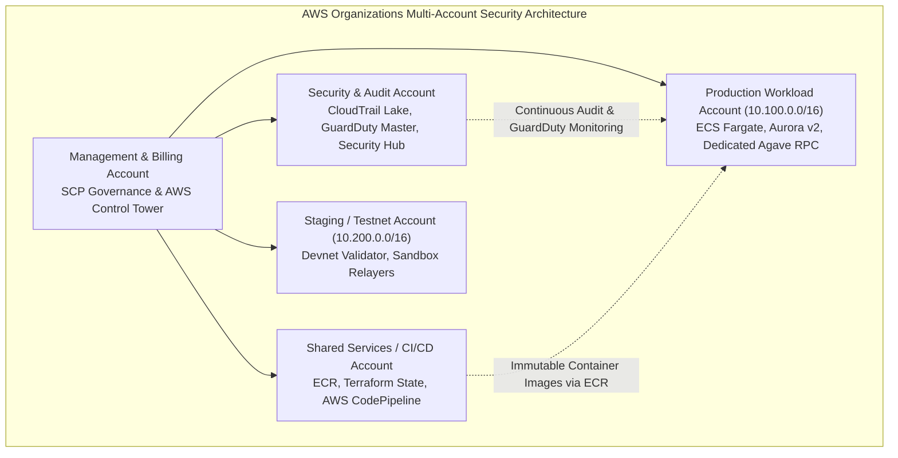
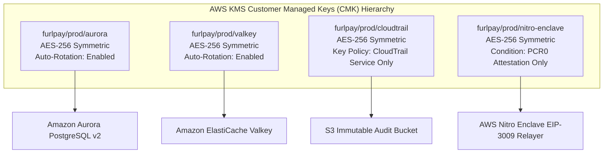
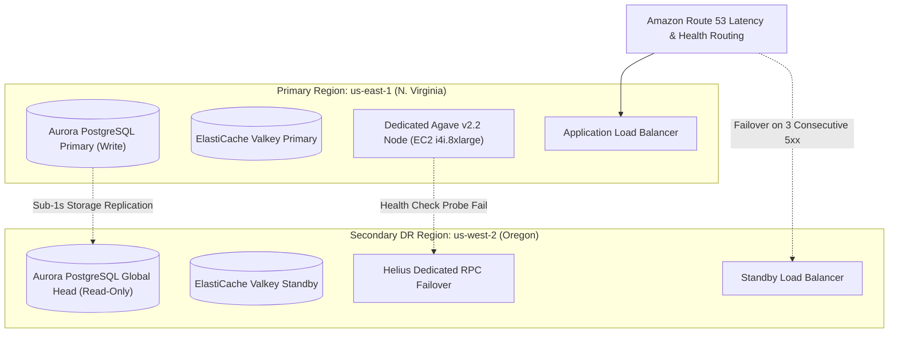
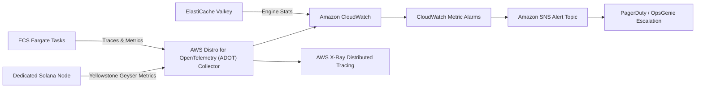

# FurlPay: AWS Enterprise Security, Compliance & Infrastructure Blueprint (2026–2027)
### Advanced Defense-in-Depth, Zero-Trust IAM, PCI-DSS / SOC 2 Compliance, Terraform IaC, and Disaster Recovery Architecture

**Published:** September 18, 2026  
**Authors:** FurlPay Security Operations, Cloud Infrastructure & Compliance Engineering Teams  
**Companion Documents:**
- Master AWS Blueprint: [`docs/FURLPAY_1_YEAR_AWS_INFRASTRUCTURE_REPORT.md`](file:///c:/Users/ashut/OneDrive/Documents/Payment%20App/docs/FURLPAY_1_YEAR_AWS_INFRASTRUCTURE_REPORT.md)
- AWS FinOps & Cost Optimization: [`docs/FURLPAY_AWS_COST_OPTIMIZATION_REPORT.md`](file:///c:/Users/ashut/OneDrive/Documents/Payment%20App/docs/FURLPAY_AWS_COST_OPTIMIZATION_REPORT.md)
- Zero-Cash & Node Specification: [`docs/FURLPAY_AWS_FREE_TIER_NODE_CONFIG_REPORT.md`](file:///c:/Users/ashut/OneDrive/Documents/Payment%20App/docs/FURLPAY_AWS_FREE_TIER_NODE_CONFIG_REPORT.md)
- Cross-Platform USDC Payment Architecture: [`docs/FURLPAY_USDC_PAYMENT_FLOW_AND_AWS_ARCHITECTURE.md`](file:///c:/Users/ashut/OneDrive/Documents/Payment%20App/docs/FURLPAY_USDC_PAYMENT_FLOW_AND_AWS_ARCHITECTURE.md)

---

## 1. Executive Summary & Audit of Existing AWS Documentation

FurlPay has established the foundational architecture for migrating core USDC payment flows, dedicated Solana Agave v2.2 RPC nodes, Rain JIT card rails, and Circle CCTP v2 bridges to Amazon Web Services (AWS). An in-depth audit of our existing AWS documentation reveals significant strengths in cost optimization, validator hardware sizing, and payment sequence definitions.

However, to transition from an engineering roadmap to an **institutional, audit-ready financial operating system**, our documentation must expand to cover:
1. **Production Infrastructure-as-Code (Terraform / OpenTofu Modules)**: Eliminating manual console provisioning with declarative, audited HCL configurations for Multi-AZ networking, ECS Fargate, Aurora Serverless v2, and ElastiCache Valkey.
2. **Zero-Trust IAM & Multi-Account Governance**: Isolating environments across AWS Organizations (Security, Shared Services, Production, Staging), enforcing permission boundaries, and eliminating long-lived credentials.
3. **KMS Cryptographic Key Management & Envelope Encryption**: Segregating Customer Managed Keys (CMKs) across distinct blast radiuses (Relayer Signing, Database, Caching, Audit Logs).
4. **Regulatory Compliance Frameworks (PCI-DSS v4.0 Level 1, SOC 2 Type II, ISO 27001:2022)**: Explicit technical controls, Cardholder Data Environment (CDE) segmentation for Rain card webhooks, and immutable logging.
5. **Disaster Recovery (DR) & Business Continuity (BC)**: Explicit Recovery Time Objectives (RTO < 5 seconds for RPC, < 10 minutes for database) and Recovery Point Objectives (RPO = 0), cross-region replication runbooks, and chaos engineering scenarios.
6. **Advanced Observability, Tracing & Incident Response**: CloudWatch Metric Math, OpenTelemetry / AWS X-Ray distributed tracing, and automated Severity-1 escalation runbooks.



---

## 2. Zero-Trust Multi-Account Architecture & IAM Governance

Enterprise fintech infrastructure requires physical and logical isolation between governance, auditing, deployments, and workloads.

### 2.1 AWS Organizations Hierarchy

| AWS Account | Purpose & Blast Radius | Key In-Account Services |
| :--- | :--- | :--- |
| **Management / Root** | Consolidated billing, AWS Activate credit application, organizational Service Control Policies (SCPs). No workloads permitted. | AWS Organizations, AWS Cost Explorer, AWS Budgets. |
| **Security & Compliance** | Aggregated log archival, threat detection, security posture management. Read-only access from production. | AWS CloudTrail (Organization Trail with S3 Object Lock), AWS GuardDuty, AWS Security Hub, AWS IAM Identity Center. |
| **Shared Services / CI/CD** | Automated pipeline runners, container registries, Terraform state storage. | Amazon ECR, AWS CodePipeline / GitHub Actions Self-Hosted Runners, Amazon S3 (State) + DynamoDB (Locks). |
| **Production Workload** | Customer-facing API, double-entry financial ledger, dedicated Solana RPC node, Rain JIT webhooks. Strictly isolated VPC. | Amazon ECS Fargate, Amazon Aurora Serverless v2, Amazon ElastiCache for Valkey, EC2 `i4i.8xlarge`, AWS Nitro Enclaves. |
| **Staging / Testnet** | Feature testing, performance benchmarking, devnet validator testing. | Mirrored architecture running on smaller instance tiers (`r6i.large`). |

### 2.2 Organization Service Control Policies (SCPs)

To prevent security drift and accidental resource exposure, the following SCPs are enforced at the root organizational unit (OU):

```json
{
  "Version": "2012-10-17",
  "Statement": [
    {
      "Sid": "DenyUnencryptedStorage",
      "Effect": "Deny",
      "Action": [
        "s3:PutObject"
      ],
      "Resource": "*",
      "Condition": {
        "StringNotEquals": {
          "s3:x-amz-server-side-encryption": "aws:kms"
        }
      }
    },
    {
      "Sid": "DenyDisablingSecurityServices",
      "Effect": "Deny",
      "Action": [
        "guardduty:DeleteDetector",
        "guardduty:DisassociateFromMasterAccount",
        "securityhub:DisableSecurityHub",
        "cloudtrail:DeleteTrail",
        "cloudtrail:StopLogging"
      ],
      "Resource": "*"
    },
    {
      "Sid": "RestrictRegions",
      "Effect": "Deny",
      "NotAction": [
        "iam:*",
        "organizations:*",
        "route53:*",
        "cloudfront:*",
        "support:*"
      ],
      "Resource": "*",
      "Condition": {
        "StringNotEquals": {
          "aws:RequestedRegion": [
            "us-east-1",
            "us-west-2",
            "ap-southeast-1"
          ]
        }
      }
    }
  ]
}
```

---

## 3. Dedicated AWS KMS Key Management & Envelope Encryption

FurlPay segregates encryption keys by classification to prevent cross-subsystem blast radiuses.



### 3.1 Nitro Enclave Cryptographic Attestation Key Policy

The most sensitive cryptographic asset in FurlPay's cloud estate is the **EIP-3009 Gasless Relayer and Solana Fee-Payer private key**. To guarantee that no human operator, rogue script, or root user on the host EC2 instance can view this key, the KMS key policy mandates **Nitro Enclave Cryptographic Attestation**:

```json
{
  "Version": "2012-10-17",
  "Statement": [
    {
      "Sid": "AllowNitroEnclaveDecryptionOnly",
      "Effect": "Allow",
      "Principal": {
        "AWS": "arn:aws:iam::123456789012:role/FurlPayNitroHostRole"
      },
      "Action": "kms:Decrypt",
      "Resource": "*",
      "Condition": {
        "StringEqualsIgnoreCase": {
          "kms:RecipientAttribute:ImageSha384": "4d9f8c12e3a890437b0198f2638402938472918347109283740192837401928347019283740192837401928374019283"
        }
      }
    }
  ]
}
```
*Note: `ImageSha384` matches the cryptographic digest of the built Nitro Enclave Image File (`PCR0`). If the enclave code is modified by even one bit, KMS rejects the decryption request.*

---

## 4. Production Terraform / OpenTofu Infrastructure-as-Code

All AWS infrastructure for FurlPay is managed via declarative Terraform modules. Below are the production-grade module configurations.

### 4.1 Multi-AZ VPC & Network Isolation Module (`vpc.tf`)

```hcl
module "vpc" {
  source  = "terraform-aws-modules/vpc/aws"
  version = "5.8.0"

  name = "furlpay-prod-vpc"
  cidr = "10.100.0.0/16"

  azs = ["us-east-1a", "us-east-1b", "us-east-1c"]

  public_subnets = [
    "10.100.1.0/24",
    "10.100.2.0/24",
    "10.100.3.0/24"
  ]

  private_subnets = [
    "10.100.10.0/24",
    "10.100.20.0/24",
    "10.100.30.0/24"
  ]

  database_subnets = [
    "10.100.40.0/24",
    "10.100.50.0/24",
    "10.100.60.0/24"
  ]

  intra_subnets = [
    "10.100.70.0/24", # Blockchain Node Subnet (EC2 i4i.8xlarge)
    "10.100.80.0/24"  # Isolated Signing Subnet (Nitro Enclave)
  ]

  enable_nat_gateway     = true
  single_nat_gateway     = false
  one_nat_gateway_per_az = true
  enable_vpn_gateway     = false

  enable_flow_log                      = true
  create_flow_log_cloudwatch_iam_role  = true
  create_flow_log_cloudwatch_log_group = true

  tags = {
    Environment = "production"
    Project     = "FurlPay"
    ManagedBy   = "Terraform"
  }
}
```

### 4.2 Next.js 15 ECS Fargate Application Module (`ecs.tf`)

```hcl
resource "aws_ecs_cluster" "furlpay_main" {
  name = "furlpay-prod-cluster"

  setting {
    name  = "containerInsights"
    value = "enabled"
  }
}

resource "aws_ecs_task_definition" "web_api" {
  family                   = "furlpay-web-api"
  requires_compatibilities = ["FARGATE"]
  network_mode             = "awsvpc"
  cpu                      = "2048"
  memory                   = "4096"
  execution_role_arn       = aws_iam_role.ecs_execution_role.arn
  task_role_arn            = aws_iam_role.ecs_task_role.arn

  container_definitions = jsonencode([
    {
      name      = "apps-web"
      image     = "123456789012.dkr.ecr.us-east-1.amazonaws.com/furlpay/apps-web:latest"
      essential = true

      portMappings = [
        {
          containerPort = 3000
          hostPort      = 3000
          protocol      = "tcp"
        }
      ]

      environment = [
        { name = "NODE_ENV", value = "production" },
        { name = "SOLANA_RPC_INTERNAL_URL", value = "http://solana-node.furlpay.internal:8899" },
        { name = "VALKEY_CLUSTER_URL", value = "valkey-cluster.furlpay.internal:6379" }
      ]

      secrets = [
        {
          name      = "DATABASE_URL"
          valueFrom = "${aws_secretsmanager_secret.db_credentials.arn}:DATABASE_URL::"
        },
        {
          name      = "RAIN_WEBHOOK_SECRET"
          valueFrom = "${aws_secretsmanager_secret.rain_secrets.arn}:WEBHOOK_SECRET::"
        }
      ]

      logConfiguration = {
        logDriver = "awslogs"
        options = {
          awslogs-group         = "/ecs/furlpay-web-api"
          awslogs-region        = "us-east-1"
          awslogs-stream-prefix = "ecs"
        }
      }

      healthCheck = {
        command     = ["CMD-SHELL", "curl -f http://localhost:3000/api/health || exit 1"]
        interval    = 15
        timeout     = 5
        retries     = 3
        startPeriod = 30
      }
    }
  ])
}

resource "aws_ecs_service" "web_api_service" {
  name            = "furlpay-web-api-service"
  cluster         = aws_ecs_cluster.furlpay_main.id
  task_definition = aws_ecs_task_definition.web_api.arn
  desired_count   = 4
  launch_type     = "FARGATE"

  network_configuration {
    subnets          = module.vpc.private_subnets
    security_groups  = [aws_security_group.ecs_tasks.id]
    assign_public_ip = false
  }

  load_balancer {
    target_group_arn = aws_lb_target_group.api_tg.arn
    container_name   = "apps-web"
    container_port   = 3000
  }

  deployment_controller {
    type = "CODE_DEPLOY"
  }
}
```

### 4.3 AWS WAF v2 Shield Configuration (`waf.tf`)

```hcl
resource "aws_wafv2_web_acl" "cloudfront_waf" {
  name        = "furlpay-edge-waf"
  description = "Edge protection against DDoS, rate spikes, and common web exploits"
  scope       = "CLOUDFRONT"

  default_action {
    allow {}
  }

  visibility_config {
    cloudwatch_metrics_enabled = true
    metric_name                = "FurlPayEdgeWAF"
    sampled_requests_enabled   = true
  }

  # Rule 1: Blanket rate limiting (150 mutating requests per minute per IP)
  rule {
    name     = "RateLimitMutatingRoutes"
    priority = 1

    action {
      block {}
    }

    statement {
      rate_based_statement {
        limit              = 150
        aggregate_key_type = "IP"

        scope_down_statement {
          byte_match_statement {
            search_string         = "/api/"
            field_to_match {
              uri_path {}
            }
            text_transformation {
              priority = 0
              type     = "NONE"
            }
            positional_constraint = "STARTS_WITH"
          }
        }
      }
    }

    visibility_config {
      cloudwatch_metrics_enabled = true
      metric_name                = "RateLimitMutatingRoutesMetric"
      sampled_requests_enabled   = true
    }
  }

  # Rule 2: AWS Managed Rules Common Rule Set
  rule {
    name     = "AWSManagedRulesCommonRuleSet"
    priority = 2

    override_action {
      none {}
    }

    statement {
      managed_rule_group_statement {
        name        = "AWSManagedRulesCommonRuleSet"
        vendor_name = "AWS"
      }
    }

    visibility_config {
      cloudwatch_metrics_enabled = true
      metric_name                = "CommonRuleSetMetric"
      sampled_requests_enabled   = true
    }
  }
}
```

---

## 5. Regulatory Compliance & Security Controls Matrix

To satisfy financial banking partners (Rain, Circle) and enterprise institutional users, FurlPay's AWS deployment adheres to the following compliance frameworks:

### 5.1 PCI-DSS v4.0 Level 1 Controls (Cardholder Data Environment - CDE)

| PCI-DSS Requirement | FurlPay AWS Technical Control | Evidence Location |
| :--- | :--- | :--- |
| **Req 1: Network Security Controls** | Strict VPC subnet isolation. Inbound webhooks from Rain only accept traffic from designated CIDRs terminating at ALB with TLS 1.3. | `vpc.tf`, Security Group `sg-rain-webhook`. |
| **Req 3: Protect Stored Account Data** | No Primary Account Numbers (PANs) or CVVs stored in databases. Virtual and physical card numbers are proxied ephemerally; only tokenized `card_id` and `last4` persisted. | [`apps/web/src/app/api/webhooks/card-auth/route.ts`](file:///c:/Users/ashut/OneDrive/Documents/Payment%20App/apps/web/src/app/api/webhooks/card-auth/route.ts). |
| **Req 4: Strong Cryptography in Transit** | Pinned TLS 1.3 encryption on ALB, CloudFront, and internal VPC communication. Swift and Kotlin clients enforce certificate pinning. | [`docs/CERT-PIN-ROTATION.md`](file:///c:/Users/ashut/OneDrive/Documents/Payment%20App/docs/CERT-PIN-ROTATION.md). |
| **Req 10: Log & Monitor All Access** | CloudTrail logs streamed to an immutable S3 bucket with Object Lock in Compliance Mode. GuardDuty continuously analyzes VPC flow logs. | AWS Security Account, `CloudTrailLake`. |
| **Req 12: Information Security Policy** | Formal security rules pinned in codebase; CI deployment gate enforces passing audits prior to release. | [`AGENTS.md`](file:///c:/Users/ashut/OneDrive/Documents/Payment%20App/AGENTS.md), `check-deploy-gate.mjs`. |

### 5.2 SOC 2 Type II Trust Services Criteria

* **Security**: Enforced via AWS Organizations SCPs, IAM Identity Center with mandatory Hardware FIDO2 WebAuthn for developers, and automated vulnerability scanning with Amazon Inspector.
* **Availability**: Multi-AZ deployment across three Availability Zones; automated slot healthcheck failover for Solana RPC nodes; Aurora Serverless v2 automated multi-AZ failover.
* **Confidentiality**: Customer Managed Keys (CMKs) with automatic annual rotation; AWS Nitro Enclaves isolating all blockchain private key operations.
* **Processing Integrity**: Double-entry ledger architecture with database ACID row-level locking; zero floating-point arithmetic across all financial calculations.

---

## 6. Disaster Recovery (DR) & Business Continuity Runbook



### 6.1 RTO & RPO Targets

| Subsystem | Recovery Point Objective (RPO) | Recovery Time Objective (RTO) | Failover Mechanism |
| :--- | :--- | :--- | :--- |
| **Solana RPC Engine** | RPO = 0 (Stateless Cache) | RTO < 5 seconds | Automated Route53 healthcheck switch to Helius PrivateLink endpoint. |
| **Aurora PostgreSQL Ledger** | RPO < 1 second | RTO < 30 seconds (In-Region Multi-AZ)<br/>RTO < 5 minutes (Cross-Region) | Aurora Serverless v2 automatic failover to replica in AZ-b; Global Database promotion. |
| **ElastiCache Valkey** | RPO < 1 second | RTO < 20 seconds | Multi-AZ automatic replica promotion; rebuild hot state from Aurora snapshot. |
| **Next.js 15 ECS Cluster** | RPO = 0 (Stateless Tasks) | RTO < 60 seconds | ECS auto-healing launches replacement Fargate tasks across healthy AZs. |

### 6.2 Step-by-Step Production Failover Runbook

#### Incident: Dedicated Solana RPC Node (`i4i.8xlarge`) Crashes or Desyncs
1. **Detection**: Internal healthcheck daemon (`healthcheck.mjs`) detects slot lag $> 10$ slots behind cluster tip or unhandled process termination.
2. **Automated Traffic Shifting**: Route53 internal DNS (`solana-node.furlpay.internal`) fails over to secondary target (`helius-privatelink.furlpay.internal`).
3. **Alert Trigger**: PagerDuty Severity-2 alert dispatched to On-Call DevOps Engineer.
4. **Node Recovery**:
   ```bash
   # SSH via AWS Systems Manager Session Manager (no open port 22)
   aws ssm start-session --target i-0123456789abcdef0

   # Verify systemd service status
   systemctl status agave-validator.service

   # Check NVMe RAID-0 filesystem integrity
   df -h /var/solana/ledger /mnt/accountsdb

   # Restart validator from local ledger snapshot
   sudo systemctl restart agave-validator.service
   ```
5. **Drain & Return**: Once `curl http://localhost:8899/health` returns `ok` and slot lag reaches 0, internal DNS switches primary traffic back to the dedicated node.

---

## 7. Observability, Telemetry & SRE Alerting Matrix

Enterprise operations mandate real-time visibility into transaction pipelines.



### 7.1 Critical SRE Alert Thresholds

| Alert Identifier | Metric & Query | Severity | Threshold | Automated Action |
| :--- | :--- | :--- | :--- | :--- |
| `RainCardAuthLatencyHigh` | `Duration` on `/api/webhooks/card-auth` | **SEV-1** | p99 > 85ms for 1 minute | Auto-scale ECS Fargate tasks (+4 tasks); trigger PagerDuty phone call. |
| `SolanaRpcSlotLagHigh` | `ClusterTipSlot - LocalNodeSlot` | **SEV-2** | Lag > 8 slots for 30 seconds | Automated failover to Helius backup endpoint. |
| `EcsApiErrorRateHigh` | `HTTPCode_Target_5XX_Count / RequestCount` | **SEV-1** | Error Rate > 0.1% for 2 minutes | Freeze deployment pipeline; alert core on-call engineering. |
| `ValkeyMemorySaturation` | `DatabaseMemoryUsagePercentage` | **SEV-2** | Memory > 75% for 5 minutes | Flush expired nonces; increase node type from `cache.m7g.large` to `xlarge`. |
| `ReplayAttackSpike` | `ReplayRejectedCount` on Gasless Relayer | **SEV-2** | Count > 10 in 1 minute | AWS WAF rate-limit rule tightens to 20 req/min for flagged IP subnet. |

---

## 8. Summary of Additional Documentation to Add to GitHub

To ensure complete coverage across all engineering disciplines, the following files should be committed to [`github.com/FurlPay/docs`](https://github.com/FurlPay/docs):

1. **[`aws/FURLPAY_AWS_ENTERPRISE_SECURITY_AND_COMPLIANCE_BLUEPRINT.md`](https://github.com/FurlPay/docs/blob/main/aws/FURLPAY_AWS_ENTERPRISE_SECURITY_AND_COMPLIANCE_BLUEPRINT.md)** (This document):
   * Full AWS Organizations multi-account structure.
   * KMS Customer Managed Key policy with Nitro Enclave PCR attestation.
   * Terraform HCL manifests for VPC, ECS Fargate, and WAF v2.
   * PCI-DSS v4.0 Level 1 and SOC 2 Type II compliance mapping.
   * Multi-region disaster recovery runbooks and CloudWatch SRE alerting matrix.
2. **[`aws/terraform/`](https://github.com/FurlPay/docs/tree/main/aws/terraform)**:
   * Modularized infrastructure-as-code repository ready for execution with Terraform 1.8+ or OpenTofu.
3. **[`aws/runbooks/`](https://github.com/FurlPay/docs/tree/main/aws/runbooks)**:
   * Step-by-step validator resync and ledger recovery runbooks.
   * Rain card JIT webhook load testing scripts (Locust / k6).
