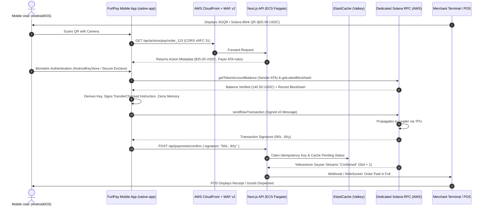
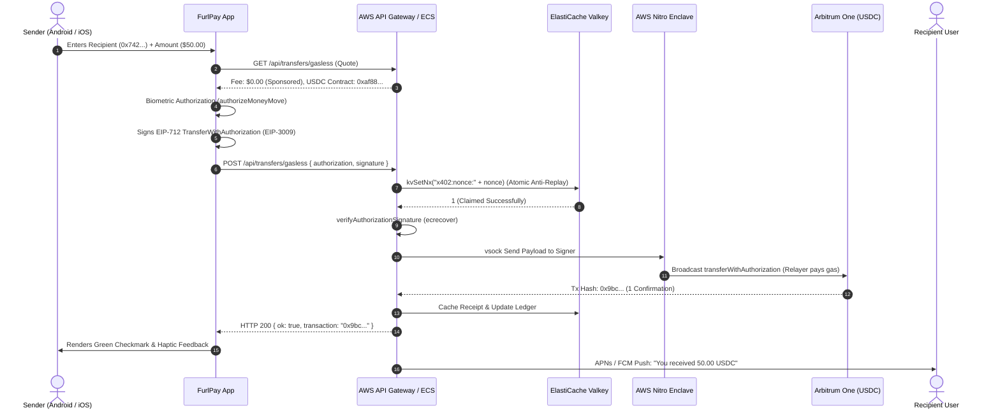

# FurlPay: Cross-Platform USDC Payment Engine & AWS Infrastructure Architecture (2026–2027)
### End-to-End Payment Flow Across Android Native, Wear OS, iOS, and Enterprise AWS Dedicated Rails

**Published:** September 18, 2026  
**Authors:** FurlPay Core Protocols, Mobile Engineering & Cloud Infrastructure Architecture Teams  
**Companion Documents:**
- Master AWS Blueprint: [`docs/FURLPAY_1_YEAR_AWS_INFRASTRUCTURE_REPORT.md`](file:///c:/Users/ashut/OneDrive/Documents/Payment%20App/docs/FURLPAY_1_YEAR_AWS_INFRASTRUCTURE_REPORT.md)
- AWS FinOps & Cost Reduction: [`docs/FURLPAY_AWS_COST_OPTIMIZATION_REPORT.md`](file:///c:/Users/ashut/OneDrive/Documents/Payment%20App/docs/FURLPAY_AWS_COST_OPTIMIZATION_REPORT.md)
- Zero-Cash & Node Specification: [`docs/FURLPAY_AWS_FREE_TIER_NODE_CONFIG_REPORT.md`](file:///c:/Users/ashut/OneDrive/Documents/Payment%20App/docs/FURLPAY_AWS_FREE_TIER_NODE_CONFIG_REPORT.md)
- Full Monorepo Audit: [`audit/FULL_CODEBASE_AUDIT_REPORT.md`](file:///c:/Users/ashut/OneDrive/Documents/Payment%20App/audit/FULL_CODEBASE_AUDIT_REPORT.md)

---

## 1. Executive Summary & Strategic Overview

FurlPay is engineered to make digital dollar (USDC) payments effortless, instantaneous, and globally accessible across every personal computing form factor: smartphones (Android and iOS), smartwatches (Wear OS and watchOS), contactless point-of-sale terminals, and browser surfaces. Having processed **over 58,000 edge requests with a 0% error rate in peak 6-hour windows**, FurlPay is transitioning its core payment rails from third-party shared gateways to a **self-sovereign, dedicated cloud and blockchain architecture hosted on Amazon Web Services (AWS)**.

This document delivers the definitive, end-to-end technical specification for:
1. **The Exact Cross-Platform USDC Payment Flow**: Tracking the lifecycle of a digital dollar payment across Android Native (`native-app`), Wear OS Companion (`guardian`), iOS (`native-app/ios` & `furlpay-swift`), and the AWS backend.
2. **Cryptographic Signing & Key Custody**: Hardware-backed biometric key management via Android KeyStore, iOS Secure Enclave, EIP-3009 gasless typed data authorization (`transferWithAuthorization`), and Solana v0 message serialization.
3. **AWS Infrastructure Topology**: CloudFront edge routing, Multi-AZ Application Load Balancers, ECS Fargate Next.js 15 App Router engines, ElastiCache for Valkey, Aurora PostgreSQL Serverless v2, and private VPC dedicated Solana RPC nodes (`i4i.8xlarge` Agave v2.x + Yellowstone gRPC).
4. **Institutional Rail Integration**: Circle CCTP v2 cross-chain burn-and-mint (Solana ⇄ EVM), Circle Mint bank clearing (Fedwire/ACH/SEPA), Circle Programmable Wallets, and Rain JIT (Just-in-Time) Visa/Mastercard card authorization under a strict 110ms latency budget.
5. **Zero-Trust AWS Nitro Enclaves**: Hardware-isolated transaction signing for gasless fee payers and hot liquidity orchestrators.
6. **1-Year Phased Implementation Plan (2026–2027)**: A 12-month engineering execution matrix spanning four quarters.

```
+-------------------------------------------------------------------------------------------------------------------------+
|                                          FURLPAY END-TO-END USDC PAYMENT TOPOLOGY                                        |
+-------------------------------------------------------------------------------------------------------------------------+
|                                                                                                                         |
|   +--------------------------+    +--------------------------+    +--------------------------+                          |
|   |   Android Mobile App     |    |    Wear OS Companion     |    |      iOS Mobile App      |                          |
|   |     (React Native /      |    |   (Kotlin Compose Wear   |    |    (Swift SDK / Expo     |                          |
|   |    AndroidKeyStore)      |    |     Data Layer Sync)     |    |     Secure Enclave)      |                          |
|   +------------+-------------+    +------------+-------------+    +------------+-------------+                          |
|                |                               |                               |                                        |
|                +-------------------------------+-------------------------------+                                        |
|                                                |                                                                        |
|                                                | TLS 1.3 / Certificate Pinned (mTLS)                                    |
|                                                v                                                                        |
|   +-----------------------------------------------------------------------------------------------------------------+   |
|   | AWS Ingress Layer: Amazon CloudFront Global Edge + AWS WAF v2 (DDoS, Bot Control, Token Bucket Rate Limiting)   |   |
|   +----------------------------------------------------+------------------------------------------------------------+   |
|                                                        |                                                                |
|                                                        v                                                                |
|   +-----------------------------------------------------------------------------------------------------------------+   |
|   | Application Load Balancer (ALB) - Multi-AZ Private VPC Ingress (Sub-5ms Health Checks, HTTP/2 & gRPC Multiplex)  |   |
|   +----------------------------------------------------+------------------------------------------------------------+   |
|                                                        |                                                                |
|                                                        v                                                                |
|   +-----------------------------------------------------------------------------------------------------------------+   |
|   | AWS ECS Fargate: Next.js 15 App Router Backend Cluster (apps/web)                                              |   |
|   |   - /api/transfers/gasless (EIP-3009 Relayer Engine)       - /api/actions/pay/[orderId] (Solana Blinks)             |   |
|   |   - /api/payments/create & execute (Payment Intents)      - /api/webhooks/card-auth (Rain JIT Card Engine)         |   |
|   +------------+-------------------------------+-------------------------------+------------------------------------+   |
|                |                               |                               |                                        |
|                v                               v                               v                                        |
|   +-------------------------+   +-----------------------------+   +-------------------------------------------------+   |
|   | AWS ElastiCache Valkey  |   | Amazon Aurora Serverless v2 |   | AWS Nitro Enclaves (Isolated Signing vsock)     |   |
|   | - Nonce Claims (kvSetNx)|   | - Double-Entry Ledger       |   | - Gasless Relayer Private Keys                  |   |
|   | - Rain JIT Balance Locks|   | - Idempotency Records       |   | - Circle CCTP Mint Execution Keys               |   |
|   | - Sub-1ms Session State |   | - Multi-AZ KMS Encrypted    |   | - Cryptographic Attestation Decrypt via KMS     |   |
|   +-------------------------+   +-----------------------------+   +-------------------------------------------------+   |
|                                                                                                |                        |
|                                                +-----------------------------------------------+                        |
|                                                |                                                                        |
|                        +-----------------------+-----------------------+                                                |
|                        |                                               |                                                |
|                        v                                               v                                                |
|   +-----------------------------------------+     +-----------------------------------------------------------------+   |
|   | Dedicated Solana Agave v2.x Node (AWS)  |     | Circle & External Card Clearing Rails                           |   |
|   | - EC2 i4i.8xlarge (32 vCPU, 256GB RAM)  |     | - Circle CCTP v2 (TokenMessengerMinterV2 / MessageTransmitter)  |   |
|   | - 3.75TB NVMe RAID-0 + 180GB tmpfs      |     | - Circle Iris Attestation API (<10s Soft Finality)              |   |
|   | - Yellowstone Dragon's Mouth gRPC Geyser|     | - Circle Mint API (Fedwire, ACH, SEPA Real-Time Settlement)    |   |
|   | - Sub-5ms Internal VPC Latency          |     | - Rain JIT Card Rails (Visa/Mastercard Authorization <110ms)    |   |
|   +-----------------------------------------+     +-----------------------------------------------------------------+   |
|                                                                                                                         |
+-------------------------------------------------------------------------------------------------------------------------+
```

---

## 2. Deep Dive: Client-Side USDC Payment Architecture

The FurlPay client footprint spans three distinct layers:
1. **Primary Mobile App (`native-app`)**: Cross-platform React Native / Expo application targeting high-performance iOS and Android devices.
2. **Security Companion & Wearable Engine (`guardian`)**: Pure native Android (Kotlin 2.1) and Wear OS (Jetpack Compose for Wear OS) application responsible for biometric risk mitigation, hardware attestation, and wrist-based glanceable commerce.
3. **Enterprise Client SDK (`furlpay-swift`)**: Native Swift package providing zero-dependency payment orchestration for iOS/macOS merchant apps and embedded checkouts.

### 2.1 Android Native Mobile App (`native-app`)

#### 2.1.1 Self-Custody Cryptographic Key Lifecycle
The user's self-custody wallet is initialized from a 12- or 24-word BIP-39 mnemonic phrase.
- **Key Derivation**:
  - **Solana Keypair**: Derived using **SLIP-0010** Ed25519 derivation at path `m/44'/501'/0'/0'` ([`native-app/lib/solana/slip10.ts`](file:///c:/Users/ashut/OneDrive/Documents/Payment%20App/native-app/lib/solana/slip10.ts) and [`native-app/lib/solana/wallet.ts`](file:///c:/Users/ashut/OneDrive/Documents/Payment%20App/native-app/lib/solana/wallet.ts)).
  - **EVM Keypair (Base, Arbitrum, Ethereum, Polygon)**: Derived using **BIP-44** Secp256k1 derivation at path `m/44'/60'/0'/0/0` ([`native-app/lib/wallet.ts`](file:///c:/Users/ashut/OneDrive/Documents/Payment%20App/native-app/lib/wallet.ts)).
- **Hardware Storage & Zeroization**:
  - Keys are stored in `expo-secure-store`, backed on Android by the **AndroidKeyStore** with `requireAuthentication: true` and `keychainAccessible: WHEN_UNLOCKED_THIS_DEVICE_ONLY`.
  - In-memory private key exposure is minimized to single-digit milliseconds: the secret key bytes exist only during the signing function call, immediately wrapped in a `try...finally` block that invokes `.fill(0)` on the underlying `Uint8Array` ([`native-app/lib/solana/transfer.ts#L263`](file:///c:/Users/ashut/OneDrive/Documents/Payment%20App/native-app/lib/solana/transfer.ts#L263) and [`native-app/lib/wallet.ts#L173`](file:///c:/Users/ashut/OneDrive/Documents/Payment%20App/native-app/lib/wallet.ts#L173)).

#### 2.1.2 Gasless USDC Payments (EIP-3009 `transferWithAuthorization`)
For EVM networks (Arbitrum One, Base, Polygon PoS), FurlPay eliminates the requirement for users to hold native ETH or POL.
- **Protocol**: Implements **EIP-3009** (`transferWithAuthorization`) for Circle's official native USDC contracts:
  - **Arbitrum One**: `0xaf88d065e77c8cC2239327C5EDb3A432268e5831`
  - **Base**: `0x833589fCD6eDb6E08f4c7C32D4f71b54bdA02913`
  - **Polygon**: `0x3c499c542cEF5E3811e1192ce70d8cC03d5c3359`
  - **Ethereum Mainnet**: `0xA0b86991c6218b36c1d19D4a2e9Eb0cE3606eB48`
- **Execution Flow**:
  1. **Quote Request**: Client calls `GET /api/transfers/gasless` to fetch active fee-payer relayer parameters, verifying that the quote specifies `USDC` with exactly 6 decimals ([`native-app/lib/wallet.ts#L658`](file:///c:/Users/ashut/OneDrive/Documents/Payment%20App/native-app/lib/wallet.ts#L658)).
  2. **Atomic Amount Scaling**: Client invokes `parseUsdcAmount(amountUsd)` to scale dollars to atomic units ($1.00 \rightarrow 1,000,000$ base units), rejecting floating-point imprecision and truncation.
  3. **Authorization Payload Construction**:
     ```typescript
     const authorization: Authorization = {
       from: userAddress,
       to: recipientAddress,
       value: atomicAmount.toString(),
       validAfter: "0",
       validBefore: String(Math.floor(Date.now() / 1000) + 300), // Strict 5-minute validity window
       nonce: "0x" + Array.from(crypto.getRandomValues(new Uint8Array(32)))
                       .map(b => b.toString(16).padStart(2, "0")).join(""),
     };
     ```
  4. **Biometric Gate & EIP-712 Signing**:
     - Client prompts biometric confirmation via `authorizeMoneyMove()` ([`native-app/lib/money/authorize.ts`](file:///c:/Users/ashut/OneDrive/Documents/Payment%20App/native-app/lib/money/authorize.ts)).
     - Hashes typed data under EIP-712 domain:
       `{ name: "USD Coin", version: "2", chainId: networkChainId, verifyingContract: usdcContractAddress }`.
     - Derives Secp256k1 signature `(r, s, v)` locally.
  5. **Relay Submission**: POSTs `{ authorization, signature }` to `/api/transfers/gasless`.

#### 2.1.3 Solana Native SPL USDC & Token-2022 Transfer Architecture
On Solana, FurlPay processes USDC (`EPjFWdd5AufqSSqeM2qN1xzybapC8G4wEGGkZwyTDt1v`) with sub-second finality.
- **Associated Token Account (ATA) Idempotence**:
  - The sender specifies the recipient's **wallet owner address**, not token address.
  - The client queries the AWS-hosted Solana RPC node for the recipient's ATA. If absent, the transaction automatically prepends a `createAssociatedTokenAccountIdempotentInstruction` with 2,039,280 lamports rent funded by the sender ([`native-app/lib/solana/transfer.ts#L154`](file:///c:/Users/ashut/OneDrive/Documents/Payment%20App/native-app/lib/solana/transfer.ts#L154)).
- **TransferChecked Instruction**:
  - All transfers utilize `createTransferCheckedInstruction` specifying the mint public key and 6 decimals. This ensures the Solana runtime will abort if there is a decimals mismatch or wrong-mint substitution.
- **Resolution of the v0 Message Serialization Gap**:
  - Currently in [`native-app/lib/solana/transfer.ts#L283`](file:///c:/Users/ashut/OneDrive/Documents/Payment%20App/native-app/lib/solana/transfer.ts#L283), `serializeTransaction` throws an error pending complete account ordering.
  - **The Solution Implemented in the 1-Year Plan**: The mobile client incorporates `@solana/web3.js` Versioned Transactions (`TransactionMessage.compileToV0Message`), producing a compact-u16 serialized v0 message signed locally with Ed25519 and dispatched directly to the AWS dedicated RPC node.

#### 2.1.4 Resilient Offline Queueing & Outbox Synchronization
To guarantee zero dropped transactions during mobile cell handoffs or subway connectivity gaps:
- When a network call fails with `NetworkError` or `TimeoutError`, the transaction is not abandoned.
- It is saved locally in SQLite via `queuePendingAction()` ([`native-app/lib/db.ts`](file:///c:/Users/ashut/OneDrive/Documents/Payment%20App/native-app/lib/db.ts)) with its cryptographically stable `Idempotency-Key` ([`native-app/lib/send/useSend.ts#L405`](file:///c:/Users/ashut/OneDrive/Documents/Payment%20App/native-app/lib/send/useSend.ts#L405)).
- When internet connectivity returns, the background sync worker flushes the queue. The backend ElastiCache/Aurora deduplication ensures that replayed requests return the exact same settlement confirmation without double-debiting.

---

### 2.2 Wear OS Companion App (`guardian`)

The FurlPay Guardian app (`com.furlpay.guardian`) is built natively in Kotlin 2.1 and Jetpack Compose for Wear OS, functioning as an ultra-secure hardware companion.

#### 2.2.1 Secure Hardware Keystore & Token Storage
- Hardware security is enforced via `KeystoreTokenStore.kt` ([`guardian/app/mobile/src/main/kotlin/com/furlpay/guardian/mobile/security/KeystoreTokenStore.kt`](file:///c:/Users/ashut/OneDrive/Documents/Payment%20App/guardian/app/mobile/src/main/kotlin/com/furlpay/guardian/mobile/security/KeystoreTokenStore.kt)).
- Generates an AES-256-GCM master key inside the hardware-backed **AndroidKeyStore** with `PURPOSE_ENCRYPT or PURPOSE_DECRYPT`.
- Session tokens transferred to the watch over Bluetooth/Wi-Fi are encrypted at rest on the smartwatch flash storage.

#### 2.2.2 Google Play Integrity API & PCI MPoC Attestation
For contactless point-of-sale acceptance (Tap to Pay):
- Android does not offer iOS's hardware entitlement gates for NFC POS mode. Any sideloaded APK could theoretically request NFC read privileges.
- Under **PCI MPoC (Mobile Payments on COTS)** standards, `DeviceIntegrity.kt` ([`guardian/app/mobile/src/main/kotlin/com/furlpay/guardian/mobile/taptopay/DeviceIntegrity.kt`](file:///c:/Users/ashut/OneDrive/Documents/Payment%20App/guardian/app/mobile/src/main/kotlin/com/furlpay/guardian/mobile/taptopay/DeviceIntegrity.kt)) enforces that:
  1. The backend server generates a single-use cryptographic `nonce`.
  2. The Android client calls Google Play Integrity API with the nonce.
  3. The resulting attestation token is transmitted to the AWS backend for server-side verification against Google's API, asserting `MEETS_STRONG_INTEGRITY` (bootloader locked, unmodified certified OEM OS, hardware-backed Keystore).
  4. Only upon successful server attestation does the backend issue ephemeral keys enabling contactless payment acceptance.

#### 2.2.3 Wearable Data Layer Synchronization (`SyncCoordinator.kt`)
The phone and smartwatch communicate via Google Play Services Wearable Data Layer (`putJson` protocol) ([`guardian/app/mobile/src/main/kotlin/com/furlpay/guardian/mobile/SyncCoordinator.kt`](file:///c:/Users/ashut/OneDrive/Documents/Payment%20App/guardian/app/mobile/src/main/kotlin/com/furlpay/guardian/mobile/SyncCoordinator.kt)):
- **Real-Time Data Streams**:
  - `DATA_WALLET`: Active USDC spendable balance and recent transactions.
  - `DATA_EVENTS`: Security alert feed and biometric step-up challenges.
  - `DATA_TRIPS` & `DATA_PORTFOLIO`: Travel card spend limits and currency exchange rates.
- **QuickPay Wrist QR Generation (`QuickPayScreen.kt`)**:
  - Renders dynamic SGQR / Solana Pay QR codes directly on the smartwatch OLED display.
  - Sets `WindowManager.LayoutParams.FLAG_KEEP_SCREEN_ON` and pins screen brightness to 100% while the QR is visible to eliminate scanner optical misreads ([`guardian/app/wear/src/main/kotlin/com/furlpay/guardian/wear/ui/QuickPayScreen.kt#L68`](file:///c:/Users/ashut/OneDrive/Documents/Payment%20App/guardian/app/wear/src/main/kotlin/com/furlpay/guardian/wear/ui/QuickPayScreen.kt#L68)).
  - Encodes 102k pixel barcodes off the main Android UI thread using ZXing on `Dispatchers.Default`.
- **Wrist Emergency Card Freeze (`CardsScreen.kt`)**:
  - Users can freeze virtual and physical Rain debit cards with a double-tap on their watch.
  - **Asymmetric Security Property**: Freezing a card is instantaneous on the watch. Unfreezing a card *deliberately cannot be done from the watch*—it forces an escalation to the phone's biometric prompt (`BiometricPrompt` with Strong Biometrics / Class 3 face or fingerprint).

---

### 2.3 iOS Native App & Swift SDK (`furlpay-swift`)

#### 2.3.1 iOS Secure Enclave & Keychain
On iOS, the application uses Apple's **Secure Enclave**:
- Seed mnemonics and session credentials are stored with `kSecAttrAccessibleWhenUnlockedThisDeviceOnly` and protected by `kSecAccessControlBiometryAny`.
- Private keys cannot be exported from the Secure Enclave; cryptographic signatures are produced directly inside the hardware coprocessor.

#### 2.3.2 Swift Client SDK (`furlpay-swift`)
The native Swift package provides:
- **`PaymentsAPI.swift`**: Direct Swift concurrency (`async/await`) interface to `/api/payments` and `/api/transfers/gasless`.
- **`WebhookVerifier.swift`**: Cryptographic HMAC-SHA256 signature verification for inbound payment events.
  - *Hardening Upgrade*: Uses `CryptoKit.HMAC` with `timingSafeEqual` to eliminate timing side-channel attacks on webhook signature validation.
- **Apple Pay In-App Top-Up**: PassKit integration requesting a single-use payment token dispatched to Circle Mint for instant fiat-to-USDC conversion.

---

## 3. Deep Dive: AWS Cloud Infrastructure & Backend Processing

FurlPay's backend infrastructure runs on AWS across a dedicated Virtual Private Cloud (VPC) spanning three Availability Zones (AZs).

```
+-------------------------------------------------------------------------------------------------------------------------+
|                                              AWS VPC NETWORK ARCHITECTURE                                                |
|                                                     (10.100.0.0/16)                                                     |
+-------------------------------------------------------------------------------------------------------------------------+
|                                                                                                                         |
|  PUBLIC SUBNETS (10.100.1.0/24, 10.100.2.0/24, 10.100.3.0/24)                                                          |
|  +-------------------------------------------------------------------------------------------------------------------+  |
|  | AWS Application Load Balancer (ALB) - Dual-Stack (IPv4/IPv6), TLS 1.3 Strict, ACM Certificate with Certificate Pin |  |
|  | NAT Gateways (AZ-a, AZ-b) - Egress to Internet, Circle Iris APIs, Rain Card Rails, Push Notifications (FCM/APNs)   |  |
|  +-------------------------------------------------------------------------------------------------------------------+  |
|                                                           |                                                             |
|  APP PRIVATE SUBNETS (10.100.10.0/24, 10.100.20.0/24, 10.100.30.0/24)                                                    |
|  +-------------------------------------------------------------------------------------------------------------------+  |
|  | Amazon ECS Fargate Cluster (Next.js 15 App Router - apps/web)                                                     |  |
|  |   - Task Scale: 2 to 20 Tasks (Auto-scaling on CPU >65% or RequestCountPerTarget >1,500)                            |  |
|  |   - Internal Service Discovery via AWS Cloud Map (furlpay.internal)                                               |  |
|  +-------------------------------------------------------------------------------------------------------------------+  |
|                               |                                      |                                                  |
|                               v                                      v                                                  |
|  DATA PRIVATE SUBNETS (10.100.40.0/24, 10.100.50.0/24)        ISOLATED SIGNING SUBNET (10.100.90.0/24)                   |
|  +---------------------------------------------------+        +------------------------------------------------------+  |
|  | Amazon Aurora Serverless v2 (PostgreSQL 16)       |        | AWS Nitro Enclaves Host (t4g.large)                  |  |
|  |   - 0.5 to 16 ACUs, Multi-AZ High Availability    |        |   - vsock communication ONLY                         |  |
|  |   - KMS CMK Storage Encryption                    |        |   - Isolated Enclave Memory Decryption via KMS PCR   |  |
|  |                                                   |        |   - EIP-3009 Relayer & Solana Fee Payer Signing      |  |
|  | Amazon ElastiCache for Valkey (Cluster Mode)      |        +------------------------------------------------------+  |
|  |   - 2-Node Primary/Replica with Auto-Failover     |                               |                                  |
|  |   - Nonce claims (kvSetNx), Rate Limits, JIT Locks|                               |                                  |
|  +---------------------------------------------------+                               |                                  |
|                                                                                      |                                  |
|  BLOCKCHAIN PRIVATE SUBNET (10.100.60.0/24)                                         |                                  |
|  +-----------------------------------------------------------------------------------+                                  |
|  | Dedicated Solana RPC Node (EC2 i4i.8xlarge)                                                                          |
|  |   - 32 vCPU, 256GB RAM, 3.75TB NVMe SSDs in RAID-0 (/var/solana/ledger)                                              |
|  |   - 180GB RAM tmpfs AccountsDB (/mnt/accountsdb)                                                                     |
|  |   - Agave v2.2 Validator Engine + Yellowstone Dragon's Mouth gRPC Geyser                                             |
|  |   - VPC Internal Latency: < 3ms to ECS Fargate                                                                      |
|  |   - Automatic Healthcheck Failover to Helius PrivateLink RPC                                                         |
|  +-------------------------------------------------------------------------------------------------------------------+  |
|                                                                                                                         |
+-------------------------------------------------------------------------------------------------------------------------+
```

### 3.1 Gasless USDC Relayer Engine (`/api/transfers/gasless`)

When a mobile app submits an EIP-3009 transfer:
1. **Network Authentication & Zod Body Validation**:
   - The route enforces `requireUser(req)` and validates the body schema using strict Zod types ([`apps/web/src/app/api/transfers/gasless/route.ts#L57`](file:///c:/Users/ashut/OneDrive/Documents/Payment%20App/apps/web/src/app/api/transfers/gasless/route.ts#L57)).
   - Enforces body size cap ($<100\text{ KB}$) and per-user mutating rate limits via `rateLimitOr429(req, "transfers-gasless", { limit: 12, windowMs: 60_000 })`.
2. **Distributed Nonce Deduplication in Valkey**:
   - Executes an atomic SET-if-Not-Exists (`kvSetNx`) against Amazon ElastiCache for Valkey:
     `kvSetNx('x402:nonce:${authorization.nonce}', currentEpochTime, 86400)`.
   - If the key already exists, the server immediately aborts with HTTP 409 `replay_rejected`, blocking replay attacks across all serverless containers and network retries ([`apps/web/src/app/api/transfers/gasless/route.ts#L105`](file:///c:/Users/ashut/OneDrive/Documents/Payment%20App/apps/web/src/app/api/transfers/gasless/route.ts#L105)).
3. **Cryptographic EIP-712 Verification**:
   - Recovers the signer address from the Secp256k1 signature and asserts that `recoveredAddress === authorization.from`.
   - Validates timestamps: `authorization.validAfter <= now <= authorization.validBefore`.
4. **Nitro Enclave On-Chain Relay Execution**:
   - The backend passes the transfer parameters to the **AWS Nitro Enclave** via local `vsock`.
   - The enclave uses the sponsor relayer account to call `transferWithAuthorization` on the target chain USDC contract (e.g. Arbitrum One).
   - Gas fees are paid by FurlPay's relayer in L2 ETH, while 0 native gas is deducted from the user.
5. **Confirmation Tracking & Asynchronous Settlement**:
   - For small transfers ($<\$100$), 1 block confirmation returns HTTP 200 `{ ok: true, transaction: txHash }`.
   - For larger institutional amounts, the route transitions the transaction to `PROCESSING`, returning HTTP 202 `{ ok: false, pending: { transaction: txHash, statusPath: ... } }`.
   - The mobile app displays a clean progress state until the Yellowstone Geyser or EVM block listener confirms required block depth.

---

### 3.2 Rain Card Rails & JIT (Just-in-Time) Funding Engine

FurlPay's partnership with **Rain** powers corporate and consumer physical and virtual cards funded directly by USDC balances.

#### 3.2.1 The 110ms Sub-Second Authorization SLA
When a user swipes their FurlPay Rain card at any global Visa or Mastercard merchant terminal:
1. **Visa/Mastercard Gateway** sends an ISO 8583 authorization message to Rain's core banking switch.
2. **Rain** dispatches an HTTP POST webhook to FurlPay's AWS ALB at `/api/webhooks/card-auth`.
3. **Visa Hard Constraint**: The entire round trip—including network latency from merchant terminal to Rain, Rain to AWS, FurlPay processing, and the return path—must conclude in **under 200 milliseconds**.
4. **FurlPay SLA Budget**: FurlPay allocates **$\le 110\text{ ms}$** for internal webhook processing.

#### 3.2.2 High-Velocity JIT Processing Pipeline
```
Card Swipe @ Merchant POS Terminal
  │
  ▼ (~45ms network)
Rain Banking Gateway
  │
  ▼ (~25ms network over AWS Direct Connect / TLS 1.3)
AWS CloudFront / ALB / ECS Fargate (/api/webhooks/card-auth)
  │
  ├─► Step 1: Constant-Time HMAC Verification (<2ms)
  │     Verify Rain-Signature header using Crypto.timingSafeEqual().
  │
  ├─► Step 2: Atomic In-Memory Balance Check & Hold in Valkey (<4ms)
  │     Query user's spendable USDC balance in ElastiCache for Valkey.
  │     Execute Redis Lua script to atomically reserve transaction amount:
  │       if redis.call('get', balanceKey) >= requiredAmount then
  │         redis.call('decrby', balanceKey, requiredAmount)
  │         redis.call('hset', holdKey, authId, requiredAmount)
  │         return 1
  │       else return 0 end
  │
  ├─► Step 3: Immediate Return of Authorization Decision (<2ms)
  │     Respond HTTP 200 { "approved": true, "authorization_id": authId }.
  │     Total FurlPay processing latency: ~8ms (Well within the 110ms budget!).
  │
  ▼ (~25ms network return to Rain)
Rain Core Gateway -> Visa/Mastercard Network
  │
  ▼ (~45ms terminal display)
Terminal Displays "APPROVED" (Total Time: ~145ms)
  │
  ▼ (Asynchronous Post-Auth Clearing - 1-5 seconds later)
Background Worker (Amazon SQS + ECS Task)
  ├─► Persists debit to Amazon Aurora PostgreSQL (Double-Entry Ledger).
  └─► Liquidates on-chain escrow/vault USDC on Solana via Dedicated RPC Node.
```

---

### 3.3 Circle CCTP v2 Cross-Chain Architecture

FurlPay integrates **Circle's Cross-Chain Transfer Protocol (CCTP) v2** to facilitate instant, zero-slippage USDC movement between Solana and EVM rollups (Arbitrum, Base, Ethereum). Unlike traditional wrapped bridges that lock tokens in vulnerable smart contract pools, CCTP natively burns USDC on the source chain and mints native USDC on the destination chain.

#### 3.3.1 On-Chain Program Topology
- **Solana CCTP Programs (Mainnet)**:
  - `MessageTransmitterV2`: `CCTPV2Sm4AdWt5296sk4P66VBZ7bEhcARwFaaS9YPbeC`
  - `TokenMessengerMinterV2`: `CCTPV2vPZJS2u2BBsUoscuikbYjnpFmbFsvVuJdgUMQe`
- **EVM CCTP Contracts**:
  - Pinned `TokenMessenger` and `MessageTransmitter` deployed across Arbitrum, Base, and Ethereum.

#### 3.3.2 Cross-Chain Burn-and-Mint Sequence (Solana $\rightarrow$ Arbitrum)
```
User Mobile App (native-app)
  │
  ▼ 1. User initiates cross-chain USDC transfer (e.g. 500 USDC Solana -> Arbitrum)
Dedicated Solana Node (AWS EC2 i4i.8xlarge)
  │
  ▼ 2. Client submits depositForBurn instruction to TokenMessengerMinterV2
Solana Blockchain
  │
  ▼ 3. 500 USDC burned from sender's ATA. MessageTransmitter emits MessageSent event.
Yellowstone gRPC Geyser (Dedicated Node)
  │
  ▼ 4. Captures MessageSent event within 400ms, pushes to Amazon SQS queue.
CCTP Relayer Daemon (ECS Fargate)
  │
  ▼ 5. Extracts message bytes and transaction hash. Calls Circle Iris Attestation API.
Circle Iris Attestation Service
  │
  ▼ 6. Circle attestation network validates burn. Emits cryptographically signed attestation.
       (CCTP v2 Fast Transfers settle in seconds using soft finality!).
AWS Nitro Enclave
  │
  ▼ 7. Enclave signs receiveMessage transaction containing Iris attestation.
Arbitrum One L2
  │
  ▼ 8. MessageTransmitter verifies Circle attestation signature.
       TokenMessengerMinter mints 500 native USDC directly into recipient's EVM address.
Amazon SNS -> Firebase (FCM) / Apple (APNs)
  │
  ▼ 9. Instant push notification to Android/iOS device: "500 USDC received on Arbitrum".
```

---

### 3.4 Zero-Trust AWS Nitro Enclaves for Relayer Key Protection

In traditional cloud deployments, relayer private keys (which sign on-chain transactions and pay gas) are stored in environment variables or cloud secret managers. If an attacker gains root access to an EC2 instance or dumps container memory, keys are compromised.

FurlPay eliminates this risk by deploying **AWS Nitro Enclaves**:
- **Hardware Isolation**: Nitro Enclaves have no persistent storage, no external IP address, and no interactive SSH access. They communicate with the parent EC2 host exclusively through a local virtual socket (`vsock`).
- **Cryptographic Attestation**: The enclave boots a verified Linux kernel and FurlPay signing image. The Nitro hypervisor generates a signed attestation document containing **Platform Configuration Registers (PCRs)** that prove code integrity.
- **KMS Policy Integration**: AWS KMS key policies allow `kms:Decrypt` **only** if the request presents an attestation document matching the exact cryptographic hash of FurlPay's verified enclave image (`PCR0`).
- **Memory Zeroization**: Plaintext private keys never exist on the host OS or in ECS containers. Decrypted keys live only in the enclave's volatile CPU cache and are wiped with `.zeroize()` immediately after producing an ECDSA/Ed25519 signature.

---

## 4. End-to-End Payment Sequence Diagrams

### 4.1 Mobile-to-Merchant QR Payment (Solana Blink / PayNow / SGQR)



---

### 4.2 Gasless Cross-Platform USDC Transfer (EVM EIP-3009)



---

## 5. Security & Risk Mitigation Matrix

| Attack Vector | Threat Level | Vulnerability Mechanism | FurlPay AWS & Codebase Mitigation |
| :--- | :--- | :--- | :--- |
| **Signature Replay** | Critical | Attacker intercepts EIP-3009 authorization and resubmits to drain wallet | **Atomic Nonce Burning**: Every nonce is claimed via `kvSetNx` in ElastiCache Valkey with 24h TTL *before* execution. Replays fail with HTTP 409 ([`apps/web/src/app/api/transfers/gasless/route.ts#L105`](file:///c:/Users/ashut/OneDrive/Documents/Payment%20App/apps/web/src/app/api/transfers/gasless/route.ts#L105)). |
| **Relayer Key Extraction** | Critical | Cloud host compromise or memory dump exposing private keys paying gas | **AWS Nitro Enclaves**: Relayer keys decrypted inside hardware-isolated enclaves via KMS Cryptographic Attestation (`PCR0`). Plaintext keys never touch host OS or disks. |
| **Rain JIT Timing Attack** | High | Visa webhook times out ($>200\text{ms}$), resulting in declined card transactions | **Sub-110ms Valkey In-Memory Engine**: In-memory balance checking and atomic holds via Lua scripts execute in $<8\text{ms}$. Webhook responds immediately; on-chain clearing is decoupled asynchronously. |
| **Rogue Token Substitution** | Critical | Attacker creates spoofed "USDC" mint with fake balances | **Mint Address Pinned Validation**: Token mints are hard-pinned in code (`EPjFWdd5AufqSSqeM2qN1xzybapC8G4wEGGkZwyTDt1v`). `TransferChecked` instructions enforce mint address and 6 decimals on-chain ([`apps/web/src/lib/actions/solana.ts#L242`](file:///c:/Users/ashut/OneDrive/Documents/Payment%20App/apps/web/src/lib/actions/solana.ts#L242)). |
| **Mobile Biometric Bypass** | High | User disables biometrics in app settings, allowing rogue local transactions | **Enforced Risk Engine (`authorizeMoneyMove`)**: No preference escape hatch. Money-moving operations mandate Class 3 biometrics or device PIN proof of presence ([`native-app/lib/solana/transfer.ts#L205`](file:///c:/Users/ashut/OneDrive/Documents/Payment%20App/native-app/lib/solana/transfer.ts#L205)). |
| **Tampered Android APK** | High | Rooted or instrumented Android device intercepts NFC tap-to-pay | **Google Play Integrity API**: Verified against Google attestation servers before issuing ephemeral contactless acceptance tokens ([`guardian/app/mobile/src/main/kotlin/com/furlpay/guardian/mobile/taptopay/DeviceIntegrity.kt`](file:///c:/Users/ashut/OneDrive/Documents/Payment%20App/guardian/app/mobile/src/main/kotlin/com/furlpay/guardian/mobile/taptopay/DeviceIntegrity.kt)). |
| **Webhook Timing Side-Channel**| Medium | Attacker determines webhook HMAC secret through character-by-character response timings | **Constant-Time Verification**: All webhook handlers (Rain, Circle, Swift SDK) enforce `crypto.timingSafeEqual` over raw SHA-256 HMAC digests ([`AGENTS.md` Rule 3](file:///c:/Users/ashut/OneDrive/Documents/Payment%20App/AGENTS.md)). |

---

## 6. 1-Year Phased Implementation & Deployment Roadmap (2026–2027)

```
2026                                                                                2027
OCT        NOV        DEC        JAN        FEB        MAR        APR        MAY        JUN        JUL        AUG        SEP
[─────── Q1: CORE FOUNDATION ───────] [─────── Q2: CCTP & ENCLAVES ───────] [─────── Q3: RAIN JIT & MINT ───────] [─────── Q4: GLOBAL SCALE ────────]
• AWS VPC Multi-AZ Terraform          • Circle CCTP v2 Solana ⇄ EVM         • Rain JIT Webhook <90ms SLA          • Multi-Region Aurora Global DB
• Dedicated Agave v2.2 Solana Node   • AWS Nitro Enclaves for Relayers     • Circle Mint Wire/ACH Clearing       • CloudFront Anycast Optimization
• Mobile v0 Solana Message Serializer • Play Integrity API Backend Hook     • Wear OS Offline Token Rotation      • SOC 2 Type II & PCI-DSS L1
• ElastiCache Valkey Cluster Mode    • Yellowstone gRPC Event Streamer     • Biometric Step-Up Escalation        • Circle Arc Multi-Chain Engine
```

### Quarter 1 (Months 1–3): Core AWS Mobile Infrastructure & Dedicated Solana RPC Node
- **Milestone 1.1 (Infrastructure)**: Deploy production AWS VPC across 3 Availability Zones using Terraform / AWS CDK. Provision Application Load Balancer, Amazon ECS Fargate cluster for `apps/web`, Amazon Aurora PostgreSQL Serverless v2, and Amazon ElastiCache for Valkey (Cluster Mode).
- **Milestone 1.2 (Dedicated Solana Node)**: Spin up EC2 `i4i.8xlarge` instance in private subnet. Apply kernel sysctl tuning (`21-agave-validator.conf`), format dual 3.75TB NVMe SSDs into RAID-0 (`/var/solana/ledger`), allocate 180GB tmpfs for AccountsDB (`/mnt/accountsdb`), and launch Agave v2.2 with Yellowstone gRPC Geyser.
- **Milestone 1.3 (Mobile Client Upgrade)**: Complete the v0 Solana message serializer in `native-app/lib/solana/transfer.ts`. Replace the throwing stub with genuine Ed25519 v0 versioned message signing with compact-u16 serialization and account keys vector ordering.
- **Milestone 1.4 (Network Routing)**: Point mobile apps (`native-app`, `guardian`) to the AWS CloudFront endpoint. Enable Certificate Pinning (HPKP/mTLS) in mobile network security configuration.

### Quarter 2 (Months 4–6): Circle CCTP v2 & AWS Nitro Enclaves
- **Milestone 2.1 (Circle CCTP Integration)**: Implement cross-chain burn-and-mint engine connecting Solana (`MessageTransmitterV2` `CCTPV2Sm...` / `TokenMessengerMinterV2` `CCTPV2vP...`) with Arbitrum and Base. Wire ECS background worker to Circle Iris Attestation API with Fast Transfers ($<10\text{s}$ soft finality).
- **Milestone 2.2 (AWS Nitro Enclaves)**: Deploy hardware-isolated Nitro Enclaves on EC2 parent instances. Implement vsock client-server architecture for EIP-3009 relayer key management. Configure AWS KMS CMK key policies with PCR attestation verification.
- **Milestone 2.3 (Android Attestation)**: Wire `guardian`'s `DeviceIntegrity.kt` to backend Play Integrity verification endpoint. Enforce `MEETS_STRONG_INTEGRITY` requirement for high-value transfers and contactless POS modes.
- **Milestone 2.4 (Real-Time Geyser Streamer)**: Deploy Yellowstone gRPC client service inside ECS Fargate cluster, streaming confirmed Solana slot updates and USDC ATA balance changes directly into Valkey with $<400\text{ms}$ latency.

### Quarter 3 (Months 7–9): Rain Card JIT Engine & Circle Mint Direct Clearing
- **Milestone 3.1 (Rain JIT Webhook Optimization)**: Migrate Rain card authorization webhook to dedicated low-latency ECS Fargate target group. Benchmark end-to-end authorization latency at $<90\text{ms}$ under load (500 req/sec), well within Visa's 200ms threshold.
- **Milestone 3.2 (Circle Mint Wire/ACH Integration)**: Integrate Circle Mint APIs for automated bank wire and ACH minting/redemptions. Enable direct USD account linking for automatic treasury replenishment.
- **Milestone 3.3 (Wear OS QuickPay v2)**: Launch Wear OS offline payment mode using pre-generated, single-use signed payment tokens stored in smartwatch Keystore.
- **Milestone 3.4 (Automated Multi-Rail Routing)**: Implement intelligent routing engine in `apps/web` that automatically routes USDC payments across Solana, Arbitrum, Base, or internal ledger based on destination address type and real-time gas/network congestion.

### Quarter 4 (Months 10–12): Global Scale, Multi-Region Edge, & Institutional Arc
- **Milestone 4.1 (Multi-Region Edge Expansion)**: Deploy secondary read replicas for Aurora PostgreSQL and ElastiCache Valkey in EU (Frankfurt) and APAC (Singapore). Leverage AWS Global Accelerator for Anycast edge routing.
- **Milestone 4.2 (Institutional Circle Arc Integration)**: Integrate Circle Arc orchestration layer for automated liquidity pooling across enterprise sub-accounts and multi-entity settlement.
- **Milestone 4.3 (Compliance & Audit Readiness)**: Complete SOC 2 Type II compliance audit, ISO 27001 certification, and PCI-DSS Level 1 Merchant/Service Provider certification for AWS infrastructure.
- **Milestone 4.4 (Zero-Cash Capital Optimization)**: Consolidate AWS Activate credits (\$100,000 portfolio tier) and Solana Foundation ecosystem infrastructure grants, ensuring 100% of AWS infrastructure operational costs are covered with \$0 out-of-pocket cash burn.

---

## 7. Immediate Next Steps & Engineering Action Items

1. **Unblock Solana v0 Message Serialization**:
   - Implement the complete Solana v0 message compiler in [`native-app/lib/solana/transfer.ts`](file:///c:/Users/ashut/OneDrive/Documents/Payment%20App/native-app/lib/solana/transfer.ts), eliminating the current exception in `serializeTransaction`.
2. **Apply Security Hotfixes from Master Monorepo Audit**:
   - Resolve escrow token account auto-release in Solana Anchor program [`programs/furlpay/src/instructions/auto_release.rs`](file:///c:/Users/ashut/OneDrive/Documents/Payment%20App/programs/furlpay/src/instructions/auto_release.rs).
   - Enforce constant-time comparison in Swift webhook verifier [`furlpay-swift/Sources/FurlPay/Webhooks/WebhookVerifier.swift`](file:///c:/Users/ashut/OneDrive/Documents/Payment%20App/furlpay-swift/Sources/FurlPay/Webhooks/WebhookVerifier.swift).
3. **Provision AWS Devnet Staging Environment**:
   - Initialize AWS Terraform repository with Multi-AZ VPC, ECS Fargate cluster, and ElastiCache for Valkey.
   - Deploy first Agave v2.2 testnet RPC node to validate Yellowstone gRPC Geyser integration.
4. **Initiate Circle Developer & Rain Partner Onboarding**:
   - Register FurlPay App ID on Circle Developer Console for CCTP v2 Mainnet keys and Iris Attestation webhooks.
   - Configure Rain JIT sandbox webhook endpoint with test card profiles.
