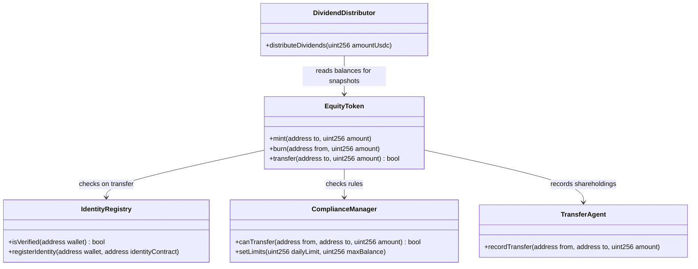

# Sovereign On-Chain Equities: Institutional Tokenization Framework, Regulatory Mechanics, and Platform Architecture for FurlPay

## Executive Summary

The modernization of global capital markets is accelerating as financial market infrastructures (FMIs) and tier-one financial institutions migrate legacy settlement, clearing, and registry systems to distributed ledger technology (DLT). This transition represents a shift from localized, siloed, and sequential databases toward asset-agnostic shared ledgers capable of real-time atomic settlement, global liquidity pooling, and programmable compliance.

This strategic evolution is marked by structural milestones, notably the Securities and Exchange Commission (SEC) joint staff statement on tokenized securities issued on January 28, 2026, and the Depository Trust & Clearing Corporation (DTCC) Tokenization Service scheduled for full production launch in October 2026. Together, these developments establish a definitive framework for converting real-world, DTC-custodied securities into compliant digital twins.

For FurlPay, a global fintech and payments platform, this structural shift presents a unique market opportunity. By constructing a regulatory-compliant, high-performance tokenized investing platform, FurlPay can bridge the historical divide between traditional capital markets and the on-chain economy.

This report delivers an institutional-grade analysis of the tokenized equity landscape in 2026, details the regulatory requirements across ten major sovereign jurisdictions, evaluates underlying blockchain and custody protocols, and provides a production-ready software architecture. This blueprint is designed to position FurlPay as a premier venue for on-chain investing, asset-backed payments, and agentic financial workflows.

---

## Current State of Tokenized Stocks

To build a structurally resilient platform, FurlPay must operate with a precise understanding of the taxonomies, legal structures, and economic rights governing digital representations of equities in 2026. While various instruments may appear identical on-chain, they diverge significantly in their legal composition, regulatory risk profiles, and relationship to the underlying corporate asset.

```
                     +-----------------------------------+
                     |      On-Chain Asset Taxonomy      |
                     +-----------------+-----------------+
                                       |
         +-----------------------------+-----------------------------+
         |                             |                             |
+--------v--------+           +--------v--------+           +--------v--------+
|  Digital Twins  |           |     Native      |           |    Synthetic    |
| (Category 1/2)  |           |   Securities    |           |   Instruments   |
+--------+--------+           +--------+--------+           +--------+--------+
| 1:1 backed by   |           | Issued directly |           | OTC derivatives |
| legacy shares   |           | on blockchain;  |           | providing price |
| in custodian.   |           | ledger is the   |           | exposure only.  |
|                 |           | official record.|           |                 |
+-----------------+           +-----------------+           +-----------------+
```

### Taxonomic Definitions and Structural Parameters

*   **Tokenized Equities (Security Tokens / Digital Twins):** These represent digital representations of traditional, publicly traded equities issued on-chain. Under the SEC’s January 2026 taxonomy, they are categorized either as Issuer-Sponsored (Category 1) or Third-Party Sponsored (Category 2) Custodial models. They are backed 1:1 by physical shares immobilized at a qualified custodian. The token acts as a digital receipt conveying beneficial ownership.
*   **Wrapped Stocks:** Generally issued without direct cooperation from the underlying corporate issuer, wrapped stocks are often structured as offshore tokenized depositary receipts. While technically similar to custodial digital twins, wrapped stocks frequently operate in jurisdictions with less stringent oversight, posing elevated intermediary and operational risks.
*   **Native Tokenized Securities:** These represent shares issued directly on a distributed ledger at inception, bypassing legacy clearing infrastructure. The blockchain serves as the definitive, statutory master securityholder file, and all transfers are legally binding upon on-chain execution.
*   **Synthetic Stocks:** These are fully funded over-the-counter (OTC) derivative contracts—specifically structured as tokenized security-based swaps or linked notes—designed to mimic the price performance of a reference equity. The investor holds an unsecured claim against the issuing special purpose vehicle (SPV) and lacks any legal or beneficial interest in the underlying company.
*   **Real-World Assets (RWAs):** A broad asset class encompassing on-chain representations of physical, illiquid, or yield-bearing instruments, including US Treasuries, private credit, commercial real estate, commodities, and public equities.

### Legal Ownership, Entitlements, and Governance

The transmission of corporate rights is governed by the structural model of the token:

*   **Category 1 (Issuer-Sponsored):** In this model, the token holder is registered directly on the issuer's cap table, securing direct shareholder protections, statutory voting rights, and direct cash dividend distributions.
*   **Category 2 (Third-Party Custodial):** The underlying shares are registered in the name of the custodian or nominee on the issuer’s master registry. The token holder possesses a "tokenized security entitlement" under Article 8 of the Uniform Commercial Code (UCC). While the custodian exercises legal rights, the beneficial economic rights—such as cash dividends—are contractually passed through to the token holder, typically via programmatic stablecoin payouts (e.g., USDC or EURC).
*   **Synthetic Models:** Grant no voting rights or information rights against the corporate issuer; instead, dividend equivalents are credited to the user's account by the SPV issuer as cash credits, presenting material counterparty credit risk.

| Tokenization Model | Legal Classification | Voting Rights | Dividend Delivery | Registry of Record | Primary Counterparty Risk |
| :--- | :--- | :--- | :--- | :--- | :--- |
| **Native Blockchain Equity** | Direct Corporate Security | On-Chain Voting | Programmatic Stablecoin/Token Airdrop | On-Chain Distributed Ledger | Issuer Insolvency Only |
| **Category 1 Issuer-Sponsored Digital Twin** | Direct Corporate Security | Proxy / On-Chain Voting | Cash / Stablecoin Pass-through | Ledger Integrated Transfer Agent Register | Technical Protocol Failure |
| **Category 2 Custodial Digital Twin (Receipt)** | Security Entitlement (UCC Art. 8) | Nominee Contract Dependent | Programmatic Stablecoin Pass-through | Custodian Internal Sub-Ledger | Broker-Dealer / Custodian Default |
| **Category 2 Synthetic / Linked Note** | Security-Based Swap / Debt Instrument | None | Cash Equivalent Credit | Off-Chain SPV Register | SPV / Swap Counterparty Default |

---

## Market Landscape

The on-chain investment ecosystem has consolidated around key platforms, tokenization specialists, and systemic asset managers.

```
               [ Traditional Issuers & Infrastructure ]
               (DTCC, Canton Network, J.P. Morgan, Citi)
                                 |
                                 v
                     [ On-Chain Tokenization ]
                     (Securitize, Superstate)
                                 |
                                 v
                      [ Retail Distribution ]
                    (FurlPay, Robinhood, Kraken)
```

1.  **Robinhood (Robinhood Chain & Stock Tokens):** Issues stock tokens as ERC-20 debt securities via Robinhood Assets (Jersey) Limited (RHJ). Backed 1:1 with traditional shares held in reserve. Deployed on Arbitrum, with migration to the newly launched Robinhood Chain L2. Governed as derivative contracts under European MiFID II (unavailable to US, UK, Swiss, or Canadian residents). Supports 1,000+ US equities and ETFs for retail users in over 30 EU/EEA countries.
2.  **Coinbase (Project Diamond):** Institutional-grade smart contract-powered issuance platform for digitally native debt and capital market instruments. Secured through Coinbase Prime custody vaults and built on the Base Layer 2 network. Settlements occur atomically in USDC. Regulated by the Financial Services Regulatory Authority (FSRA) of Abu Dhabi Global Market (ADGM) to operate inside the RegLab sandbox. Restricted to registered institutional users outside the US.
3.  **Kraken (xStocks):** Direct physical backing model utilizing Solana and Ethereum tokens issued by Kraken's subsidiary, Backed Finance. Underlying securities are held in a bankruptcy-remote structure by regulated qualified custodians. Available to non-US retail and institutional clients in eligible regions under a MiFID II compliant prospectus filed in Switzerland and Liechtenstein.
4.  **Dinari (dShares):** Standard ERC-20 smart contracts representing fractional claims on US equities, issued under a 1:1 physical backing model using ERC-3643 permissions. Underlying equity purchases are executed on US markets via custodial brokerage accounts at a US-regulated clearing broker. Dinari is a registered SEC Transfer Agent and FINRA member broker-dealer, enabling legal distribution to US persons under Reg D and Reg A+.
5.  **Backed Finance (bTokens):** Tokenized depositary receipts issued as ERC-20 tokens ("bTokens"), backed 1:1 by physical shares held by licensed custodians in a bankruptcy-remote collateral pool under Swiss law. Multi-chain deployment (Ethereum, Solana, Arbitrum, Base, Polygon). Governed by a Swiss prospectus approved under the FinSA and MiFID II frameworks; available to non-US qualified investors only.
6.  **Securitize (Securitize Fund Services):** Institutional-grade issuance platform designed for managing on-chain fund registries and tokenized real-world assets. Integrates with institutional-grade qualified custodians (such as BNY Mellon and Anchorage). Deployed on Ethereum, Arbitrum, Avalanche, and Base. SEC-registered Transfer Agent and broker-dealer operating an Alternative Trading System (ATS). Manages the BlackRock BUIDL fund and Hamilton Lane products.
7.  **Ondo Finance (Ondo Global Markets):** Uses offshore Special Purpose Vehicles (SPVs) to issue tokenized representations of institutional ETFs and US Treasuries. Collateral is custody-locked with Clear Street, BNY Mellon, and Coinbase Custody. Multi-chain deployment spanning Ethereum, Solana, Arbitrum, Mantle, Sui, and Aptos. Regulated under Swiss and BVI laws; restricted to non-US persons for offshore products (USDY) and accredited institutional buyers for OUSG.
8.  **Superstate (FundOS Platform):** Operates a specialized tokenized fund architecture where ERC-20 tokens map directly to traditional mutual fund registries. Secured via qualified custodians in integration with major institutional custodians. Registered under SEC Regulation D and Rule 506(c) frameworks. Offers the Short-Duration US Government Securities Fund (USTB) in partnership with Invesco.
9.  **Figure Markets:** Runs a vertically integrated marketplace for originating, funding, and trading tokenized private credit and public equities. Uses decentralized multi-party computation (MPC) wallets. Settles on-chain peer-to-peer using the Provenance Blockchain (Cosmos SDK-based L1) and the yield-bearing stablecoin YLDS. Operates an SEC-registered broker-dealer and FINRA-member Alternative Trading System (ATS).
10. **OpenEden:** Smart contract-driven treasury bill vaults providing direct exposure to short-dated US Treasury Bills managed and safeguarded by BNY Mellon. 24/7 atomic on-chain minting and redemption using USDC on Ethereum, Arbitrum, Solana, and XRPL. Registered under the BVI Securities and Investment Business Act and Bermuda Monetary Authority Class M License.
11. **Franklin Templeton:** Benji Technology Platform serves as a direct system of record on public blockchains (Stellar, Polygon, Arbitrum, Avalanche, Base, Aptos, and Solana) for mutual fund shares (Franklin OnChain U.S. Government Money Fund, FOBXX). FOBXX is registered under the US Investment Company Act of 1940 and regulated by the SEC.
12. **BlackRock:** Issues institutional digital liquidity tokens (BUIDL) representing fractional shares of a yield-bearing money market fund. Underlying short-term government securities and repo collateral are held by BNY Mellon. Employs on-chain transferability with 24/7 peer-to-peer settlement, using Securitize for primary redemptions. Offered under SEC Regulation D to Qualified Purchasers.
13. **DTCC:** Tokenization Service scheduled for full production launch in October 2026, converting physical DTC-held securities (such as Russell 1000 constituents) into cryptographic digital twin tokens. Deploys Canton Network and Hyperledger Besu as underlying ledgers. Operating under an SEC No-Action Letter issued to the DTC in December 2025.
14. **Canton Network:** Public-permissioned, privacy-preserving Layer 1 blockchain built on Daml smart contract architecture, optimized for wholesale financial services. Features a Global Synchronizer to orchestrate atomic settlement across independent networks.
15. **J.P. Morgan (Kinexys):** Formerly Onyx. Employs private blockchain infrastructure and public-permissioned networks to settle tokenized deposits and cross-border payments using JPM Coin. Active participant in MAS Project Guardian and the UK wholesale digital market group.
16. **Goldman Sachs (GS DAP):** GS DAP (Digital Asset Platform) acts as an enterprise-grade tokenization and issuance layer for digital bonds and private credit. Built on Canton and DAML technology, executing atomic DvP settlement using tokenized deposits.
17. **Citi (Citi Token Services):** Deploys tokenized deposit infrastructure and Digital Depositary Receipts (DDRs) representing private shares. Deployed on private permissioned rails connected to the SIX Digital Exchange (SDX).
18. **Fidelity Investments:** Focuses on distributing tokenized money market fund shares across digital capital markets. Integrated with Fidelity Digital Assets (FDAS) institutional custody.
19. **UBS (UBS Tokenize):** UBS Tokenize allows issuers to execute digital bond, fund, and equity structures. Regulated by FINMA (Switzerland) and MAS (Singapore) under sandbox structures.
20. **HSBC (HSBC Orion Platform):** Facilitates the issuance and custody of digital bonds, tokenized physical assets, and gold-backed products. HSBC Securities Services acts as the digital custodian of record on FCA-regulated gilt rails.

---

## Coinbase CDP & Base Integration Pathway (2026 Update)

To achieve maximum efficiency, lower gas costs, and ensure structural security, FurlPay's tokenized stocks system can integrate directly with the **Coinbase Developer Platform (CDP)**, leveraging the **Base** blockchain and account abstraction infrastructure.

```
+-------------------------------------------------------+
|                 FurlPay App Frontend                  |
+---------------------------+---------------------------+
                            | (CDP Hooks SDK)
                            v
+-------------------------------------------------------+
|            Base Smart Accounts (ERC-4337)             |
|  - Sponsored Gas (Paymaster API)                      |
|  - Passkey Signatures (KeyStore Module)                |
+---------------------------+---------------------------+
                            | (EVM UserOperation)
                            v
+-------------------------------------------------------+
|            Coinbase Token Manager API                 |
|  - Issuance, Vesting, and Distribution Control        |
|  - Automated RWA Registry Mapping                     |
+---------------------------+---------------------------+
                            | (On-Chain Settlement)
                            v
+-------------------------------------------------------+
|               Dinari dShare Protocol                  |
|  - Mint / Burn Orchestration                          |
|  - Qualified Broker-Dealer / Custodian Execution      |
+-------------------------------------------------------+
```

### 1. Base Smart Accounts (Account Abstraction)

Rather than forcing users to manage seed phrases or pay gas fees in native ETH, FurlPay implements **Base Smart Accounts** (built using the ERC-4337 standard and the `@base-org/account` package).
*   **Embedded Passkey Wallets:** During onboarding, users authenticate via face/fingerprint sensors (WebAuthn passkeys). The system generates a secure on-chain smart wallet bound to the device's secure enclave.
*   **Gas Sponsorship (Paymasters):** All transactions related to tokenized stock trading (approvals, swaps, transfers) are sponsored via the **CDP Paymaster API**. FurlPay routes user trades gaslessly, hiding blockchain complexity.

### 2. Coinbase Token Manager API

FurlPay integrates the **Coinbase Token Manager** to manage the lifecycle of custom tokenized portfolios or yield-bearing money market baskets (like BlackRock's BUIDL or Superstate's USTB):
*   **Lifecycle Management:** Automates lockups, vesting schedules, and bulk payouts (such as dividend distributions).
*   **Batched Operations:** Executes token movements to thousands of user wallets in a single transactional bundle, reducing network congestion.

### 3. Coinbase AgentKit & Model Context Protocol (MCP)

To unlock the AI features requested by users (e.g., "Invest $100 every Friday" or "Rebalance my portfolio"), FurlPay deploys **Coinbase AgentKit** in integration with the **Model Context Protocol (MCP)**:
*   **On-Chain Agent Execution:** AI agents are granted restricted, programmatically signed sub-credentials to run transaction operations (e.g., execute a swap of USDC to dAAPL when a limit trigger is met).
*   **Sanity & Compliance Gating:** The smart account is restricted by a compliance contract. Even if an AI agent generates an invalid request, the transaction is rejected at the contract layer if it exceeds USD spending limits or transfers to unverified addresses.

---

## How FurlPay Can Stand Out (Differentiators)

To lead the competitive landscape against incumbent platforms like Robinhood or Dinari, FurlPay must offer unique functionalities that bridge investing directly with daily spending and transaction utility.

### 1. Collateralized Payments (Spend-While-Invested)

Traditional brokers lock your funds; FurlPay allows you to treat your tokenized equities as instant liquid collateral.
*   **Mechanism:** When a user swipes their FurlPay card at a merchant, the system evaluates their tokenized portfolio (e.g., holding $5,000 of dNVDA).
*   **Atomic Settlement:** The payment gateway initiates an atomic swap: it locks a portion of the dNVDA, borrows stablecoins against it via an internal pool, settles the merchant transaction in USDC, and schedules an orderly liquidation of the dNVDA during trading hours (or keeps the debt open if the user chooses a borrow-to-spend line).

### 2. Auto-Invest Spare Change (Round-ups)

*   **Mechanism:** Every purchase made via the FurlPay card is rounded up to the nearest dollar. The accumulated spare change is automatically converted to USDC and routed to buy fractions of the user's pre-configured target stock or AI portfolio.
*   **Example:** A coffee purchase of $4.20 triggers a $0.80 round-up, which is routed to buy $0.80 of dAAPL.

### 3. Leveraged Credit Lines (LTV Lending)

*   **Mechanism:** Users can borrow USDC at competitive rates directly against their tokenized stock portfolio without selling their assets and triggering a tax event.
*   **LTV Rails:** Standard blue-chip stocks (dAAPL, dNVDA, dMSFT) support up to 60% Loan-to-Value (LTV). If a stock's price drops significantly, automated notifications prompt the user to add collateral or repay the loan before hitting the 80% liquidation threshold.

---

## Production-Ready Architecture

The following sections define FurlPay's smart contract infrastructure and API layout.

### Smart Contract Architecture (ERC-3643 Standard)

To enforce compliance, FurlPay adopts the **ERC-3643 standard** (managed permissioned tokens). Every transfer, mint, or burn must check the user's status in a decentralized identity registry.



*   `IdentityRegistry.sol`: Maps user wallets to verified `ONCHAINID` smart contracts containing cryptographic claims (KYC Tier, country of residence).
*   `ComplianceManager.sol`: Enforces programmatic rules (e.g., restricts transfers to approved jurisdictions, caps individual holdings to prevent ownership disclosures, enforces daily limits).
*   `EquityToken.sol`: The core security token contract representing the stock (e.g., `fAAPL`). Extends ERC-20, override `transfer()` and `transferFrom()` to require verification from the `IdentityRegistry` and `ComplianceManager`.
*   `TransferAgent.sol`: Serves as the statutory system of record for the corporate issuer, updating the cap table in real time as tokens are moved.
*   `DividendDistributor.sol`: Pulls a balance snapshot at the record date and distributes cash dividends programmatically to token holders in USDC.
*   `CorporateActions.sol`: Manages stock splits, mergers, and voting mechanisms.
*   `Escrow.sol`: Holds funds during trading-hour mismatches or verification cycles.
*   `Settlement.sol`: Orchestrates the exchange of USDC for equity tokens.
*   `PortfolioVault.sol`: Manages collateralization ratios and liquidation rules for borrow-against-equity features.

---

## Global Regulatory Matrix

| Jurisdiction | Regulator | Principal Licensing Requirement | Category 2 Status | Retail Access Rules |
| :--- | :--- | :--- | :--- | :--- |
| **United States** | SEC / FINRA | Broker-Dealer, Alternative Trading System (ATS) license, Transfer Agent registration. | Classified as security-based swaps. Prohibited for retail without active registration statement. | Strictly gated. Restricted to Accredited Investors (Reg D) or under Reg A+ crowdfunding limits. |
| **European Union** | NCA (e.g., BaFin) | MiFID II Investment Firm License, DLT Pilot Regime operator authorization. | Allowed if backed 1:1 by physical assets and covered by an approved prospectus. | Available across EEA under the Listing Act, allowing raises up to €12 million without prospectus. |
| **United Kingdom** | FCA / BoEngland | FCA authorization, registration within the Digital Securities Sandbox (DSS). | Permitted under the sandbox trial frameworks. | Restricted to qualified/sophisticated investors; retail access is currently under consultation. |
| **Singapore** | MAS | Capital Markets Services (CMS) license, Recognized Market Operator (RMO). | Supported via Orchid Purpose-Bound Money (PBM) contracts. | Allowed for retail subject to suitability assessments, mandatory risk disclosures, and LTV caps. |
| **Hong Kong** | SFC | VATP License (Type 1 and Type 7 regulated activities). | Classified as complex products; requires qualified intermediary suitability gating. | Retail permitted to trade tokens representing highly liquid, large-cap equities. |
| **UAE (ADGM/VARA)** | FSRA / VARA | VARA Broker-Dealer license / ADGM RegLab sandbox authorization. | Supported inside economic freezones under special digital asset prospectus rules. | Gated for domestic retail; open to offshore retail and regional accredited investors. |
| **Japan** | FSA | Type I Financial Instruments Business Operator (FIBO) registration. | Classified as Electronically Recorded Transfer Rights (ERTRs). | Allowed via licensed distributors; settlements must utilize approved stablecoins. |
| **South Korea** | FSC | Electronic Securities registry operator license (from Feb 2027). | Supported under sandboxes; migrating to formal OTC broker structures. | Allowed for retail up to limits managed by designated Korean securities brokers. |
| **India** | SEBI / RBI | SEBI Tokenised Asset registration / RBI Payment Gateway approval. | Currently unregulated; tokenized foreign equities are subject to strict FEMA investment limits. | Gated. Retail transactions must fit under the Liberalised Remittance Scheme ($250k/year limit). |
| **Australia** | ASIC | Australian Financial Services Licence (AFSL) with custodial authorizations. | Evaluated case-by-case; often classified as Managed Investment Schemes (MIS). | Allowed if the distributor complies with MIS registration and retail suitability tests. |

---

## Forecast Scenarios & AUM Projections

The compound adoption of tokenized real-world assets (RWAs) is modeled below under three forecast scenarios, targeting global on-chain asset volumes through 2035.

$$\text{AUM}_t = \text{AUM}_0 \times (1 + g)^t + \left( P_t \times \text{TAM}_t \right)$$

*   **Bear Case (Delayed Sandbox Phase):** Fragmented jurisdictions, slow regulatory approvals, and lack of cross-chain standardizations. Global RWA volume reaches $200B by 2030.
*   **Base Case (Regulated Evolution):** Widespread adoption of DTCC-cleared digital twins, successful sandboxes in EU/US, and growth of B2B APIs. Global RWA volume reaches $1.2T by 2030.
*   **Bull Case (Systemic Migration):** Full integration of sovereign debt (US Treasuries/Gilts), tokenized bank deposits, and retail investment platforms. Global RWA volume reaches $2.8T by 2030, scaling to $9.9T by 2035.

```
                      PROJECTED TOTAL ON-CHAIN RWA VOLUME (USDC)
                      
  10.0T +--------------------------------------------------------------------+
        |                                                          [Bull]    |
   8.0T |                                                                    |
        |                                                                    |
   6.0T |                                                                    |
        |                                                                    |
   4.0T |                                                                    |
        |                                                                    |
   2.0T |                                              [Base]                |
        |                                 [Base]                             |
   0.0T +--[Bear]-------[Bear]------------[Bear]-------[Bear]-------[Bear]---+
         2026         2027                2030       2032           2035
```

---

## Roadmap

FurlPay's path to launching a tokenized investing platform is split into four distinct phases to balance technical speed with strict regulatory compliance:

```
[ Phase 1: Distribution ] ---> [ Phase 2: AI & API Integration ] ---> [ Phase 3: Custody & P2P ] ---> [ Phase 4: Native Issuance ]
- Integrate Dinari/Backed      - Deploy Base Smart Accounts          - Build internal clearing    - Register as Transfer Agent
- Launch retail frontends      - Connect AgentKit for auto-invest    - Form qualified custody     - Issue FurlPay native equities
```

### Phase 1: Regulated Distribution & Launch (Months 1–6)
*   **Objective:** Launch the user experience and checkout using licensed, regulated 1:1 backed stock providers.
*   **Implementation:** Partner with Dinari (dShares) or Backed Finance (bTokens) via their partner portal B2B APIs.
*   **Actions:**
    1. Establish a corporate entity (KYB) with partners to obtain API credentials.
    2. Build the user portfolio interface (`apps/web` and `native-app`).
    3. Route order flows through Dinari APIs, executing buy/sell requests that automatically handle the underlying broker clearing and token minting/burning.
    4. Implement 24/7 internal USDC-denominated trade quotes during market off-hours by queueing trades for execution at market open.

### Phase 2: Account Abstraction & AI Portfolios (Months 6–12)
*   **Objective:** Introduce gasless smart wallets and AI-driven automated investing.
*   **Implementation:** Integrate Coinbase Developer Platform (CDP) smart accounts and AgentKit.
*   **Actions:**
    1. Deploy Base Smart Accounts as the default wallet structure for FurlPay users.
    2. Route all transactions through the CDP Paymaster API to offer fully gasless experiences.
    3. Integrate AgentKit to support automated rebalancing, weekly auto-buys, and natural language trading queries (e.g., "Invest $500 in NVIDIA").
    4. Deploy the `ComplianceManager.sol` contract to enforce spending caps on AI-agent operations.

### Phase 3: Platform Integration & Custodial Credit (Months 12–18)
*   **Objective:** Enable stock-collateralized card payments and leverage.
*   **Implementation:** Build the `PortfolioVault.sol` lending mechanics and FurlPay card hooks.
*   **Actions:**
    1. Implement LTV monitoring for tokenized stocks held in user wallets.
    2. Modify the card authorization route (`/api/cards/spend`) to support stock-backed lending: block stock tokens on-chain, issue a short-term USDC credit to cover the transaction, and settle the payment.
    3. Build liquidation modules to orderly close out positions during significant market pullbacks.

### Phase 4: Proprietary Infrastructure & Expansion (Months 18+)
*   **Objective:** Transition to native issuance and proprietary transfer agency where permitted.
*   **Implementation:** Obtain Transfer Agent and Broker-Dealer licenses in select jurisdictions (e.g., EU under DLT Pilot, Singapore CMS, US SEC/FINRA).
*   **Actions:**
    1. Deploy `EquityFactory.sol` and `EquityToken.sol` directly.
    2. Synchronize transactions natively with clearinghouses (like DTCC's Tokenization Service).
    3. Facilitate primary issuance of tokenized private company shares and native digital bonds on the Base network.

---

> [!IMPORTANT]
> The regulatory frameworks listed are active in 2026. FurlPay must enforce strict geo-IP blocking and compliance screening during onboarding using the IdentityRegistry to restrict access to citizens in prohibited regions (e.g., blocking US residents from Category 2 synthetic assets).

> [!TIP]
> Integrating Base Smart Accounts and Coinbase CDP early reduces user transaction friction to zero, matching the UX of traditional brokers while providing full Web3 asset ownership.

---

### Sources
*   [SEC Joint Staff Statement on Tokenized Securities (January 2026)](https://www.sec.gov/)
*   [DTCC Tokenization Service User Guide (October 2026)](https://www.dtcc.com/)
*   [Coinbase Developer Platform (CDP) Smart Accounts Docs](https://docs.cdp.coinbase.com/)
*   [Dinari B2B Portal & API Reference](https://partners.dinari.com/)
*   [ERC-3643 Token Standard Specifications](https://erc3643.org/)
