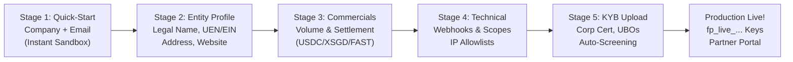
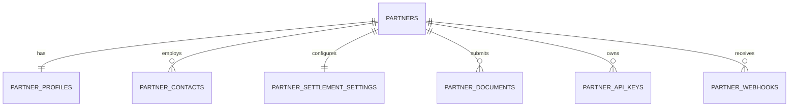
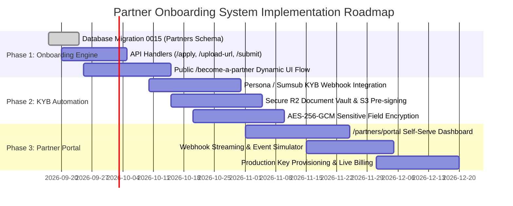

# FurlPay Partner Ecosystem & Onboarding Architecture: Master Implementation Report
## Engineering the Global Partner Onboarding Flow (`/partners` & `/become-a-partner`), KYB Lifecycle, Data Storage Schema, and Developer Portal
**Date:** September 2026 | **Author:** FurlPay Core Platform, Security & Product Engineering  
**Target Routes:** `/partners` (Directory & Showcase) & `/become-a-partner` (Onboarding & Application Engine)

---

# Table of Contents
1. [Executive Summary & Strategic Architecture](#1-executive-summary--strategic-architecture)
2. [The Public Partner Experience (`/partners`)](#2-the-public-partner-experience-partners)
   - 2.1 Directory Structure & Partner Tracks
   - 2.2 Case Studies & Co-Marketing Showcases
   - 2.3 Primary CTA & Deep-Link Routing to Onboarding
3. [The Partner Onboarding Engine (`/become-a-partner`)](#3-the-partner-onboarding-engine-become-a-partner)
   - 3.1 Dynamic Onboarding Link Architecture (Invites, Referrals & QR)
   - 3.2 The 5-Stage Progressive Onboarding Funnel (2026 KYB Standard)
   - 3.3 Stage 1: Quick-Start & Instant Sandbox Activation (<60 Seconds)
   - 3.4 Stage 2: Business Legal Entity & Regulatory Classification
   - 3.5 Stage 3: Commercial Volume & Settlement Preferences
   - 3.6 Stage 4: Technical Configuration & Webhook Endpoints
   - 3.7 Stage 5: KYB Document Upload & UBO Verification
4. [Data Storage & Database Schema Architecture](#4-data-storage--database-schema-architecture)
   - 4.1 Relational Schema Design (Postgres / Supabase Migration `0015`)
   - 4.2 Entity Relationship Diagram (ERD)
   - 4.3 Secure Document Storage Architecture (Cloudflare R2 / AWS S3)
   - 4.4 Partner Lifecycle State Machine
5. [Security, Privacy & Regulatory Compliance Guardrails](#5-security-privacy--regulatory-compliance-guardrails)
   - 5.1 Adherence to `AGENTS.md` Invariants (Zod, Rate Limiting, Secret Stripping)
   - 5.2 AES-256-GCM Field-Level Encryption for Sensitive Corporate PII
   - 5.3 Document Upload Pre-Signed URL Hardening & Magic-Number Sniffing
   - 5.4 MAS Notice PS-N02 & FATF KYB / UBO Verification Compliance
6. [The Partner Portal Experience (`/partners/portal`)](#6-the-partner-portal-experience-partnersportal)
   - 6.1 API Key Management (Sandbox vs Production)
   - 6.2 Webhook Testing, Simulation & Event Log Streaming
   - 6.3 Settlement & Payout Reconciliation Dashboard
   - 6.4 Revenue Share & Affiliate Tracking
7. [API Route Specifications & Zod Validation Contracts](#7-api-route-specifications--zod-validation-contracts)
8. [Master Implementation Roadmap & Phased Rollout](#8-master-implementation-roadmap--phased-rollout)

---

# 1. Executive Summary & Strategic Architecture

Partnerships are the lifeblood of FurlPay's financial operating system. Rather than attempting to obtain banking charters in 100 jurisdictions simultaneously, FurlPay thrives by composing licensed rails (**StraitsX, Circle, Nium, Stripe, Wise, Alpaca**) and empowering merchants, airlines, hotels, and autonomous AI agents to build on top of FurlPay's non-custodial smart accounts.

### The Problem with Legacy Partner Onboarding
Traditional B2B fintech partner onboarding (Airwallex, traditional banks) suffers from severe friction:
1. **The "Contact Us / Book a Call" Wall:** Prospective partners are greeted with a static form or `mailto:` link, followed by weeks of email exchanges before ever touching an API or sandbox.
2. **Point-in-Time Opaque KYB:** Businesses are forced to submit dozens of notarized PDF documents upfront without knowing if their business model is supported.
3. **No Progressive Path:** Developers wanting to test an x402 agent micropayment or a drop-in checkout widget are blocked until full enterprise legal contracts are signed.

### The FurlPay Solution: Progressive "Trust-First" Onboarding
FurlPay implements the **2026 Progressive Disclosure KYB Architecture**:
- **Instant Sandbox in 60 Seconds:** Developers and founders enter their company name, email, and track, and immediately receive Sandbox API keys (`fp_test_...`) and access to the interactive API docs.
- **Self-Serve Commercial Configuration:** Partners configure settlement currencies (USDC, XSGD, EURC, USD), webhook destinations, and drop-in SDK options.
- **Automated Document Verification:** When ready for production (`fp_live_...`), corporate entity verification, Singapore ACRA UEN / US EIN checks, and Ultimate Beneficial Owner (UBO) screening are executed asynchronously via automated verification pipelines (Persona KYB / Sumsub).

```
┌─────────────────────────────────────────────────────────────────────────────┐
│                    FURLPAY PARTNER ONBOARDING FLYWHEEL                      │
│                                                                             │
│  /partners (Showcase) ──▶ /become-a-partner?track=merchant&ref=token_xyz   │
│                                     │                                       │
│                                     ▼                                       │
│  STAGE 1: Instant Sandbox Access (<60s)                                     │
│  • Enter Company Name + Email ──▶ Issues fp_test_... + Webhook Simulator    │
│                                     │                                       │
│                                     ▼                                       │
│  STAGE 2: Entity & Commercial Profile                                       │
│  • Legal Name, UEN/EIN, Country, Settlement Currencies (USDC/XSGD)          │
│                                     │                                       │
│                                     ▼                                       │
│  STAGE 3: Automated KYB & UBO Screening                                     │
│  • Certificate of Inc, UBO (>25%), MAS/OFAC Sanctions Auto-Screen          │
│                                     │                                       │
│                                     ▼                                       │
│  STAGE 4: Production Activation & Partner Portal (/partners/portal)         │
│  • Generate fp_live_... keys, Configure Webhooks, Live POS & Settling       │
└─────────────────────────────────────────────────────────────────────────────┘
```

---

# 2. The Public Partner Experience (`/partners`)

The `/partners` route serves as the institutional showcase, proving credibility, highlighting global partnerships, and driving conversions into `/become-a-partner`.

## 2.1 Directory Structure & Partner Tracks
The page organizes partners across five primary strategic tracks:

1. **Infrastructure & Settlement Rails:**
   - *Current Partners:* Solana, Base, Circle, Turnkey, Safe, Bridge.xyz.
   - *Upcoming:* StraitsX (XSGD/FAST), Nium (Visa BIN).
2. **Financial Services & Banking:**
   - *Current Partners:* Stripe, Wise, Alpaca, Marqeta.
   - *Upcoming:* dtcpay, DBS PayNow Gateway.
3. **Lifestyle & Commerce Partners:**
   - *Hotels & Travel:* Travala (2.2M properties), Duffel (300+ airlines).
   - *Luxury & Retail:* Global merchants accepting stablecoin checkout.
4. **Autonomous AI & Agent Platforms:**
   - *x402 & MCP Ecosystem:* Claude Desktop, Cursor, OpenAI Agents, AutoGen.
5. **Global Event & Community Partners:**
   - *Featured:* **Wiki Finance Expo Hong Kong 2026** (Official Global Partner).

## 2.2 Case Studies & Co-Marketing Showcases
Each category card features:
- Partner Logo / SVG wordmark with consistent dark-mode styling (`bg-white/[0.02]`, border `border-white/10`, neon hover accents).
- High-level value exchange summary (e.g. *"Sub-second finality, <$0.01 fees. Primary settlement rail for USDC and x402."*).
- Live integration status badge (`Live in Production`, `Sandbox Ready`, `Co-Marketing Partner`).

## 2.3 Primary CTA & Deep-Link Routing
The outdated `mailto:partners@furlpay.com` CTA is upgraded into a dynamic conversion engine:
- **Primary Action:** Directs to `/become-a-partner` with category pre-selection:
  - *"Accept Stablecoins in Your Store"* $\rightarrow$ `/become-a-partner?track=merchant`
  - *"Connect Your Liquidity or Payment Rail"* $\rightarrow$ `/become-a-partner?track=infrastructure`
  - *"Build with x402 & Agent MCP"* $\rightarrow$ `/become-a-partner?track=agent`
  - *"Issue Cards with Yield-as-Cash"* $\rightarrow$ `/become-a-partner?track=card_issuer`

---

# 3. The Partner Onboarding Engine (`/become-a-partner`)

The `/become-a-partner` route is an interactive, multi-stage onboarding portal engineered for high conversion, automated data collection, and instant developer gratification.

## 3.1 Dynamic Onboarding Link Architecture

FurlPay onboarding links support dynamic parameters to customize the user journey:

$$\text{URL} = \texttt{https://furlpay.com/become-a-partner?track=\{track\}\&ref=\{ref\}\&step=\{step\}\&plan=\{plan\}}$$

### Parameter Specifications:
* `track`: Pre-selects the onboarding category:
  - `merchant`: Online stores, luxury retail, SaaS apps.
  - `infrastructure`: Payment processors, stablecoin issuers, banks.
  - `agent`: AI developer platforms, agentic commerce builders.
  - `travel`: Airlines, hotel aggregators, OTAs.
  - `card_issuer`: Co-branded card programs.
  - `affiliate`: Creators, ambassadors, referral partners.
* `ref`: Cryptographic partner invite or referral token:
  - Format: `inv_` + 32-character hexadecimal token (e.g. `inv_8f9c1a2b...`).
  - Allows FurlPay enterprise sales representatives to send pre-configured, signed links to VIP partners (e.g., StraitsX, dtcpay, Travala) with pre-filled company information and waived fees.
* `step`: Allows resume-state deep linking (`1` to `5`). State is saved locally in `sessionStorage` with cryptographic hash synchronization, ensuring zero data loss if the user reloads.

---

## 3.2 The 5-Stage Progressive Onboarding Funnel



---

## 3.3 Stage 1: Quick-Start & Instant Sandbox Activation (<60 Seconds)

**Goal:** Eliminate drop-off by granting immediate developer access before asking for legal paperwork.

### Fields Collected:
* **Company / Project Name:** (String, 2–100 chars).
* **Work Email:** (Valid business email; free email providers like Gmail/Yahoo flag for manual review).
* **Primary Partner Track:** (Selector: Merchant, Infrastructure, AI Agent, Travel, Card Issuer).
* **Expected Launch Timeline:** (`Immediate`, `1-3 months`, `Exploring / R&D`).

### Instant Outcome:
* Generates a new `partner_id` (`prt_` + UUID).
* Automatically provisions a **Sandbox API Key** (`fp_test_...`).
* Dispatches a magic-link verification email.
* Displays a live code snippet in TypeScript, Python, and cURL with their actual test key pre-populated.

---

## 3.4 Stage 2: Business Legal Entity & Regulatory Classification

**Goal:** Establish legal identity for compliance and contract structuring.

### Fields Collected:
* **Legal Entity Name:** Official registered name on corporate registry.
* **Operating / Trade Name (DBA):** Public-facing brand name.
* **Country of Incorporation:** ISO 3166-1 alpha-2 code (e.g. `SG`, `US`, `GB`, `AE`).
* **Entity Registration Number:**
  - In Singapore: **ACRA UEN** (Unique Entity Number).
  - In US: **EIN** (Employer Identification Number) or Delaware File Number.
  - In UK: **Companies House Number**.
* **Registered Office Address:** Street, City, Postal Code, Country.
* **Official Website & App Store URLs:** Validated via automated domain health checks.
* **Regulatory Licensing Profile:**
  - `MAS_MPI` (Singapore Major Payment Institution).
  - `MAS_SPI` (Singapore Standard Payment Institution).
  - `MICA_CASP` (EU Markets in Crypto-Assets).
  - `US_MSB` (FinCEN Money Services Business).
  - `EXEMPT_OR_NON_CUSTODIAL` (Software / Pure Technology Provider).
  - `NONE_UNREGULATED` (Standard merchant / corporate).

---

## 3.5 Stage 3: Commercial Volume & Settlement Preferences

**Goal:** Configure payment routing, treasury auto-sweep, and fee schedules.

### Fields Collected:
* **Expected Monthly Processing Volume:**
  - Tier 1: `< $100,000 / month` (Standard self-serve pricing: 0.5% + network gas).
  - Tier 2: `$100,000 – $1,000,000 / month` (Growth pricing: 0.35%).
  - Tier 3: `$1,000,000 – $10,000,000 / month` (Enterprise: 0.20%).
  - Tier 4: `> $10,000,000 / month` (Custom institutional routing).
* **Default Settlement Currency:**
  - `USDC` (Base, Arbitrum, Solana, Ethereum).
  - `XSGD` (Solana, Base, Ethereum).
  - `EURC` (Base, Ethereum).
  - `USD` (Domestic US FedNow / ACH wire).
  - `SGD` (Domestic Singapore FAST / PayNow bank transfer).
* **Settlement Destination Configuration:**
  - **On-Chain Safe Smart Account:** Default self-custodial destination.
  - **External Solana / EVM Address:** Validated via `PublicKey` and EVM regex.
  - **Local Bank Account:** Account Holder Name, Bank Name, SWIFT/BIC, Account Number, IBAN.
* **Yield-as-Cash Auto-Sweep Option:** Toggle enabling idle settlement funds to auto-deposit into tokenized short-term US Treasuries (Ondo USDY / BlackRock BUIDL) earning **4.8% APY** until withdrawn.

---

## 3.6 Stage 4: Technical Configuration & Webhook Endpoints

**Goal:** Establish developer integration parameters.

### Fields Collected:
* **Primary Technical Lead:** Name, technical email, Slack/Discord handle (optional).
* **Production Webhook URL:** HTTPS URL endpoint where FurlPay will deliver real-time settlement and compliance events.
* **Webhook Subscriptions:**
  - `payment.succeeded`
  - `payment.failed`
  - `cctp.fast_transfer.completed`
  - `pos.card.preauth_requested`
  - `x402.payment.settled`
  - `kyb.status.updated`
* **IP Allowlist (Optional):** Restrict live API requests to specific CIDR blocks.

---

## 3.7 Stage 5: KYB Document Upload & UBO Verification

**Goal:** Fulfill Singapore MAS Notice PS-N02, FATF Recommendations, and FinCEN CDD (Customer Due Diligence) requirements before production activation.

### Documents Collected:
1. **Certificate of Incorporation / Good Standing:** (PDF, max 10MB).
2. **Constitutional Documents:** Memorandum & Articles of Association, Constitution, or Bylaws.
3. **Register of Directors & Officers:** Official ACRA Bizfile extract (Singapore) or state certificate.
4. **Register of Ultimate Beneficial Owners (UBOs):** Declaration of all natural persons holding $\ge 25\%$ voting rights or equity.
   - For each UBO: Full Legal Name, Residential Address, Date of Birth, Nationality, Passport / National ID copy.
5. **Proof of Operating Address:** Bank statement or utility invoice dated within the last 90 days.

---

# 4. Data Storage & Database Schema Architecture

All partner details are stored in a normalized, fully audited PostgreSQL schema managed via Supabase (`0015_partners_and_onboarding.sql`).

## 4.1 Relational Schema Design

```sql
-- Migration: 0015_partners_and_onboarding.sql

-- 1. Core Partners Registry
CREATE TABLE IF NOT EXISTS partners (
    id UUID PRIMARY KEY DEFAULT gen_random_uuid(),
    partner_id VARCHAR(64) UNIQUE NOT NULL, -- e.g. prt_01h...
    slug VARCHAR(64) UNIQUE NOT NULL,
    legal_name VARCHAR(255) NOT NULL,
    dba_name VARCHAR(255),
    track VARCHAR(32) NOT NULL CHECK (track IN ('infrastructure', 'financial_services', 'merchant', 'travel', 'agent', 'card_issuer', 'affiliate')),
    status VARCHAR(32) NOT NULL DEFAULT 'draft' CHECK (status IN ('draft', 'submitted', 'under_review', 'documents_requested', 'approved', 'rejected', 'suspended')),
    tier VARCHAR(32) NOT NULL DEFAULT 'starter' CHECK (tier IN ('starter', 'growth', 'enterprise', 'strategic_rail')),
    created_at TIMESTAMPTZ NOT NULL DEFAULT NOW(),
    updated_at TIMESTAMPTZ NOT NULL DEFAULT NOW()
);

-- 2. Partner Corporate & Legal Profile
CREATE TABLE IF NOT EXISTS partner_profiles (
    partner_id UUID PRIMARY KEY REFERENCES partners(id) ON DELETE CASCADE,
    registration_number VARCHAR(100) NOT NULL, -- e.g. Singapore UEN, US EIN
    incorporation_country CHAR(2) NOT NULL,    -- ISO 3166-1 alpha-2
    incorporation_date DATE,
    registered_address JSONB NOT NULL,         -- street, city, state, postal, country
    operating_address JSONB,
    website_url VARCHAR(255) NOT NULL,
    regulatory_status VARCHAR(64) NOT NULL DEFAULT 'none',
    regulatory_license_number VARCHAR(128),
    expected_monthly_volume_usd NUMERIC(14, 2),
    created_at TIMESTAMPTZ NOT NULL DEFAULT NOW(),
    updated_at TIMESTAMPTZ NOT NULL DEFAULT NOW()
);

-- 3. Partner Contacts
CREATE TABLE IF NOT EXISTS partner_contacts (
    id UUID PRIMARY KEY DEFAULT gen_random_uuid(),
    partner_id UUID NOT NULL REFERENCES partners(id) ON DELETE CASCADE,
    role VARCHAR(32) NOT NULL CHECK (role IN ('business_owner', 'technical_lead', 'compliance_officer', 'billing')),
    full_name VARCHAR(255) NOT NULL,
    email VARCHAR(255) NOT NULL,
    phone VARCHAR(50),
    is_primary BOOLEAN NOT NULL DEFAULT false,
    created_at TIMESTAMPTZ NOT NULL DEFAULT NOW()
);

-- 4. Partner Settlement Settings
CREATE TABLE IF NOT EXISTS partner_settlement_settings (
    partner_id UUID PRIMARY KEY REFERENCES partners(id) ON DELETE CASCADE,
    default_currency VARCHAR(16) NOT NULL DEFAULT 'USDC',
    settlement_network VARCHAR(32) NOT NULL DEFAULT 'base',
    payout_mode VARCHAR(32) NOT NULL DEFAULT 'realtime' CHECK (payout_mode IN ('realtime', 'daily_batch', 'manual')),
    payout_address VARCHAR(255) NOT NULL, -- Safe address, Solana pubkey, or Bank Ref
    bank_account_encrypted BYTEA,         -- AES-256-GCM encrypted bank coordinates
    auto_yield_sweep BOOLEAN NOT NULL DEFAULT false,
    created_at TIMESTAMPTZ NOT NULL DEFAULT NOW(),
    updated_at TIMESTAMPTZ NOT NULL DEFAULT NOW()
);

-- 5. Partner KYB Documents
CREATE TABLE IF NOT EXISTS partner_documents (
    id UUID PRIMARY KEY DEFAULT gen_random_uuid(),
    partner_id UUID NOT NULL REFERENCES partners(id) ON DELETE CASCADE,
    document_type VARCHAR(64) NOT NULL CHECK (document_type IN ('incorporation_cert', 'mou_articles', 'ubo_register', 'operating_proof', 'regulatory_license', 'ubo_passport')),
    storage_key VARCHAR(512) NOT NULL,    -- Cloudflare R2 / S3 path
    file_name VARCHAR(255) NOT NULL,
    file_size_bytes INTEGER NOT NULL,
    mime_type VARCHAR(64) NOT NULL,
    sha256_checksum CHAR(64) NOT NULL,
    verification_status VARCHAR(32) NOT NULL DEFAULT 'pending' CHECK (verification_status IN ('pending', 'verified', 'rejected', 'expired')),
    verified_at TIMESTAMPTZ,
    notes TEXT,
    created_at TIMESTAMPTZ NOT NULL DEFAULT NOW()
);

-- 6. Partner API Credentials
CREATE TABLE IF NOT EXISTS partner_api_keys (
    id UUID PRIMARY KEY DEFAULT gen_random_uuid(),
    partner_id UUID NOT NULL REFERENCES partners(id) ON DELETE CASCADE,
    environment VARCHAR(16) NOT NULL CHECK (environment IN ('sandbox', 'production')),
    key_prefix VARCHAR(16) NOT NULL,       -- e.g. fp_test_ or fp_live_
    key_hash CHAR(64) NOT NULL UNIQUE,     -- SHA-256 of raw secret key
    name VARCHAR(100) NOT NULL DEFAULT 'Default Key',
    scopes JSONB NOT NULL DEFAULT '["payments:read", "payments:write"]'::jsonb,
    last_used_at TIMESTAMPTZ,
    revoked_at TIMESTAMPTZ,
    created_at TIMESTAMPTZ NOT NULL DEFAULT NOW()
);

-- 7. Partner Webhooks
CREATE TABLE IF NOT EXISTS partner_webhooks (
    id UUID PRIMARY KEY DEFAULT gen_random_uuid(),
    partner_id UUID NOT NULL REFERENCES partners(id) ON DELETE CASCADE,
    environment VARCHAR(16) NOT NULL CHECK (environment IN ('sandbox', 'production')),
    url VARCHAR(512) NOT NULL,
    hmac_secret_encrypted BYTEA NOT NULL,  -- AES-256-GCM encrypted
    subscribed_events JSONB NOT NULL,
    is_active BOOLEAN NOT NULL DEFAULT true,
    failed_deliveries_count INTEGER NOT NULL DEFAULT 0,
    created_at TIMESTAMPTZ NOT NULL DEFAULT NOW()
);
```

## 4.2 Entity Relationship Diagram (ERD)



## 4.3 Secure Document Storage Architecture (Cloudflare R2 / AWS S3)

To ensure zero PII exposure and bank-grade storage security:
1. **Pre-Signed Upload URLs:** The browser never uploads documents to FurlPay web servers directly. FurlPay backend issues an ephemeral, cryptographically signed S3/R2 PUT URL with strict single-use expiry (15 minutes).
2. **File Validation & Magic-Number Sniffing:**
   - Only `application/pdf`, `image/png`, and `image/jpeg` are accepted.
   - Files are inspected for standard byte magic numbers (`%PDF-`, `\x89PNG`, `\xFF\xD8\xFF`) to prevent disguised executables.
   - Max file size: 10MB per document.
3. **Encrypted at Rest:** Files are encrypted with SSE-KMS (Server-Side Encryption with Customer-Managed Keys) or AES-256.
4. **Zero Public Access:** Storage buckets have public access blocked at the bucket policy level. Documents are only viewable by compliance officers via short-lived pre-signed GET URLs (expiry 60 seconds).

## 4.4 Partner Lifecycle State Machine

```
┌─────────────────────────────────────────────────────────────────────────────┐
│                       PARTNER ONBOARDING STATE MACHINE                      │
│                                                                             │
│  [DRAFT] ──(Stage 1 Complete)──▶ [SANDBOX_ACTIVE]                           │
│                                          │                                  │
│                                 (Stage 5 Submitted)                         │
│                                          ▼                                  │
│                                   [UNDER_REVIEW]                            │
│                                   /            \                            │
│           (Document Issue)       /              \ (Compliance Approved)     │
│                  ▼              /                ▼                          │
│     [DOCUMENTS_REQUESTED] ◄────                  [PRODUCTION_LIVE]          │
│                  │                                       │                  │
│          (Re-submitted)                                  │ (Risk Anomaly)   │
│                  │                                       ▼                  │
│                  └────────────────────────────────▶ [SUSPENDED]             │
└─────────────────────────────────────────────────────────────────────────────┘
```

---

# 5. Security, Privacy & Regulatory Compliance Guardrails

FurlPay enforces mandatory security invariants across every API route and database operation in strict accordance with [`AGENTS.md`](file:///c:/Users/ashut/OneDrive/Documents/Payment%20App/AGENTS.md):

## 5.1 Adherence to `AGENTS.md` Invariants
1. **Zod Validation on Every Request:** Every POST and PATCH handler parses request bodies through strict Zod schemas defined in `@/lib/schemas` or `@/lib/validate`, enforcing a 100KB payload cap.
2. **Public Route Rate Limiting:** Public onboarding endpoints (`/api/partners/apply`, `/api/partners/upload-url`) enforce strict rate limits via `rateLimitOr429()` from `@/lib/rateLimit` (e.g. max 10 applications per hour per IP).
3. **Zero Secrets in Responses:** GET and PATCH responses strip all encrypted secrets, `hmac_secret`, `key_hash`, and full tax identifiers.
4. **Cryptographic Randomness:** All IDs, invitation tokens, and API key salts are generated using `crypto.randomUUID()` or `crypto.getRandomValues()`—never `Math.random()`.
5. **No Mass Assignment:** Incoming JSON is whitelisted explicitly field-by-field before persisting to the database.

## 5.2 AES-256-GCM Field-Level Encryption
For highly sensitive partner data (bank account numbers, tax identification numbers, and webhook HMAC secrets):
- Data is encrypted before database insertion using **AES-256-GCM** with a dynamic 12-byte initialization vector (IV) and a 16-byte authentication tag.
- The master encryption key is derived from `ENCRYPTION_SECRET` registered in `apps/web/src/lib/env.ts`.

## 5.3 MAS Notice PS-N02 & FATF KYB Verification
- **Automated Sanctions Screening:** All company names, trading DBAs, and UBO names are automatically screened against MAS, OFAC, and UN sanctions lists via integrated TRM Labs / Chainalysis oracles upon submission.
- **Perpetual KYB (pKYB):** Unlike legacy annual reviews, FurlPay's compliance engine subscribes to automated webhook webhooks (via Persona/Sumsub) that trigger instant alerts if a partner's directors or corporate ownership change.

---

# 6. The Partner Portal Experience (`/partners/portal`)

Once approved, partners log in to their dedicated self-serve command center:

```
┌─────────────────────────────────────────────────────────────────────────────┐
│                           FURLPAY PARTNER PORTAL                            │
│                                                                             │
│  ┌───────────────────────────────────────────────────────────────────────┐  │
│  │ Partner: Acme Global Payments · Status: Production Live · Tier: Growth │  │
│  └───────────────────────────────────────────────────────────────────────┘  │
│                                                                             │
│  ┌───────────────────────┐  ┌──────────────────────┐  ┌──────────────────┐  │
│  │   API CREDENTIALS     │  │   SETTLEMENT VAULT   │  │ WEBHOOK MONITOR  │  │
│  │ • fp_live_9a8f...     │  │ • 142,500 USDC (Base)│  │ • Health: 99.98% │  │
│  │ • fp_test_3b1c...     │  │ • Auto-Sweep: ON     │  │ • 14,210 Events  │  │
│  │ • Rotate Key Button   │  │ • Yield Earned: $540 │  │ • Test Event Btn │  │
│  └───────────────────────┘  └──────────────────────┘  └──────────────────┘  │
│                                                                             │
│  ┌───────────────────────────────────────────────────────────────────────┐  │
│  │ REAL-TIME SETTLEMENT & TRANSACTION STREAM                             │  │
│  │ [2026-09-17 13:20] Flight Booking (Duffel)   +450.00 USDC   [Settled]  │  │
│  │ [2026-09-17 13:14] Merchant In-Store (PayNow) +120.00 SGD    [Settled]  │  │
│  │ [2026-09-17 13:02] x402 AI Agent Micro-Call   +0.05 USDC     [Settled]  │  │
│  └───────────────────────────────────────────────────────────────────────┘  │
└─────────────────────────────────────────────────────────────────────────────┘
```

### Key Portal Modules:
1. **API Keys & Developer Secrets:** Real-time key creation, scope restriction (read-only vs payment authorization), and immediate revocation.
2. **Webhook Event Log & Replay:** Live streaming of all outbound webhooks with HTTP response codes, latency metrics, and a "Re-send Webhook" button for debugging.
3. **Settlement & Payout Configuration:** Update settlement payout wallet (Solana, Base, or Singapore FAST bank account) with biometric step-up authentication.
4. **Yield-as-Cash Earnings:** Real-time dashboard showing the yield accrued on idle partner balances (4.8% APY).

---

# 7. API Route Specifications & Zod Contracts

The partner engine implements three high-performance serverless Next.js API route handlers:

### 1. `POST /api/partners/apply` (Initial Onboarding & Sandbox Provisioning)
- **Rate Limit:** 10 req / hour / IP.
- **Validation:** `PartnerApplicationSchema` (Company name, work email, track, volume estimate).
- **Behavior:** Validates inputs, creates partner record, creates default `fp_test_...` key, dispatches welcome email, returns sandbox credentials and pre-configured quickstart payload.

### 2. `POST /api/partners/upload-url` (Secure S3/R2 Pre-Signed Upload Request)
- **Rate Limit:** 30 req / hour / IP.
- **Validation:** `DocumentUploadRequestSchema` (Document type, file name, MIME type, file size $\le 10\text{MB}$).
- **Behavior:** Verifies MIME type, generates S3/R2 pre-signed PUT URL with 15-minute expiry, records pending document in `partner_documents`.

### 3. `POST /api/partners/kyb/submit` (Final KYB Submission for Production Review)
- **Rate Limit:** 5 req / hour / IP.
- **Validation:** `PartnerKybSubmissionSchema` (Legal entity details, UEN/tax ID, registered address, uploaded document IDs, UBO declarations).
- **Behavior:** Transitions partner status to `under_review`, triggers automated sanctions and corporate registry screening, alerts compliance operations.

---

# 8. Master Implementation Roadmap & Phased Rollout



### Immediate Deliverables:
1. **Week 1:** Deploy migration `0015_partners_and_onboarding.sql` to Supabase.
2. **Week 2:** Implement API routes `/api/partners/apply` and `/api/partners/upload-url` with full Zod validation.
3. **Week 3:** Launch `/become-a-partner` multi-stage progressive wizard with dynamic category selection and invite token support.
4. **Week 4:** Update `/partners` landing page to link directly to `/become-a-partner`, replacing the legacy mailto link.

---

# 9. Conclusion

By deploying this master partner onboarding architecture, FurlPay converts what was once an opaque, manual email process into a **self-serve, developer-first conversion machine**. 

Prospective partners (merchants, payment rails, banks, and AI agent builders) can sign up, test in sandbox in 60 seconds, configure multi-currency settlement (USDC, XSGD, FAST), complete automated KYB verification, and access live production rails seamlessly.
