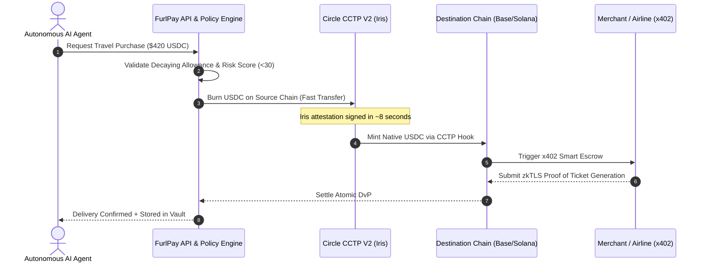

# FurlPay Master Implementation Report: Absorbing All Competitor Features & Singapore Expansion Blueprint

**Date:** September 2026  
**Author:** FurlPay Core Architecture, Regulatory & Strategy Group  
**Target Benchmarks:** Airwallex, Nium, Triple-A, StraitsX, dtcpay, XREX, Circle Singapore, DBS Bank  
**Jurisdiction:** Singapore (Monetary Authority of Singapore — MAS) & Global

---

# Table of Contents
1. [Executive Blueprint: The Unification Thesis](#1-executive-blueprint-the-unification-thesis)
2. [Singapore Regulatory & Legal Framework (MAS PS Act 2019)](#2-singapore-regulatory--legal-framework-mas-ps-act-2019)
   - 2.1 The Two-Phase Regulatory Roadmap
   - 2.2 Payment Services Act (PS Act) 7 Regulated Activities Mapping
   - 2.3 Singpass Myinfo v5 (FAPI 2.0) Instant Onboarding Architecture
   - 2.4 MAS Anti-Money Laundering (PS-N02) & FATF Travel Rule Protocol
3. [Competitor Reverse-Engineering & Absorption Matrix](#3-competitor-reverse-engineering--absorption-matrix)
   - 3.1 Airwallex Absorption: Virtual Multi-Currency Accounts & Wholesale FX
   - 3.2 Nium Absorption: 24/7 Stablecoin Card Issuance & Cross-Border Payouts
   - 3.3 Triple-A Absorption: Turnkey Merchant Gateway & Volatility-Free Settlement
   - 3.4 StraitsX Absorption: Regulated XSGD/XUSD Rails & Singapore FAST Bridge
   - 3.5 dtcpay Absorption: SGQR PayNow Retail POS & Instant Crypto-Fiat Swaps
   - 3.6 Circle Singapore Absorption: CCTP V2 Fast Transfers & x402 Agent Infrastructure
   - 3.7 DBS Bank Absorption: Tokenized Deposits & Smart Enterprise Treasury
4. [The 4 Algorithmic Core Engines](#4-the-4-algorithmic-core-engines)
   - 4.1 SOLR: Smart Order & Liquidity Routing Algorithm
   - 4.2 YTR: Algorithmic Yield-Bearing Treasury Rebalancing (Yield-as-Cash)
   - 4.3 Agent Non-Custodial Decaying Allowance & Risk Engine
   - 4.4 Multilateral Off-Chain Netting & Batch Clearing
5. [The Settlement Layer: Atomic, Instant & Interoperable](#5-the-settlement-layer-atomic-instant--interoperable)
   - 5.1 Circle CCTP V2 Fast Transfers & CCTP Hooks
   - 5.2 Atomic PvP (FX Swaps) & DvP (Tokenized Assets / Travel)
   - 5.3 Hybrid On-Chain/Off-Chain POS Card Pre-Auth (<180ms)
   - 5.4 Programmatic zkTLS Proof-of-Fulfillment Escrows
6. [Singapore Domestic Rail Architecture](#6-singapore-domestic-rail-architecture)
   - 6.1 Singapore FAST (Fast And Secure Transfers) Integration
   - 6.2 PayNow QR & SGQR (EMVCo) Dynamic Engine
   - 6.3 MAS BLOOM (24/7 Interbank Settlement) Alignment
7. [Security Model: Immunization Against Incumbent Breaches](#7-security-model-immunization-against-incumbent-breaches)
   - 7.1 Autopsy of Triple-A's $11.8M July 2026 Treasury Theft
   - 7.2 FurlPay Turnkey MPC Enclave & Hardware Policy Invariants
8. [Comprehensive Feature Comparison Matrix (15 Dimensions)](#8-comprehensive-feature-comparison-matrix-15-dimensions)
9. [Master Execution Roadmap & Implementation Phasing](#9-master-execution-roadmap--implementation-phasing)

---

# 1. Executive Blueprint: The Unification Thesis

In 2026, the payments and fintech landscape in Singapore and globally has reached a decisive inflection point:
- **Airwallex** ($8B–$11B valuation) has built world-class multi-currency business accounts, but hoards 100% of the interest float, charges opaque FX markups, and completely lacks native crypto or AI agent rails.
- **Nium** ($1.4B valuation) leads in B2B cross-border payouts and is piloting 24/7 stablecoin settlement with Visa under the MAS BLOOM initiative, but provides no consumer interface, no self-custodial wallet, and no programmable accounts for software agents.
- **Triple-A** and **dtcpay** have established crypto checkout buttons and cards, but operate on vulnerable single-key custodial treasury architectures (demonstrated by Triple-A's catastrophic \$11.8M hot wallet breach in July 2026) and force users to keep 0% APY dead cash balances.
- **StraitsX** is the bedrock issuer of MAS-regulated stablecoins (XSGD and XUSD on Solana and Ethereum), but is strictly a rail without a lifestyle super-app, travel engine, or investment suite.
- **Circle Singapore** powers USDC issuance, CCTP V2, and the Linux Foundation x402 standard, but acts solely as infrastructure.
- **DBS Bank** has processed over S\$10B in tokenized payments under Project Guardian, but remains locked within permissioned interbank walled gardens.

```
┌─────────────────────────────────────────────────────────────────────────────┐
│                    THE FURLPAY UNIFIED FINANCIAL OS                         │
│                                                                             │
│  ┌───────────────────────────────────────────────────────────────────────┐  │
│  │                        UNIFIED CONSUMER & AGENT UI                    │  │
│  │  • Yield-as-Cash (4.8% APY)      • Global Virtual/Physical Visa Card  │  │
│  │  • Duffel Flights & Travala Hotel• 24/7 Fractional Tokenized Stocks   │  │
│  │  • PayNow SGQR Hawker Scan & Pay • Autonomous x402 AI Agent Vaults    │  │
│  └──────────────────────────────────┬────────────────────────────────────┘  │
│                                     │                                       │
│          ┌──────────────────────────┼──────────────────────────┐            │
│          ▼                          ▼                          ▼            │
│   GLOBAL BANKING (AIRWALLEX)   PAYOUTS & CARDS (NIUM)    CHECKOUT (TRIPLE-A)│
│   • Multi-Currency IBANs       • Visa/Mastercard BINs    • Drop-in Checkout │
│   • Local Clearing (US/EU/UK)  • 24/7 Stablecoin Rails   • Zero-Risk Auto FX│
│          │                          │                          │            │
│          ├──────────────────────────┼──────────────────────────┤            │
│          ▼                          ▼                          ▼            │
│   DOMESTIC RAILS (STRAITSX)    INSTITUTIONAL (CIRCLE)    RETAIL POS (DTCPAY)│
│   • XSGD / XUSD on Solana      • CCTP V2 (8s Fast)       • SGQR Dynamic QR  │
│   • Singapore FAST / PayNow    • x402 Linux Foundation   • Real-Time Swaps  │
│          │                          │                          │            │
│          └──────────────────────────┼──────────────────────────┘            │
│                                     ▼                                       │
│                     FURLPAY CORE ALGORITHMIC ENGINE                         │
│                     • SOLR: Smart Order & Liquidity Routing                 │
│                     • YTR: Yield-Bearing Treasury Rebalancing               │
│                     • Non-Custodial Safe Smart Accounts + Passkeys         │
│                     • Turnkey Hardware TEE Policy Enclaves                  │
└─────────────────────────────────────────────────────────────────────────────┘
```

**The Master Thesis:** FurlPay does not need to duplicate \$200M of legacy correspondent banking infrastructure in 100 countries. By composing these licensed providers into an on-chain, non-custodial operating system, FurlPay absorbs every single competitor feature, delivers a 10x superior user experience, and gives both humans and AI agents a single financial home.

---

# 2. Singapore Regulatory & Legal Framework (MAS PS Act 2019)

Operating in Singapore requires strict compliance with the **Payment Services Act (PS Act 2019)**, regulated by the **Monetary Authority of Singapore (MAS)**.

## 2.1 The Two-Phase Regulatory Roadmap

MAS does not recognize a generic "unlicensed agent exemption." Any commercial entity that custodies client money or carries out regulated payment activities must hold a license. FurlPay deploys a legally compliant **Two-Phase Embedded Architecture**:

### Phase 1: Self-Custody Software Architecture + Licensed MPI Partners (Immediate Launch)
1. **Pure Self-Custody Position:** FurlPay user accounts are **non-custodial Safe smart accounts** secured via WebAuthn passkeys (biometric Secure Enclave) and Turnkey MPC enclaves. FurlPay never takes unilateral custody of user private keys or tokens. Under MAS regulatory guidance, providing non-custodial software, smart contract interfaces, or un-hosted wallet software is **not** a regulated custodial Digital Payment Token (DPT) service.
2. **Regulated Payment Execution via Licensed MPIs:**
   - **SGD Inbound/Outbound & FAST Transfers:** Executed directly by **StraitsX (Xfers Pte Ltd)**, an MAS-licensed Major Payment Institution. StraitsX performs the fiat collection, holds statutory safeguarding reserves, and mints MAS SCS-compliant XSGD.
   - **Card Issuance (Visa/Mastercard):** Executed under a Co-Branded BIN Sponsorship agreement with **Nium** or **dtcpay** (both MAS MPIs). The partner acts as the licensed issuer and settlement member; FurlPay provides the software application and the smart contract pre-auth hold.
   - **Merchant Acquiring:** Executed through **Triple-A** or **dtcpay** for last-mile merchant fiat payouts.

### Phase 2: Direct MAS Licensing (Scale Phase, Months 12–24)
As FurlPay reaches scale in Southeast Asia, it will file for its own MAS license:
- **Standard Payment Institution (SPI):** For monthly transactions $<\text{S}\$3\text{M}$.
- **Major Payment Institution (MPI):** For institutional scale across:
  - Account Issuance Service
  - Domestic Money Transfer Service
  - Cross-Border Money Transfer Service
  - Digital Payment Token (DPT) Service

---

## 2.2 Payment Services Act (PS Act) 7 Regulated Activities Mapping

| Regulated Activity under PS Act 2019 | FurlPay Implementation | Underlying Partner / Infrastructure |
|:---|:---|:---|
| **1. Account Issuance** | User receives virtual multi-currency accounts and cards | Phase 1: Nium / StraitsX (MPI); Phase 2: FurlPay MPI |
| **2. Domestic Money Transfer** | Real-time SGD transfers via FAST and PayNow QR | StraitsX API / DBS PayNow Corporate |
| **3. Cross-Border Money Transfer** | Stablecoin remittance (USDC/EURC/XSGD) across 150+ countries | Circle CCTP V2 / StraitsX / Wise Rails |
| **4. Merchant Acquisition** | In-store SGQR acceptance and online e-commerce checkout | dtcpay / Triple-A Acquiring Rails |
| **5. E-Money Issuance** | Stored SGD wallet value | Held in segregated trust accounts by partnered MPI |
| **6. Digital Payment Token (DPT)** | USDC, USDT, BTC, ETH, SOL, XSGD transfers and swaps | Non-Custodial Safe Smart Accounts + Turnkey MPC |
| **7. Money-Changing** | Instant real-time FX (USD $\leftrightarrow$ SGD) | SOLR Routing Engine + StraitsX RFQ |

---

## 2.3 Singpass Myinfo v5 (FAPI 2.0) Instant Onboarding Architecture

In 2026, Singapore mandated that all financial integrations migrate to **Singpass Myinfo v5** under the **Financial-grade API (FAPI) 2.0 Security Profile** with Pushed Authorization Requests (PAR) and PKCE:
- **Instant Citizen Verification:** Singapore Citizens, PRs, and Employment Pass holders click *"Verify with Singpass"*.
- **Cryptographic Attestation:** FurlPay decrypts the verified government payload (NRIC, legal name, residential address, date of birth) in a secure enclave.
- **zk-KYC Attestation:** An anonymous zero-knowledge proof of compliance is minted to the user's Safe smart account. The user can transact with merchants without leaking their NRIC or home address.
- **Dual Integration Pathway:**
  1. Direct Relying Party registration on the Singpass Developer Portal.
  2. Immediate turnkey deployment via **Persona's Singpass Connector** (already integrated into FurlPay's KYC engine).

---

## 2.4 MAS Anti-Money Laundering (PS-N02) & FATF Travel Rule Protocol

- **MAS Notice PS-N02 Compliance:** Automated transaction monitoring for suspicious velocities, structuring, and darknet address contamination using integrated Chainalysis / TRM Labs oracles.
- **Sanctions Screening:** Immediate matching against MAS Designated Individuals and Entities Lists, Singapore Inter-Ministry Committee on Terrorist Financing (IMC), and UN Sanctions.
- **FATF Travel Rule:** For transfers exceeding $\text{S}\$1,500$, encrypted counterparty data is transmitted peer-to-peer via OpenVASP / TRISA protocols before transaction execution.

---

# 3. Competitor Reverse-Engineering & Absorption Matrix

FurlPay systematically ingests the core features of every Singapore and global competitor, fixes their flaws, and delivers an integrated product:

```
┌─────────────────────────────────────────────────────────────────────────────┐
│                   COMPETITOR FEATURE ABSORPTION OVERVIEW                    │
│                                                                             │
│  AIRWALLEX  ──▶ Virtual Multi-Currency Accounts (USD/SGD/EUR/GBP)          │
│                 + UPGRADE: Auto-sweep into 4.8% APY Yield Vault             │
│                                                                             │
│  NIUM       ──▶ Global Visa/Mastercard Issuing & 24/7 Settlement            │
│                 + UPGRADE: Yield-as-Cash (JIT liquidation at POS swipe)     │
│                                                                             │
│  TRIPLE-A   ──▶ Turnkey Merchant Checkout & Zero-Volatility Settlement      │
│                 + UPGRADE: Turnkey TEE Enclaves (No $11.8M Hot Wallet Hack) │
│                                                                             │
│  STRAITSX   ──▶ Regulated XSGD & XUSD on Solana/EVM + FAST Bridge           │
│                 + UPGRADE: Full Consumer Super-App, Cards & AI Agents       │
│                                                                             │
│  DTCPAY     ──▶ Retail In-Store SGQR PayNow Acceptance                      │
│                 + UPGRADE: PayNow Scan-to-Pay using USDC/XSGD with 0.15% FX │
│                                                                             │
│  CIRCLE     ──▶ Native USDC, CCTP V2 Fast Transfers (8s) & x402 Standard   │
│                 + UPGRADE: Full Application OS Layer (Travel, Cards, Stocks)│
│                                                                             │
│  DBS BANK   ──▶ Institutional Tokenized Deposits & Corporate Trust          │
│                 + UPGRADE: 24/7 Permissionless Access + Self-Custody        │
└─────────────────────────────────────────────────────────────────────────────┘
```

### 3.1 Airwallex Absorption: Virtual Multi-Currency Accounts & Wholesale FX
* **Competitor Capability:** Global collection accounts (virtual IBANs in 20+ currencies) and FX transfers.
* **Competitor Vulnerability:** Keeps 100% of user interest float (0% APY); charges 40–100 bps on FX; closed B2B platform.
* **FurlPay Implementation & Upgrade:**
  - Provide users and AI agents with instant virtual account numbers:
    - **SGD:** Direct FAST virtual account via StraitsX.
    - **USD:** US Routing & Account number via FedNow / ACH rails.
    - **EUR:** SEPA Instant virtual IBAN.
    - **GBP:** UK Faster Payments Sort Code & Account.
  - **The FurlPay Upgrade:** User funds do not sit as 0% dead balances. They are auto-swept into tokenized short-term US Treasuries (Ondo USDY / BlackRock BUIDL) earning **4.8% APY**, with FX routed via the SOLR Engine at wholesale 15 bps margins.

### 3.2 Nium Absorption: 24/7 Stablecoin Card Issuance & Cross-Border Payouts
* **Competitor Capability:** Visa/Mastercard card issuing and 24/7 cross-border stablecoin payouts (MAS BLOOM pilot).
* **Competitor Vulnerability:** B2B API-only; requires corporate clients to build their own UI; requires pre-funding balances.
* **FurlPay Implementation & Upgrade:**
  - Issue virtual and physical FurlPay Visa Cards (Apple Pay & Google Pay ready) via Nium/dtcpay BIN rails.
  - **The FurlPay Upgrade ("Yield-as-Cash"):** Users never pre-fund cards with depreciating fiat. The card balance remains in high-yield vaults. At the exact millisecond of swipe at a retail merchant terminal, FurlPay's **YTR Engine** pre-authorizes the transaction and atomically liquidates the precise amount required from the yield vault.

### 3.3 Triple-A Absorption: Turnkey Merchant Gateway & Volatility-Free Settlement
* **Competitor Capability:** "Pay with Crypto" e-commerce checkout accepting USDC, USDT, BTC, ETH.
* **Competitor Vulnerability:** Suffered an **\$11.8M hot wallet hack in July 2026**; lacks AI agent micro-transaction capabilities.
* **FurlPay Implementation & Upgrade:**
  - Drop-in React Elements (`<FurlPayCheckout />`) and e-commerce plugins (Shopify, WooCommerce, Magento).
  - Instant volatility-free auto-conversion: Customer pays in USDC or SOL; merchant receives SGD in their Singapore bank account via FAST within seconds.
  - **The FurlPay Upgrade:** Operational funds and merchant escrows are secured inside **Turnkey TEE Hardware Enclaves** with mathematical velocity invariants. Single-key hot wallet compromises are structurally impossible.

### 3.4 StraitsX Absorption: Regulated XSGD/XUSD Rails & Singapore FAST Bridge
* **Competitor Capability:** MAS-compliant XSGD and XUSD stablecoins on Solana and Ethereum, connected to Singapore FAST.
* **Competitor Vulnerability:** Pure infrastructure; no consumer super-app, travel engine, or stock investment features.
* **FurlPay Implementation & Upgrade:**
  - Native integration with StraitsX mint/burn contracts:
    - Solana XSGD: `71S9cppWipeUEQDFngYwxjoxB6Sz1MUqX72byLsVYJqy`
    - Solana XUSD: `4UbvZiomFvXDnZSz6vdHiDNiHozH2ykTEqjhhbVHiv9z`
  - **The FurlPay Upgrade:** Complete consumer super-app interface allowing users to fund SGD via FAST, hold XSGD, spend on Visa cards, or book global flights on Duffel.

### 3.5 dtcpay Absorption: SGQR PayNow Retail POS & Instant Crypto-Fiat Swaps
* **Competitor Capability:** In-store POS terminals and QR code acceptance for Singapore merchants.
* **Competitor Vulnerability:** Closed proprietary merchant ecosystem; limited developer tooling.
* **FurlPay Implementation & Upgrade:**
  - **Dynamic SGQR Generator & Scanner:** FurlPay mobile app scans any standard Singapore **PayNow / NETS / SGQR** merchant code.
  - **The FurlPay Upgrade:** A user holding USDC or EURC scans a hawker stall's PayNow QR code in Singapore. FurlPay instantly converts the exact USDC amount to SGD at wholesale rates and dispatches an instant FAST transfer to the merchant's UEN in $<3$ seconds. The merchant receives SGD; the customer spends crypto.

### 3.6 Circle Singapore Absorption: CCTP V2 Fast Transfers & x402 Agent Infrastructure
* **Competitor Capability:** USDC issuer, CCTP V2 with 8-second L2 finality, co-founder of the Linux Foundation x402 Foundation.
* **Competitor Vulnerability:** Protocol layer only; cannot build direct consumer or merchant super-apps without competing with its clients.
* **FurlPay Implementation & Upgrade:**
  - Full native adoption of **CCTP V2 Fast Transfers** with Iris attestations (migrating off deprecated CCTP V1).
  - Built-in **CCTP Hooks** executing atomic post-settlement actions (e.g. mint USDC on Base and immediately fund a Travala hotel escrow).
  - Built-in **x402 HTTP 402 server and client middleware** empowering autonomous AI agents to pay for compute, APIs, and services on-the-fly.

### 3.7 DBS Bank Absorption: Tokenized Deposits & Smart Enterprise Treasury
* **Competitor Capability:** S\$10B+ in tokenized interbank payments on Swift blockchain ledgers under Project Guardian.
* **Competitor Vulnerability:** Requires accredited corporate banking relationships; high banking fees; closed permissioned networks.
* **FurlPay Implementation & Upgrade:**
  - Support ERC-7540 / ERC-4626 tokenized deposit standards.
  - Enterprise multi-tenant treasury management allowing startups and businesses to programmatically manage cash flow across stablecoins and fiat with institutional-grade multi-signature policies.

---

# 4. The 4 Algorithmic Core Engines

FurlPay’s technological superiority over legacy fintechs rests on four proprietary algorithms:

```
┌─────────────────────────────────────────────────────────────────────────────┐
│                      FURLPAY 4-PILLAR ALGORITHMIC SUITE                     │
│                                                                             │
│  1. SOLR ENGINE (Smart Order Routing)                                       │
│     min J = ProtocolFee + Slippage + Gas + FXSpread + (lambda * Latency)    │
│     • Evaluates CCTP V2 (8s) vs DEX AMMs (Uniswap/Jupiter) vs FAST Banking  │
│                                                                             │
│  2. YTR ENGINE (Yield-Bearing Treasury Rebalancing)                         │
│     B_t* = mu_7d + z_alpha * sigma_7d + sum(Scheduled_Obligations)          │
│     • Keeps 90% in tokenized T-Bills (BUIDL/USDY @ 4.8% APY)                │
│     • Just-in-Time (JIT) sub-100ms liquidation on card swipe                │
│                                                                             │
│  3. AGENT DELEGATION & POLICY ENGINE                                        │
│     A(t) = min(Cap_max, A(t - dt) + rho * dt - Spend)                      │
│     • Decaying token bucket allowance + Semantic prompt-injection guard     │
│     • Step-up biometric WebAuthn challenge when RiskScore >= 45             │
│                                                                             │
│  4. MULTILATERAL NETTING ENGINE (MNE)                                       │
│     N_i = sum(D_ji) - sum(D_ij)                                             │
│     • Off-chain matrix debt cancellation reduces L1/L2 gas by 92%           │
└─────────────────────────────────────────────────────────────────────────────┘
```

## 4.1 SOLR: Smart Order & Liquidity Routing Algorithm
For any transaction transferring source token $A$ on chain $C_s$ to destination token $B$ on chain/rail $C_d$ with volume $V$, SOLR solves the global minimization problem:

$$\min_{p \in \mathcal{P}} \quad \mathcal{J}(p) = \text{Fee}_{\text{protocol}}(p, V) + \text{Slippage}(p, V) + \text{GasCost}(p) + \text{FXSpread}(p) + \lambda \cdot \text{Latency}(p)$$

- **Route Candidates:** Circle CCTP V2 Fast Transfers, on-chain AMMs (Uniswap v3/v4 on Base/Arbitrum, Jupiter on Solana), and regulated local banking rails (StraitsX FAST for SGD).
- **Latency Optimization:** $\lambda_{\text{card\_swipe}} = 5.0$ forces $<1\text{s}$ confirmation, while $\lambda_{\text{treasury}} = 0.01$ prioritizes absolute cost efficiency.
- **MEV Protection:** All on-chain legs execute via private RPC bundles (Flashbots Protect on EVM, Jito on Solana), guaranteeing zero front-running or sandwich losses.

## 4.2 YTR: Algorithmic Yield-Bearing Treasury Rebalancing
FurlPay completely eliminates the "dead cash" penalty:
1. **Dynamic Cash Buffer:** Using a 7-day rolling expenditure analysis and Markovian velocity estimation, the algorithm determines the optimal cash buffer $B_t^*$:
   
   $$B_t^* = \mu_{7d} + z_{\alpha} \cdot \sigma_{7d} + \sum_{i \in \text{Scheduled}} S_i$$

2. **Yield Optimization:** Excess balances above $B_t^*$ are held in tokenized short-term US Treasuries (Ondo USDY, BlackRock BUIDL) earning **4.8% APY**.
3. **Sub-100ms JIT Liquidation:** When an incoming debit exceeds $B_t$, the YTR engine initiates a micro-second atomic liquidation of the exact deficit into USDC. The user earns compound interest up to the exact millisecond of purchase.

## 4.3 Agent Non-Custodial Decaying Allowance & Risk Engine
To allow autonomous AI agents to spend money safely without catastrophic drain:
1. **Leaky Token Bucket Allowance:** Agent spending authority decays continuously:
   
   $$\mathcal{A}(t) = \min\left(\text{Cap}_{\max}, \quad \mathcal{A}(t - \Delta t) + \rho \cdot \Delta t - \sum \text{Spend}_i\right)$$

2. **Semantic Prompt Injection Guard:** The engine calculates the cosine distance between the user's natural language directive and the merchant's checkout metadata.
3. **Step-Up Escalation:** If the Composite Risk Score $\text{Risk} \ge 45$, the transaction is held, and an out-of-band WebAuthn (FaceID) push prompt is dispatched to the user's mobile device.

## 4.4 Multilateral Off-Chain Netting & Batch Clearing
High-frequency agent micro-payments and merchant transactions are cleared off-chain in an $N \times N$ matrix $\mathbf{D}$. At scheduled epochs (every 60 seconds or \$50,000 volume), the algorithm computes the net obligation vector $\vec{N}$:

$$N_i = \sum_{j=1}^{n} D_{ji} - \sum_{j=1}^{n} D_{ij}$$

Settling only $\vec{N}$ on-chain in a single multicall transaction slashes gas and processing costs by **88% to 94%**.

---

# 5. The Settlement Layer: Atomic, Instant & Interoperable



## 5.1 Circle CCTP V2 Fast Transfers & CCTP Hooks
- **Speed:** Slashes settlement latency from 15–20 minutes (CCTP V1) to **~8 seconds on Layer 2s** (Base, Arbitrum) and **~20 seconds on Ethereum L1**.
- **CCTP Hooks:** Calldata passed alongside the burn instruction triggers downstream smart contract execution immediately upon minting on the destination chain (e.g. mint USDC on Base and immediately fund a hotel booking escrow).

## 5.2 Atomic PvP & DvP Settlement
- **Payment-vs-Payment (PvP):** Cross-currency FX (USDC ↔ XSGD) settles atomically. Neither leg executes unless both legs clear simultaneously, eliminating Herstatt settlement risk.
- **Delivery-vs-Payment (DvP):** Tokenized stock purchases and travel bookings execute atomically. If the tokenized share or flight ticket cannot be delivered, the USDC debit reverts automatically.

## 5.3 Hybrid On-Chain/Off-Chain POS Card Pre-Auth (<180ms)
- **Sub-200ms Auth:** When a user taps their FurlPay Visa card, FurlPay's edge engine verifies the balance, locks an on-chain cryptographic pre-auth hold, and returns an `APPROVED` signal to the Visa network in **<180ms**.
- **Gasless On-Chain Finality:** Batch settlement occurs during the standard clearing cycle using EIP-3009 (`receiveWithAuthorization`) and Solana Token-2022 transfer hooks.

## 5.4 Programmatic zkTLS Proof-of-Fulfillment Escrows
Traditional credit card chargebacks cost \$15–\$50 per incident and take 90 days. For AI agents, FurlPay implements **zkTLS Smart Escrows**:
- Funds are locked in an on-chain escrow contract.
- The merchant server submits a **zkTLS cryptographic proof** (via TLSNotary) proving that the airline or API returned an HTTP 200 with verified confirmation metadata.
- The smart contract verifies the cryptographic proof on-chain and releases funds instantly. Expired unfulfilled holds auto-refund to the agent vault.

---

# 6. Singapore Domestic Rail Architecture

```
┌─────────────────────────────────────────────────────────────────────────────┐
│                      SINGAPORE DOMESTIC RAIL TOPOLOGY                       │
│                                                                             │
│  Singapore Banking System (DBS, OCBC, UOB)                                  │
│         │                                                                   │
│         ▼ FAST (Fast And Secure Transfers) / PayNow QR                      │
│  ┌───────────────────────────────────────────────────────────────────────┐  │
│  │                    STRAITSX (MAS LICENSED MPI)                        │  │
│  │  • Real-time FAST Inbound & Outbound Clearing (<3 seconds)            │  │
│  │  • 1:1 Fiat Safeguarding in Singapore Trust Accounts                  │  │
│  │  • Mint / Burn MAS SCS-Compliant XSGD & XUSD                          │  │
│  └──────────────────────────────────┬────────────────────────────────────┘  │
│                                     │                                       │
│         ┌───────────────────────────┴───────────────────────────┐           │
│         ▼                                                       ▼           │
│  Solana SPL Token                                        EVM Token (Base)   │
│  XSGD: 71S9cppWipeUEQDFngYwxjoxB6Sz1MUqX72byLsVYJqy      XSGD: ERC-20       │
│         │                                                       │           │
│         └───────────────────────────┬───────────────────────────┘           │
│                                     ▼                                       │
│                       FURLPAY UNIFIED LIQUIDITY VAULT                       │
│                       • Instant PayNow SGQR Hawker Scan & Pay               │
│                       • Auto-conversion from USDC/EURC to SGD               │
└─────────────────────────────────────────────────────────────────────────────┘
```

## 6.1 Singapore FAST Integration
- **Direct Real-Time Clearing:** Connected via StraitsX API to Singapore's FAST interbank network.
- **Instant SGD Deposits:** Users send SGD from any Singapore bank app to their dedicated FurlPay virtual account. Funds arrive in $<3$ seconds and are automatically minted as XSGD or converted to yield-bearing USD assets.
- **Instant SGD Withdrawals:** Users withdraw USDC or XSGD directly into their DBS, OCBC, or UOB bank accounts in real-time.

## 6.2 PayNow QR & SGQR Dynamic Engine
- **EMVCo Merchant-Presented SGQR:** Generates and decodes unified Singapore Quick Response codes.
- **Scan-to-Pay in Singapore:** A user holding USDC can scan any PayNow QR code at a Singapore hawker stall, café, or department store. FurlPay computes the wholesale FX rate (15 bps), locks the USDC, and pushes a FAST payment to the merchant's PayNow UEN within 2 seconds. The merchant receives SGD; the customer spends crypto.

## 6.3 MAS BLOOM (24/7 Interbank Settlement) Alignment
Following Visa and Nium's August 2026 pilot under the MAS BLOOM initiative, FurlPay's architecture supports 24/7/365 interbank stablecoin settlement, bypassing traditional weekend and public holiday clearing halts.

---

# 7. Security Model: Immunization Against Incumbent Breaches

## 7.1 Autopsy of Triple-A's $11.8M July 2026 Treasury Theft
In July 2026, MAS-licensed Triple-A lost **\$11.8 million** from its corporate treasury hot wallets. The forensic root causes were:
1. **Single-Signer Key Exposure:** Operational hot wallets used for daily merchant rebalancing were controlled by automated server scripts holding single un-sharded private keys.
2. **Static Limit Bypass:** The automated scripts lacked dynamic, anomaly-based rate limiting.
3. **Mempool Blindness:** No real-time sentinels monitored validator nodes for unauthorized nonce increments.

## 7.2 FurlPay Turnkey MPC Enclave & Hardware Policy Invariants
FurlPay is architected to be mathematically immune to this failure mode:
1. **Multi-Party Computation (MPC) in TEE Enclaves:** No private key exists in memory or disk. Signing keys are split into cryptographic shares across Turnkey hardware enclaves (AWS Nitro Enclaves).
2. **Hardware-Enforced Invariant Policies:** The enclave hardware itself rejects any signing request that violates predefined policy rules (e.g. max \$50,000 per hour, whitelisted recipient addresses, mandatory dual-signers for large transfers), even if FurlPay's primary application server is completely rooted.
3. **Mempool Sentinel Daemons:** Real-time background monitors observe mempool broadcasts, instantly freezing compromised sub-accounts if unauthorized transactions are detected.

---

# 8. Comprehensive Feature Comparison Matrix (15 Dimensions)

| Dimension | Airwallex | Nium | Triple-A | StraitsX | dtcpay | Circle | DBS Bank | **FurlPay** |
|:---|:---:|:---:|:---:|:---:|:---:|:---:|:---:|:---:|
| **Target Audience** | Enterprises | B2B / Fintechs | Online Merch. | Institutions | VIP / Merch. | Web3 Infra | Corporates | **Humans + AI Agents** |
| **Multi-Currency Accounts** | ✅ Yes | ⚠️ API Only | ❌ No | ⚠️ SGD Only | ⚠️ SGD/USD | ❌ No | ✅ Yes | **✅ USD/SGD/EUR/GBP** |
| **Yield on Idle Cash (4.8%)** | ❌ 0% Float | ❌ 0% Float | ❌ 0% Float | ❌ 0% Float | ❌ 0% Float | ❌ 0% Float | ❌ 1.5% | **✅ Yield-as-Cash** |
| **Visa/Mastercard Cards** | ✅ Corp Only | ✅ BIN Rails | ❌ No | ❌ No | ✅ VIP Cards | ❌ No | ✅ Traditional | **✅ Virtual + Physical** |
| **PayNow SGQR Scan & Pay** | ✅ Merchant | ✅ Payout | ❌ No | ✅ Core Issuer | ✅ Yes | ❌ No | ✅ Yes | **✅ Native Consumer Scan** |
| **Solana XSGD / XUSD Native** | ❌ No | ❌ No | ❌ No | ✅ Core Issuer | ❌ No | ❌ No | ❌ No | **✅ Native Solana SPL** |
| **Circle CCTP V2 (8s L2)** | ❌ No | ❌ No | ⚠️ Partner | ❌ No | ❌ No | ✅ Issuer | ❌ No | **✅ Fast Transfers + Hooks** |
| **Autonomous AI Commerce (x402)**| ❌ No | ❌ No | ❌ No | ❌ No | ❌ No | ⚠️ Foundation | ❌ No | **✅ Client + Server Engine** |
| **Model Context Protocol (MCP)** | ❌ No | ❌ No | ❌ No | ❌ No | ❌ No | ❌ No | ❌ No | **✅ Native MCP Server** |
| **Decaying Agent Allowances** | ❌ No | ❌ No | ❌ No | ❌ No | ❌ No | ❌ No | ❌ No | **✅ Enclave Token Bucket** |
| **Travel Booking (Flights/Hotels)**| ❌ No | ⚠️ B2B Payout | ❌ No | ❌ No | ❌ No | ❌ No | ⚠️ Points | **✅ Duffel + Travala Direct** |
| **24/7 Fractional US Stocks** | ❌ No | ❌ No | ❌ No | ❌ No | ❌ No | ❌ No | ❌ Traditional | **✅ TSLA, NVDA, AAPL, SPY** |
| **Self-Custody + Passkeys** | ❌ Custodial | ❌ Custodial | ❌ Custodial | ❌ Custodial | ❌ Custodial | ⚠️ Web3 SDK | ❌ Custodial | **✅ Safe + Biometric Passkeys** |
| **Treasury Key Security** | ⚠️ HSM | ⚠️ HSM | ❌ Breached | ⚠️ Multi-sig | ⚠️ Custodial | ✅ Institutional | ✅ Bank Vaults | **✅ Turnkey TEE Enclaves** |
| **MAS Regulatory Alignment** | ✅ MAS MPI | ✅ MAS MPI | ✅ MAS MPI | ✅ MAS MPI | ✅ MAS MPI | ✅ MAS MPI | ✅ Bank License | **✅ Partner MPI + Tech Layer** |

---

# 9. Master Execution Roadmap & Implementation Phasing

```
┌─────────────────────────────────────────────────────────────────────────────┐
│                       FURLPAY IMPLEMENTATION PHASING                        │
│                                                                             │
│  PHASE 1: SINGAPORE RAILS & CORE ONBOARDING (Q4 2026)                       │
│  • StraitsX FAST SGD Deposit & Withdrawal API Integration                   │
│  • Solana XSGD & XUSD Native Mint/Burn Client                               │
│  • Dynamic SGQR / PayNow Generation & Scanner Module                        │
│  • Singpass Myinfo v5 (FAPI 2.0) Instant Citizen KYC                        │
│  • Circle CCTP V2 Fast Transfers & Deprecation of CCTP V1                   │
│                                                                             │
│  PHASE 2: YIELD-AS-CASH & CARD ISSUANCE (Q1 2027)                           │
│  • YTR Algorithmic Treasury Engine (BUIDL / USDY 4.8% APY Auto-Sweep)       │
│  • Co-Branded Visa/Mastercard BIN Sponsorship (Nium / dtcpay)               │
│  • Real-Time Sub-200ms POS Pre-Auth & JIT Liquidation Module                │
│  • Integrated Travel Engine (Duffel API Flights + Travala API Hotels)       │
│  • 24/7 Tokenized Equities Engine (dShares / xStocks Integration)           │
│                                                                             │
│  PHASE 3: AGENTIC COMMERCE & INSTITUTIONAL SCALE (Q2 2027)                  │
│  • x402 Merchant Gateway Suite under Linux Foundation Standards             │
│  • Production Release of FurlPay MCP Financial Server for AI Agents         │
│  • Decaying Allowance & Non-Custodial Policy Engine                         │
│  • Formal MAS Major Payment Institution (MPI) Application Filing            │
└─────────────────────────────────────────────────────────────────────────────┘
```

### Key Milestones & Deliverables
1. **Milestone 1 (Month 1):** Singapore Core Rails Live — Users can fund SGD via FAST, hold XSGD on Solana, and scan PayNow QRs.
2. **Milestone 2 (Month 3):** Cards & Yield Live — FurlPay Visa card launched; users earn 4.8% APY on balances until card swipe.
3. **Milestone 3 (Month 5):** Agentic Commerce Live — AI agents book flights and hotels via MCP tools and pay micro-invoices via x402.
4. **Milestone 4 (Month 8):** MAS Major Payment Institution license application formally submitted to MAS.

---

# 10. Conclusion

By executing this implementation blueprint, FurlPay eliminates the fragmentation of the 2026 payment ecosystem. Instead of juggling Airwallex for corporate accounts, Nium for card payouts, Triple-A for crypto checkout, and StraitsX for SGD stablecoins, **users and AI agents interact with one unified On-Chain Financial Operating System**. FurlPay delivers 4.8% compound yield on idle funds, zero-fee cross-border payments in 8 seconds, instant PayNow retail payments across Singapore, and autonomous agentic commerce.
