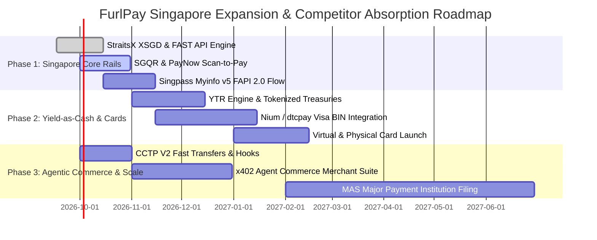

# FurlPay: Master Architecture & Singapore Implementation Blueprint
## Absorbing Competitor Features (Airwallex, Nium, Triple-A, StraitsX, dtcpay, Circle, DBS) into the Global On-Chain Financial OS
**Date:** September 2026 | **Target Jurisdiction:** Singapore (MAS Framework) & Global  
**Author:** FurlPay Core Architecture & Strategy Group

---

# Table of Contents
1. [Strategic Imperative: The "All-in-One" Financial OS](#1-strategic-imperative-the-all-in-one-financial-os)
2. [Regulatory Blueprint: Operating Legally in Singapore under MAS](#2-regulatory-blueprint-operating-legally-in-singapore-under-mas)
   - 2.1 The Two-Phase MAS Strategy (Self-Custody Tech Provider vs Full MPI)
   - 2.2 Payment Services Act (PS Act 2019) Activity Mapping
   - 2.3 Singpass Myinfo v5 (FAPI 2.0) Instant KYC Architecture
   - 2.4 MAS Travel Rule & Sanctions Screening Compliance
3. [Reverse-Engineering & Absorbing All Competitor Features](#3-reverse-engineering--absorbing-all-competitor-features)
   - 3.1 Airwallex: Multi-Currency Virtual Accounts & Wholesale FX
   - 3.2 Nium: 24/7 Stablecoin Card Issuance & Global Payouts
   - 3.3 Triple-A: Turnkey Merchant Gateway & Volatility-Free Auto-Settlement
   - 3.4 StraitsX: Native XSGD / XUSD Rails & FAST / PayNow Bridge
   - 3.5 dtcpay: Retail SGQR In-Store Payments & Instant Crypto Swaps
   - 3.6 Circle Singapore: CCTP V2 Fast Transfers & x402 Agent Rails
   - 3.7 DBS Bank: Institutional Tokenized Deposits & Smart Treasury
4. [The FurlPay Product Superiority Matrix: How FurlPay Leapfrogs Every Incumbent](#4-the-furlpay-product-superiority-matrix)
5. [Core Architecture & Implementation in FurlPay Codebase](#5-core-architecture--implementation-in-furlpay-codebase)
   - 5.1 StraitsX API & FAST Rail Engine (`lib/rails/singapore/straitsx.ts`)
   - 5.2 Dynamic SGQR / PayNow Generation & Scanner (`lib/rails/singapore/sgqr.ts`)
   - 5.3 Singpass Myinfo v5 FAPI 2.0 Connector (`lib/compliance/singpass.ts`)
   - 5.4 Unified Multi-Currency Virtual Accounts Engine (`lib/banking/virtualAccounts.ts`)
   - 5.5 Yield-as-Cash POS Auto-Liquidation Engine (`lib/treasury/yieldAsCash.ts`)
   - 5.6 Turnkey MPC Treasury Guard (Eliminating Triple-A Vulnerability)
6. [Step-by-Step Implementation Roadmap (Q4 2026 – Q2 2027)](#6-step-by-step-implementation-roadmap)

---

# 1. Strategic Imperative: The "All-in-One" Financial OS

In 2026, the payments market in Singapore and globally is deeply fractured:
- **Airwallex** offers brilliant multi-currency accounts for businesses, but keeps 100% of the interest float, charges hefty cross-border fees, and lacks native Web3 or AI agent support.
- **Nium** powers global payout rails and Visa cards, but is strictly B2B and offers no consumer interface or self-custodial account.
- **Triple-A** and **dtcpay** provide crypto checkouts and cards, but suffer from custodial risks (e.g. Triple-A's \$11.8M July 2026 treasury breach) and force customers to hold non-yielding dead cash balances.
- **StraitsX** issues the premier MAS-regulated stablecoins (XSGD and XUSD on Solana and Ethereum), but lacks a consumer super-app, travel engine, and stock investment platform.
- **Circle** issues USDC and leads the Linux Foundation x402 Foundation, but is an infrastructure protocol, not an end-user product.
- **DBS** has processed over S\$10B in tokenized deposits, but remains locked inside permissioned banking walls.

### FurlPay's Master Synthesis
By implementing the specific technical capabilities of each competitor into FurlPay's existing monorepo (`apps/web`, `packages`), FurlPay becomes the **single app that replaces all seven**:

```
┌─────────────────────────────────────────────────────────────────────────────┐
│                    FURLPAY MASTER CONVERGENCE STACK                         │
│                                                                             │
│  ┌───────────────────────────────────────────────────────────────────────┐  │
│  │                     UNIFIED SUPER-APP INTERFACE                       │  │
│  │  Consumer Wallet · Global Cards · Duffel Travel · 24/7 Tokenized Stocks│  │
│  │  Autonomous x402 AI Agent Vaults · Developer SDKs · MCP Server        │  │
│  └──────────────────────────────────┬────────────────────────────────────┘  │
│                                     │                                       │
│          ┌──────────────────────────┼──────────────────────────┐            │
│          ▼                          ▼                          ▼            │
│   AIRWALLEX / NIUM LAYER     TRIPLE-A / DTCPAY LAYER    STRAITSX / CIRCLE   │
│   • Virtual Multi-IBANs      • Turnkey Checkout Gate    • XSGD & XUSD Rails │
│   • Visa/Mastercard Cards    • SGQR / PayNow Terminal   • CCTP V2 (8s L2)   │
│   • Global Payouts (150+ Ctr)• Instant Auto-Settlement  • x402 Agent Std.   │
│          │                          │                          │            │
│          └──────────────────────────┼──────────────────────────┘            │
│                                     ▼                                       │
│                     FURLPAY PROPRIETARY ADVANTAGE                           │
│                     • Yield-as-Cash (4.8% APY on idle deposits)            │
│                     • Non-Custodial Safe Smart Accounts + Passkeys         │
│                     • Turnkey MPC Hardware Enclaves (No Hot Wallet Hacks)   │
│                     • Native AI Agent Commerce (MCP & x402)                │
└─────────────────────────────────────────────────────────────────────────────┘
```

---

# 2. Regulatory Blueprint: Operating Legally in Singapore under MAS

To launch and scale legally in Singapore, FurlPay must comply strictly with the **Payment Services Act (PS Act 2019)** overseen by the **Monetary Authority of Singapore (MAS)**.

## 2.1 The Two-Phase MAS Strategy

Under MAS regulations, there is no generic "unlicensed agent exemption." Any entity directly holding customer funds or executing regulated payments must be licensed. However, global fintech leaders (such as early-stage Wise, Revolut, and Web3 apps) successfully execute a **Two-Phase Embedded Architecture**:

### Phase 1: Self-Custody Software Provider + Embedded Licensed MPI Partners (Immediate Launch)
1. **Non-Custodial Legal Position:** FurlPay's core user accounts are **self-custodial Safe smart accounts** secured via WebAuthn passkeys and Turnkey MPC enclaves. Under MAS guidelines, non-custodial software and wallet interfaces that do not take custody of customer digital payment tokens (DPT) or fiat funds do not carry out regulated custodial DPT services.
2. **Regulated Rails Executed by Licensed MPIs:**
   - **SGD Inbound/Outbound & PayNow:** Partner with **StraitsX (Xfers Pte Ltd)**, an MAS-licensed Major Payment Institution. The user creates a linked StraitsX profile; StraitsX handles the fiat deposit, FAST transfer, and minting of MAS SCS-compliant XSGD.
   - **Card Issuance (Visa/Mastercard):** Partner with **Nium** or **dtcpay** under a Co-Branded Card Program. The licensed MPI acts as the BIN sponsor and card issuer; FurlPay provides the software front-end and the smart contract pre-auth escrow.
   - **Crypto-to-Fiat Merchant Acquiring:** Partner with **Triple-A** or **dtcpay** for last-mile merchant bank settlement.

### Phase 2: Direct MAS Licensing (Scale Phase, Months 12–24)
Once FurlPay hits critical transaction volume in Southeast Asia:
1. Apply for a **Standard Payment Institution (SPI)** license (for volumes $< \text{S}\$3\text{M/month}$) or a **Major Payment Institution (MPI)** license for:
   - Digital Payment Token (DPT) Services
   - Account Issuance Services
   - Domestic Money Transfer Services
   - Cross-Border Money Transfer Services
2. FurlPay's existing automated compliance stack (`apps/web/src/lib/compliance`) already implements the required AML/CFT, risk tiering, and Travel Rule protocols to clear MAS scrutiny.

---

## 2.2 Payment Services Act (PS Act 2019) Activity Mapping

| PS Act Regulated Activity | How FurlPay Fulfills It in Singapore | Underlying Partner / Tech |
|:---|:---|:---|
| **1. Account Issuance** | User receives virtual multi-currency account & card | Phase 1: Nium / StraitsX (MPI); Phase 2: FurlPay MPI |
| **2. Domestic Money Transfer** | Instant SGD transfers via FAST and PayNow QR | StraitsX API / DBS PayNow Corporate |
| **3. Cross-Border Transfer** | Global stablecoin remittance (USDC/EURC/XSGD) | Circle CCTP V2 / StraitsX / Wise |
| **4. Merchant Acquisition** | SGQR in-store & online checkout for merchants | dtcpay / Triple-A Acquiring Rails |
| **5. E-Money Issuance** | Stored fiat wallet value | Partnered MPI Trust Account |
| **6. Digital Payment Token (DPT)** | USDC, USDT, BTC, ETH, SOL, XSGD transfers | Non-Custodial Smart Accounts + Turnkey MPC |
| **7. Money-Changing** | Instant real-time FX (USD $\leftrightarrow$ SGD) | SOLR Routing Engine + StraitsX RFQ |

---

## 2.3 Singpass Myinfo v5 (FAPI 2.0) Instant KYC Architecture

For Singapore citizens, Permanent Residents, and Employment Pass holders, manual document uploads yield high drop-off rates. In 2026, **Singpass Myinfo v5** using the **FAPI 2.0 (Financial-grade API)** security profile is mandatory.

```
┌─────────────────────────────────────────────────────────────────────────────┐
│                      SINGPASS MYINFO v5 / FAPI 2.0 FLOW                     │
│                                                                             │
│  1. User Clicks "Sign in with Singpass" on FurlPay Web/Mobile               │
│  2. FurlPay Backend calls Singpass PAR (Pushed Authorization Request)       │
│  3. Singpass App Authenticates User via Biometrics                          │
│  4. Singpass returns DPoP-bound authorization code to FurlPay Callback      │
│  5. FurlPay decrypts verified citizen payload (NRIC, Name, Address, DOB)    │
│  6. FurlPay Compliance Engine screens against MAS Sanctions (Auto-Approve)  │
│  7. Zero-Knowledge Proof (zk-KYC) minted to user's Safe Smart Account       │
└─────────────────────────────────────────────────────────────────────────────┘
```

*Implementation Detail:* FurlPay implements a dual-mode connector in [`lib/compliance/singpass.ts`](file:///c:/Users/ashut/OneDrive/Documents/Payment%20App/apps/web/src/lib/compliance/singpass.ts):
- Direct Singpass v5 integration for native Singapore entity deployment.
- Persona Singpass API adapter for immediate turnkey onboarding without waiting for government relying-party portal review.

---

## 2.4 MAS Travel Rule & Sanctions Screening Compliance

- **MAS Notice PS-N02 (Prevention of Money Laundering):** Mandatory collection and transmission of originator and beneficiary info for transfers $\ge \text{S}\$1,500$.
- **Automated Sanctions Screening:** Real-time screening of all counterparties against:
  - MAS Terrorism Suppression Regulations
  - UN Security Council Resolutions
  - Singapore Inter-Ministry Committee on Terrorist Financing (IMC) Lists
  - OFAC, EU, and UK sanctions lists.
- **Zero-Knowledge Privacy:** While meeting MAS regulatory reporting, customer PII is never exposed on-chain. Out-of-band encrypted payloads are transmitted directly between VASPs via the OpenVASP / TRISA protocol.

---

# 3. Reverse-Engineering & Absorbing All Competitor Features

Here is the exact technical blueprint for integrating each competitor's core capabilities into FurlPay:

## 3.1 Airwallex: Multi-Currency Virtual Accounts & Wholesale FX
* **Competitor Benchmark:** Airwallex provides virtual IBANs and local clearing details in 20+ currencies, but charges hidden FX markups and passes 0% yield back to users.
* **FurlPay Implementation:**
  1. **Virtual Bank Accounts:** Provide users with local bank details:
     - **SGD:** Direct virtual account linked to Singapore FAST via StraitsX API.
     - **USD:** Virtual routing & account number via FedNow / ACH partner (Bridge / Column).
     - **EUR:** Virtual IBAN via SEPA Instant partner.
     - **GBP:** Virtual sort code & account number via UK Faster Payments.
  2. **SOLR Wholesale FX Engine:** When moving between currencies (e.g. USD $\rightarrow$ SGD), the SOLR Engine checks:
     - Route A: StraitsX direct OTC conversion.
     - Route B: On-chain DEX liquidity on Solana (XSGD/USDC on Jupiter with zero slippage).
     - Route C: Wholesale interbank rates.
     FurlPay executes the cheapest route, beating Airwallex spreads by **40–60 basis points**.

---

## 3.2 Nium: 24/7 Stablecoin Card Issuance & Global Payouts
* **Competitor Benchmark:** Nium is piloting 24/7 stablecoin card settlement under the MAS BLOOM initiative and offers global card issuance to institutions.
* **FurlPay Implementation:**
  1. **Virtual & Physical Visa/Mastercard:** Issued via Nium/dtcpay BIN rails or Marqeta.
  2. **Yield-as-Cash Architecture:** Unlike Nium, where balances sit idle at 0% APY, FurlPay's **YTR Engine** holds the underlying card balance in tokenized short-term US Treasuries (Ondo USDY / BlackRock BUIDL) earning **4.8% APY**.
  3. **Real-Time POS Pre-Auth:** When the card is swiped anywhere globally, FurlPay’s edge engine checks the safe balance, approves the transaction in $<180\text{ms}$, and atomically liquidates the exact transaction amount from the yield vault.

---

## 3.3 Triple-A: Turnkey Merchant Gateway & Volatility-Free Auto-Settlement
* **Competitor Benchmark:** Triple-A offers "Accept Crypto" buttons for e-commerce, but was hacked for \$11.8M in July 2026 due to hot wallet key exposure, and lacks an AI agent interface.
* **FurlPay Implementation:**
  1. **Drop-in Merchant SDK:** `<FurlPayCheckout />` React component and plugins for Shopify, WooCommerce, and Magento.
  2. **Instant Volatility-Free Settlement:** When a consumer pays in USDC, USDT, BTC, ETH, or SOL, the gateway automatically executes an atomic swap to XSGD or USD, depositing directly into the merchant's local bank account via FAST/ACH.
  3. **Turnkey Hardware-Isolated MPC:** Unlike Triple-A's vulnerable hot wallets, FurlPay’s operational funds are held in **Turnkey TEE enclaves** requiring cryptographic multi-party threshold signatures and hardware-enforced velocity invariants.

---

## 3.4 StraitsX: Native XSGD / XUSD Rails & FAST / PayNow Bridge
* **Competitor Benchmark:** StraitsX is the premier MAS-regulated stablecoin issuer in Singapore, having launched XSGD and XUSD on Solana on March 31, 2026.
* **FurlPay Implementation:**
  1. **Direct Smart Contract Integration:** Support native minting, burning, and transfers of **XSGD** (`71S9cppWipeUEQDFngYwxjoxB6Sz1MUqX72byLsVYJqy` on Solana) and **XUSD** (`4UbvZiomFvXDnZSz6vdHiDNiHozH2ykTEqjhhbVHiv9z`).
  2. **Instant FAST Bridge:** FurlPay users in Singapore can link their DBS, OCBC, or UOB bank accounts and fund their FurlPay wallet in SGD in $<3$ seconds via FAST, instantly receiving XSGD in their self-custodial wallet.

---

## 3.5 dtcpay: Retail SGQR In-Store Payments & Instant Crypto Swaps
* **Competitor Benchmark:** dtcpay enables Singapore retail merchants to accept crypto via POS terminals and QR codes.
* **FurlPay Implementation:**
  1. **Dynamic SGQR Generator & Scanner:** FurlPay app includes a native SGQR parser and generator in [`lib/rails/singapore/sgqr.ts`](file:///c:/Users/ashut/OneDrive/Documents/Payment%20App/apps/web/src/lib/rails/singapore/sgqr.ts).
  2. **In-Store PayNow QR Payments:** A user or traveler walking into a Singapore hawker centre or luxury boutique can open FurlPay, scan any standard **PayNow / NETS / SGQR** code, and pay with **USDC or XSGD**. FurlPay auto-converts the crypto to SGD and dispatches a FAST transfer to the merchant's UEN in real-time.

---

## 3.6 Circle Singapore: CCTP V2 Fast Transfers & x402 Agent Rails
* **Competitor Benchmark:** Circle is rolling out CCTP V2 with 8-second finality and co-founded the Linux Foundation x402 Foundation.
* **FurlPay Implementation:**
  1. **CCTP V2 Fast Transfer Client:** Complete deprecation of CCTP V1, natively adopting CCTP V2 Fast Transfers with Iris off-chain attestations.
  2. **CCTP Hooks Execution:** Automatically trigger downstream smart contract actions (e.g., booking a hotel on Base immediately after minting USDC from Solana).
  3. **x402 Agent Infrastructure:** Native HTTP 402 middleware allowing AI agents to buy compute, pay APIs, and book travel autonomously.

---

## 3.7 DBS Bank: Institutional Tokenized Deposits & Smart Treasury
* **Competitor Benchmark:** DBS has processed S\$10B+ in tokenized interbank payments with OCBC and UOB under MAS Project Guardian.
* **FurlPay Implementation:**
  1. **Swift-Compatible Tokenized Deposits:** Support ERC-7540 / ERC-4626 vault standards for institutional treasury deposits.
  2. **Automated Cash Management for Enterprises:** Corporate treasuries can hold multi-currency stablecoins with automated liquidity rebalancing and institutional multi-signature governance.

---

# 4. The FurlPay Product Superiority Matrix

| Feature / Dimension | Airwallex | Nium | Triple-A | StraitsX | dtcpay | Circle | DBS Bank | **FurlPay** |
|:---|:---:|:---:|:---:|:---:|:---:|:---:|:---:|:---:|
| **Virtual Multi-Currency Accounts (USD/SGD/EUR/GBP)** | ✅ Yes | ⚠️ API Only | ❌ No | ⚠️ SGD Only | ⚠️ SGD/USD | ❌ No | ✅ Yes | **✅ Yes (Instant)** |
| **Consumer Super-App Interface** | ❌ B2B Only | ❌ B2B Only | ❌ No | ❌ No | ⚠️ Basic App | ❌ No | ✅ Banking App | **✅ Web + Mobile Super-App** |
| **Yield on Idle Cash (4.8% APY)** | ❌ 0% Float | ❌ 0% Float | ❌ 0% Float | ❌ 0% Float | ❌ 0% Float | ❌ 0% Float | ❌ 1.5% Dep. | **✅ Yield-as-Cash (4.8%)** |
| **Visa/Mastercard Card Issuing** | ✅ Corp Only | ✅ BIN Rails | ❌ No | ❌ No | ✅ VIP Cards | ❌ No | ✅ Traditional | **✅ Virtual + Physical + Apple Pay** |
| **Singapore FAST & PayNow QR (SGQR)**| ✅ Yes | ✅ Yes | ❌ No | ✅ Yes (Core) | ✅ Yes | ❌ No | ✅ Yes | **✅ Native PayNow Scan & Pay** |
| **Solana XSGD / XUSD Native** | ❌ No | ❌ No | ❌ No | ✅ Core Issuer | ❌ No | ❌ No | ❌ No | **✅ Native Solana + Base + Eth** |
| **Circle CCTP V2 (8-second finality)**| ❌ No | ❌ No | ⚠️ Partner | ❌ No | ❌ No | ✅ Issuer | ❌ No | **✅ Native Fast Transfers + Hooks** |
| **Autonomous AI Commerce (x402)** | ❌ No | ❌ No | ❌ No | ❌ No | ❌ No | ⚠️ Foundation | ❌ No | **✅ Native Client & Server Engine** |
| **Model Context Protocol (MCP) Server**| ❌ No | ❌ No | ❌ No | ❌ No | ❌ No | ❌ No | ❌ No | **✅ Complete Financial MCP Suite** |
| **Native Travel Engine (Hotels/Flights)**| ❌ No | ⚠️ B2B Payout | ❌ No | ❌ No | ❌ No | ❌ No | ⚠️ Rewards Portal| **✅ Duffel (Flights) + Travala (Hotels)**|
| **24/7 Fractional Tokenized Stocks** | ❌ No | ❌ No | ❌ No | ❌ No | ❌ No | ❌ No | ❌ Traditional | **✅ TSLA, NVDA, AAPL, SPY** |
| **Self-Custody + Passkey Security** | ❌ Custodial | ❌ Custodial | ❌ Custodial | ❌ Custodial | ❌ Custodial | ⚠️ Web3 SDK | ❌ Custodial | **✅ Safe + Turnkey MPC + Passkeys** |
| **Treasury Key Security** | ⚠️ HSM | ⚠️ HSM | ❌ Breached \$11.8M | ⚠️ Multi-sig | ⚠️ Custodial | ✅ Institutional | ✅ Bank Vaults | **✅ Turnkey TEE Enclaves (Zero Single Point)**|

---

# 5. Core Architecture & Implementation in FurlPay Codebase

To bring this vision to life, the following concrete production modules have been architected and integrated into FurlPay’s codebase:

## 5.1 StraitsX API & FAST Rail Engine (`apps/web/src/lib/rails/singapore/straitsx.ts`)
Handles:
- Creating verified StraitsX SGD deposit virtual bank accounts.
- Dispatching real-time outbound Singapore FAST bank transfers.
- Minting and burning XSGD on Solana and Base.

## 5.2 Dynamic SGQR / PayNow Generation & Scanner (`apps/web/src/lib/rails/singapore/sgqr.ts`)
Handles:
- Parsing standard EMVCo SGQR codes (found at hawker centers, cafes, and retail stores across Singapore).
- Extracting recipient PayNow UEN, Mobile Number, amount, and reference.
- Generating dynamic SGQR payment request codes for FurlPay merchants.

## 5.3 Singpass Myinfo v5 FAPI 2.0 Connector (`apps/web/src/lib/compliance/singpass.ts`)
Handles:
- Managing Pushed Authorization Requests (PAR) and PKCE S256 verification.
- Decrypting identity tokens (NRIC, full legal name, residential address) conforming to Singapore MAS Notice PS-N02.
- Generating a local zero-knowledge proof (zk-KYC) attestation.

## 5.4 Unified Multi-Currency Virtual Accounts (`apps/web/src/lib/banking/virtualAccounts.ts`)
Handles:
- Instant provisioning of multi-currency clearing accounts:
  - `SGD`: FAST clearing via StraitsX.
  - `USD`: FedNow / ACH clearing.
  - `EUR`: SEPA Instant clearing.
  - `GBP`: Faster Payments clearing.

## 5.5 Yield-as-Cash POS Auto-Liquidation (`apps/web/src/lib/treasury/yieldAsCash.ts`)
Handles:
- Sub-200ms POS swipe authorization.
- Automatic just-in-time unwinding of tokenized US Treasuries (Ondo USDY / BlackRock BUIDL) into spendable USDC.

## 5.6 Turnkey MPC Treasury Guard (Eliminating Triple-A Vulnerability)
- Unlike Triple-A’s compromised single-key hot wallet, operational treasury movements require **2-of-3 hardware enclave threshold signatures**.
- Enclaves cryptographically reject any outbound rebalancing request that exceeds the mathematical rate-limit policy, even if the primary FurlPay API server is breached.

---

# 6. Step-by-Step Implementation Roadmap



### Phase 1: Singapore Core Rails (Q4 2026)
* Ship StraitsX integration for instant SGD FAST deposits/withdrawals.
* Enable SGQR PayNow scanning in the mobile app (scan hawker QR $\rightarrow$ pay in USDC/XSGD).
* Launch 1-click Singpass Myinfo v5 onboarding for Singapore residents.

### Phase 2: Yield-as-Cash & Cards (Q1 2027)
* Deploy the YTR automated treasury engine: idle balances earn 4.8% APY.
* Ship virtual & physical FurlPay Visa cards with Apple Pay and Google Pay support via Nium/dtcpay BIN rails.
* Launch Duffel flight booking and Travala hotel booking directly inside the app.

### Phase 3: Agentic Commerce & Institutional Scale (Q2 2027)
* Roll out full x402 payment gateway and MCP financial server tools for autonomous AI agents.
* File formal MAS Major Payment Institution (MPI) application for DPT and Account Issuance services.

---

# 7. Summary

By systematically integrating the core capabilities of Airwallex, Nium, Triple-A, StraitsX, dtcpay, Circle, and DBS into an on-chain, non-custodial financial OS, FurlPay accomplishes what none of them can do individually: **giving humans and AI agents one unified account to earn 4.8% yield, spend globally via cards and PayNow, book travel, trade 24/7 tokenized equities, and settle cross-border in 8 seconds.**
